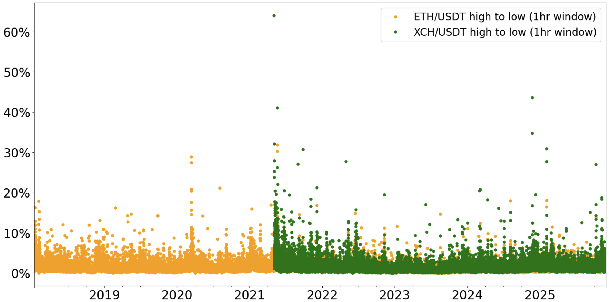
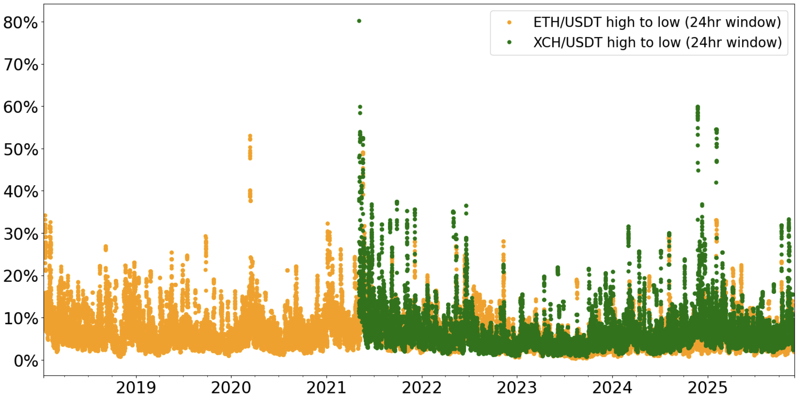
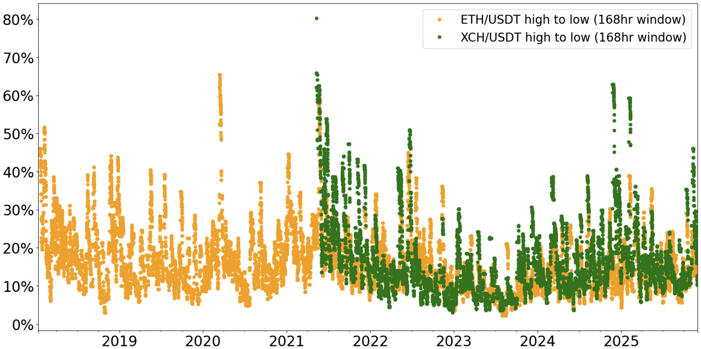

# Choosing your LTV

The **loan-to-value** (**LTV**) is a vault-specific value defined as the ratio of outstanding debt vs the value of collateral locked up in the vault.

```
LTV = debt owed / value of collateral
```

For example, if you have 100 XCH locked up in a vault, the XCH price is $40, and your debt is 1000 BYC, then the LTV is 25%.[^1]

The **Max LTV** is the LTV at which your vault becomes eligible for liquidation. Whereas you can change your LTV by adding or removing collateral, or by taking out or repaying loans, the Max LTV is a protocol parameter set by governance.[^2] Its purpose is to ensure that Bytecash remains overcollateralized.

Let's assume Max LTV is set to 60%.

To continue the example above, if the XCH price drops from $40 to $20, your LTV would increase to 50%. Because this is less than the Max LTV of 60%, the vault is still safe from liquidation. However, you might want to top up your collateral or repay part of your debt to lower your LTV in case the price drops further.

If the XCH price decreased by another $4 to $16, then the LTV would rise to 62.5%, and your vault would get liquidated.

:::info

In the context of Circuit protocol, the term **loan** in 'loan-to-value' refers to the amount of debt outstanding, not just the principal borrowed.[^3]
See the section on [collateral vaults](./user-guide/vaults) in the User Guide for additional information.

:::

## Historical XCH returns

So what is a safe LTV when borrowing Bytecash? The first thing to note is that one can never be 100% certain that a vault won't get liquidated. There is always a risk that the XCH price drops by a large amount in a very short period of time that doesn't leave enough time to repay debt or top up collateral. Borrowing is inherently a risky activity. All one can do is minimize the risk of a liquidation occuring to a level that one is comfortable with.

To get a feeling for how big the risk of a precipitous decline in the XCH price is, one can look at historical data. Shown below is the percentage difference from highest to lowest XCH price over three different rolling windows: 1 hour, 1 day, and 1 week.[^4] Included in the charts is the equivalent data for ETH for comparison.

:::danger

Past performance is not indicative of future results. Prices may be more volatile in the future than they were in the past.

:::

### One hour rolling window


The one hour rolling window is interesting for those that have very short - i.e. < 1hr - reaction times in managing their vaults. These are typically users running automated scripts to monitor their vaults, and that have near-instant access to BYC and/or XCH to repay loans or top up collateral.

The data is also useful for governance in setting the Max LTV as liquidations occur via Dutch auctions in which multiple sophisticated bidders, such as market making firms, compete to acquire a vault's collateral. Since liquidation auctions are designed to settle within 15-30 minutes, the 1 hour drawdown data represents a conservative basis for choosing an appropriate Max LTV.

As can be seen in the chart, there were only two instances shortly after on-chain XCH transfers were enabled and trading started on 3 May 2021, where the XCH price dropped by more than 40% in an hour. Given that liquidity was very thin at that time due to the small amount of XCH that was in circulation,[^5] these can be regarded as outliers that may not repeat. So if one works on the assumption that going forward it is very unlikely for a > 40% drop to occur within an hour, then a Max LTV of 1 - 40% = 60%, should prevent Bytecash from entering an undercollateralized state.

### One day rolling window


As one would expect, the longer the rolling window is, the greater the drawdawns that can occur. There are now one to two dozen instances of drawdowns in excess of 40%. However, all these drawdowns occured shortly after trading commenced.

One important observation, which in fact can be made from all three charts, is that ETH prices experienced significant drops in March 2020 and June 2021, many years after Ethereum mainnet launched. This is a good reminder that although one would generally expect lower volatility as a network matures and its market cap grows, sharp price declines larger than those observed historically can occur at any time.

### One week rolling window


The magnitude of drawdowns seen over 168 hour periods is noticeably greater than for the 1 day and 1 hour rolling windows, although the worst case scenario remains an 80% drawdown. Weekly rolling window data might be useful when leaving vaults unmoitored for longer periods of time or managing them manually.

## Choosing your LTV

If your aim is to avoid liquidation, keep in mind that any buffer you leave to protect against price declines needs to be come on top of the Max LTV, which is the buffer that protects the protocol against undercollateralization.

```
LTV = Max LTV * (1 - protected price decline)
```

For example, if Max LTV is 60%, and you would like avoid liquidation even if the XCH price drops by 60%, then your LTV must be less than 60% * 40% = 24%. In other words, the value of your collateral must be at least 1/0.24 = 417% of your debt.

When choosing your LTV, keep in mind that not only a decline in the XCH price can lead to liquidation, but also an increase in debt due to the accrual of Stability Fees over time.


[^1]: For any LTV calculations, the protocol uses the oracle price for XCH and values 1 BYC at a fixed exchange rate of 1 USD.
[^2]  More precisely, governance sets the Liquidation Ratio (Statute `VAULT_LIQUIDATION_RATIO_PCT`). Max LTV is defined as 1 / Liquidation Ratio. E.g. LR = 166 -> Max LTV = 60%.
[^2]: The principal is the amount initially borrowed when a loan is taken out. The debt owed is the principal plus any accrued Stability Fees.
[^3]: The analysis uses hourly OHLC candlestick data from OKX for the XCH/USDT and ETH/USDT spot markets.
[^4]: Mainnet launched on 19 March 2021, i.e. there was less than two months' worth of block rewards in circulation.
