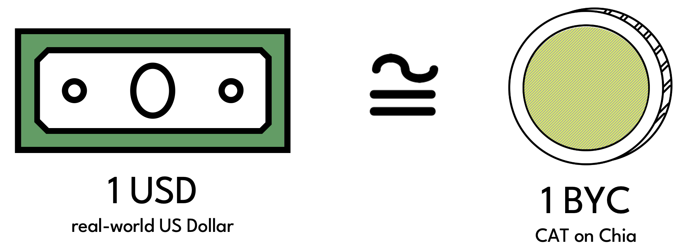

# About Circuit

**Circuit** is a DeFi protocol built on the **[Chia blockchain](https://www.chia.net)**.

Specifically, Circuit is a collateralized debt position (**CDP**) protocol that allows users to borrow **Bytecash** (**BYC**), a USD stablecoin issued by the protocol, against **XCH**, the native token of Chia.



For a 1-page introduction to how Circuit works, please see the [**Litepaper**](https://medium.com/@circuitdao/circuitdao-an-on-chain-collateralized-stablecoin-protocol-8991e3d5f01d).

### True DeFi with a true DAO

As a DeFi protocol, Circuit is:

* permissionless
* censorship-resistant
* immutable, with the exception of certain parameters that can be adjusted by governance

Governance is conducted fully on-chain via Circuit's governance token [**CRT**](./user-guide/crt-token). In particular, **CircuitDAO**, the set of all CRT tokenholders, is a true decentalized autonomous organization without any legal entity behind it.

### Getting Started

Circuit is live on Chia mainnet. Head over to the [Getting Started](./category/getting-started) guide to dive right in!

The [User Guide](./category/user-guide) provides an overview of protocol functionality and terminology.

The [Technical Manual](./category/technical-manual) was written for advanced users that want to gain a deeper understanding of the protocol's inner workings.

The Chialisp code of the puzzles used by protocol coins can be found in [this](https://github.com/circuitdao/puzzles/) Github repo.

### Bytecash Asset ID

Bytecash is a [Chia Asset Token](https://chialisp.com/cats) (CAT) with asset ID

```
ae1536f56760e471ad85ead45f00d680ff9cca73b8cc3407be778f1c0c606eac
```

You can get your wallet to recognize BYC coins by [registering](https://docs.chia.net/getting-started/wallet-guide/#add-a-new-cat) the token's asset ID.


:::info
For questions, feedback, feature requests or bug reports, please contact us on [Discord](https://discord.gg/TMama9jTwu) or send an email to info@circuitdao.com.
:::
