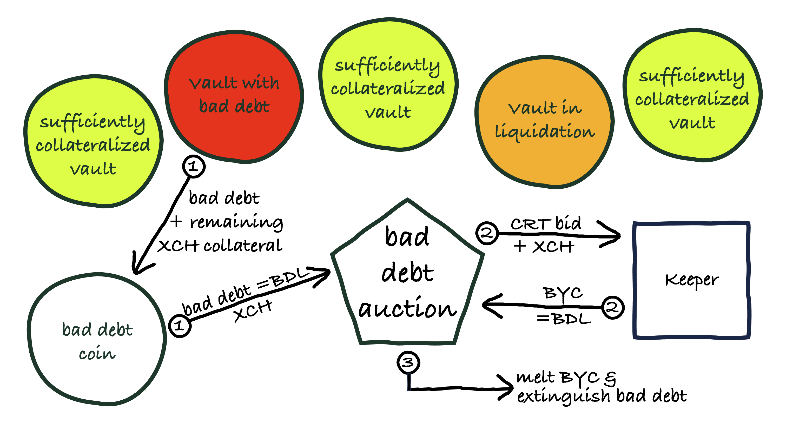

# Bad Debt

The protocol incurs **bad debt** if the system if the liquidation auction process fails to recover the outstanding debt of the vault being liquidated. This occurs if either a liquidation is not triggered at all, or the subsequent liquidation auction does not succeed in partially or fully recovering the outstanding debt. A failure to recover debt in a liqudation auction may be due to an insufficient amount of BYC being offered, or the bid prices being so high that all collateral is auctioned off before the debt is cleared.

The system accrues bad debt up to the **Bad Debt Limit** (BDL). Once bad debt exceeds the BDL, keepers can trigger a **bad debt auction**. In a bad debt auction, the protocol auctions off CRT, and potentially some XCH, in exchange for BYC.


## Bad Debt Auction Incentive

Keepers receive the **Bad Debt Auction Trigger Incentive** (BDATI) for triggering a bad debt auction. The BDATI is paid after the bad debt auction concludes, and is a percentage of the CRT paid to the winning bidder.

The purpose of the incentive is to compensate keepers for the transaction costs they incur. This should ensure that bad debt auctions are triggered in a timely manner, as it no longer makes sense for keepers to try to save on transaction fees by waiting for others to trigger the auction. Since bad debt auctions take place after the liquidation auction process has been unsuccessful, they are less urgent. Therefore it is fine for the BDATI to be substantially smaller than the Liquidation Auction Trigger Incentive, as periods of exceptionally high transaction fees can be waited out.

Keepers monitor the blockchain to keep track of which vaults have incurred bad debt. Once the total amount of bad debt exceeds the BDL, keepers can trigger a bad debt auction by spending the corresponding vaults and creating a bad debt auction coin. Any XCH that was still locked-up in the vaults gets transferred to the bad debt auction coin.


## Bad Debt Auction

Bad debt auctions are reverse auctions in which bidders offer BYC in return for the XCH in the bad debt auction coin plus a specified amount of CRT tokens. The amount of BYC offered must be exactly the BDL. The winning bid is the one that offered the least amount of CRT.



The auction begins as soon as it has been triggered by a keeper and the **Bad Debt Auction Start Delay** (BDASD) has passed. The maximum initial amount of CRT that may be requested by bidders is the **Bad Debt Auction Lot Size** (BDALS). The amount of CRT requested by bidders must decrease by at least the **Minimum Bid Decrease** (MBD).

Any bad debt that hasn't been recovered is returned to the system, potentially allowing for another bad debt auction being triggered immediately. A bad debt auction that follows a bad debt auction that has failed starts with a BDALS that equals the previous auction's lot size plus the **Bad Debt Auction Lot Size Increase** (BDALSI).

Note that bad debt auction may also run in parallel if one auction hasn't concluded yet, but enough new bad debt has accrued that the BDL has been exceeded again. TODO: what do we do with the bad debt coin once auction concludes (there may be remaining bad debt)? Is there only ever be one bad debt coin at any given time, or ok/preferable to have more than one?

The winner of a bad debt auction can claim CRT from the system in return for delivering the required amount of BYC in an atomic transaction. The system melts any BYC it receives and pays out the BDATI to the keeper that triggered the bad debt auction. Any CRT tokens paid out by the system are minted ad hoc. This increases the supply of CRT.

Auction duration is limited by the **Bad Debt Auction Duration** (BDAD). In addition there is a **Bad Debt Auction Bid Duration** (BDABD). A bad debt auction will terminate if, after a bid is placed, the BDABD passes without another bid being placed.


## Notes

:::info

Bad debt auctions can increase the supply of CRT.

```CRT minted  = (1 + BDATI) * amount of CRT requested by winning bid```

:::


## Parameters

* **Bad Debt Limit (BDL)**
    * recorded in: Statutes
    * initial value: 0.01% of outstanding debt (TODO: MakerDAO uses an absolute value (vow.sump)!)
    * updatable: yes
    * votes required: XYZ CRT
    * considerations: Choose big enough that bad debt auctions don't get triggered to often, but choose small enough that amount of bad debt does not get too large compared to oustanding debt. Also, since bad debt auctions do not allow partial bids, the lot size should not be too large for bidders to handle.
* **Bad Debt Auction Trigger Incentive (BDATI)**
    * recorded in: Statutes
    * initial value: 1% of CRT sold in auction
    * updatable: yes
    * votes required: XYZ CRT
    * considerations: Choose big enough to cover transaction fees in all but extreme market conditions
* **Bad Debt Auction Start Delay (BDASD)**
    * recorded in: Statutes
    * initial value: 24 hours
    * updatable: yes
    * votes required: XYZ CRT
    * considerations: Choose long enough to give keepers time to prepare for the bad debt auction (procure BYC, put systems in place to hedge exposure, be on stand-by)
* **Bad Debt Auction Lot Size (BDALS)**
    * recorded in: Statutes
    * initial value: TODO: What does Maker use? %age of all CRT (in relation to how big BDL is)?
    * updatable: yes
    * votes required: XYZ CRT
    * considerations: A big lot size may result in the system overpaying for recovering debt. A small lot size may result in no keepers willing to bid.
* **Bad Debt Auction Lot Size Increase (BDALSI)**
    * recorded in: Statutes
    * initial value: 50% of previous BDALS
    * updatable: yes
    * votes required: XYZ CRT
    * considerations: A big increase makes it more likely that debt gets recovered quickly, whereas a small increase may result in more auction restarts before the debt is recovered
* **Minimum Bid Decrease (MBD)**
    * recorded in: Statutes
    * initial value: 2% reduction in amount of CRT requested vs previous lowest bid
    * updatable: yes
    * votes required: XYZ CRT
    * considerations: A higher value gives keepers a bigger incentive to participate as it increases their margin
* **Bad Debt Auction Duration (BDAD)**
    * recorded in: Statutes
    * initial value: 48 hrs
    * updatable: yes
    * votes required: XYZ CRT
    * considerations: Should give keepers enough time to procure BYC even in illiquid or dirupted markets
* **Bad Debt Auction Bid Duration (BDABD)**
    * recorded in: Statutes
    * initial value: 600 seconds
    * updatable: yes
    * votes required: XYZ CRT
    * considerations: Ideally, the bid duration would be long, giving keepers more time to react to a bid by a bidder. this is particularly important if there is only a very small number of keepers. However, the longer the duration is, the less favourable any bids are because the bidder risks that the price moves before the auction ends.