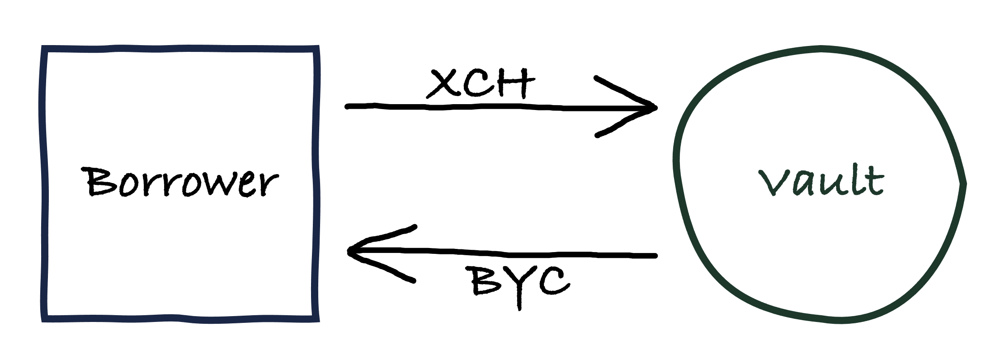

# Vaults

A **vault** is a smart coin in which XCH can be deposited. Anyone can create a vault. By depositing XCH in a vault, the vault owner can borrow BYC from the vault. XCH deposited in a vault is referred to as **collateral** as it backs any BYC borrowed.

The amount of BYC that can be borrowed from a vault is capped by the **liquidation threshold**. The liquidation threshold is a function of the **Liquidation Ratio** (LR) and the amount of collateral in the vault.

    liquidation threshold = value of collateral in USD / Liquidation Ratio

If the value drops below the liquidation threshold, keepers can trigger a vault liquidation. Note that for the purposes of determining whether the outstanding BYC debt is below or above the liquidatio threshold, BYC is always valued at 1 USD. This ensures that if BYC depegs to the downside the effective Liquidation Ratio is higher, which is desirable. If BYC depegs to the upside, the effective Liquidation Ratio is lower, which is acceptable since BYC trading above its peg indicates high confidence in the protocol and the amount of collateral backing BYC.

## Fees

* Vault creation fee
* Stability fee
* Liquidation penalty

## Chialisp considerations

Not a singleton puzzle, but a normal coin with some restrictions. This makes it much cheaper, but also implies people might have many small vaults and we should be careful if that can produce side effects.
Solution for this puzzle takes conditions. In most cases this will be a CREATE_COIN and REMARK condition. CREATE_COIN defines next iteration of the coin and REMARK is a convenient way to pass through special operation that should happen within the puzzle. 

## Puzzle parameters

## Pre-operation hooks
Restrict some conditions. We only allow for 1 REMARK condition as an operation is triggered with that. Restrict CREATE_COIN to only 1 and avoid the mess that splitting can cause. 
Create coin condition morphing. To support deposits and withdrawals, we’ll reuse the standard way it works for all coins. Users will pass a CREATE_COIN condition with their inner puzzle and amount. Amount will specify the amount for next version of the coin:
Equal. means XCH deposit remains unchanged.
Higher. XCH deposit will increase and we’ll most likely have to free some other coins to capture higher value in this spend bundle. This will be up to the driver or client side when spending the coin. We will also need to adjust the parameters that are curried into next puzzle. Requires asserting announcements from deposit XCH coins to ensure farmers can’t break them. 
Large vaults should be forced to update debt on statutes, we should also have a monitor that updates statutes every X minutes with latest debt 
Lower. Same as the previous scenario just that we adjust the variables differently and ensure that collateral ratio meets the min collateral ratio set by statutes. We fail if the user wants to withdraw too much XCH.
-1. This means the owner wants to melt this vault. This can only be possible if there are no outstanding BYC for this vault. This will destroy this coin and transfer any XCH value to whatever puzzle_hash user provided in CREATE_COIN condition. 
Check system health. If the system is shutdown, all operations apart from the claim fail.  

## Operations
Operations return puzzle state update like changes to amount of BYC minted etc and any additional conditions or asserts that are required to validate each operation successfully. It’s a convenient way to structure the code and makes it easier to read vs embedding all the rules into one big IF.  

### Mint BYC
Increases BYC_MINTED. If collateral ratio is below min required we fail. Creates conditions to allow minting of new BYC to BYC tail spend.

### Melt BYC
Decreases BYC_MINTED. If collateral ratio is below min required we fail. Amount to melt can’t be more than what this vault has minted. Creates conditions to allow for melting of BYC tokens. Sends melted values to puzzle hash passed in CREATE_COIN condition. 

## Post conditions
Zero amount lineage check. Since we can’t enforce what kind of things coins have curried in, we need to ensure that XCH vaults always start with zero amount. This ensures that curried parameters are always correct. Otherwise someone could curry in XCH deposit and BYC deposit that are not correct to mess with the system. This requires us to pass lineage information into the puzzle and use it to verify lineage on every spend. 
When coin is first spent, it provides only parent information: parent id and puzzle hash for launcher. We check that our parent indeed had a zero value and that we have a zero value as well. Next lineage information contains parent id and inner puzzle. We then regenerate parent id inside the puzzle to check our parent indeed was spawned from a coin that had zero amount.
Filter out REMARK conditions. We don’t need to return REMARK conditions as it’s only needed to parse and special instructions and run operations in the VAULT.

## Parameters

* **Liquidation Ratio (LR)**
    * recorded in: Statutes
    * initial value: 150% of outstanding debt (valued at 1 BYC = 1 USD)
    * updatable: yes
    * votes requied: XYZ CRT
    * considerations: The higher the LR, the more overcollateralized the system becomes, and the less likely a depeg to the downside becomes. On the other hand, a higher LR makes it less attractive to borrow BYC, due to the higher associated capital costs of having to lock up more XCH.

