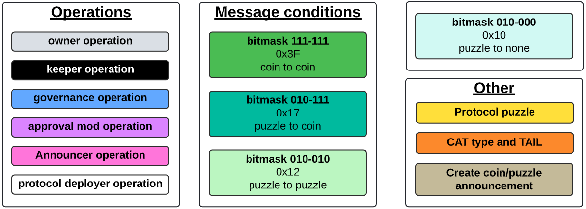
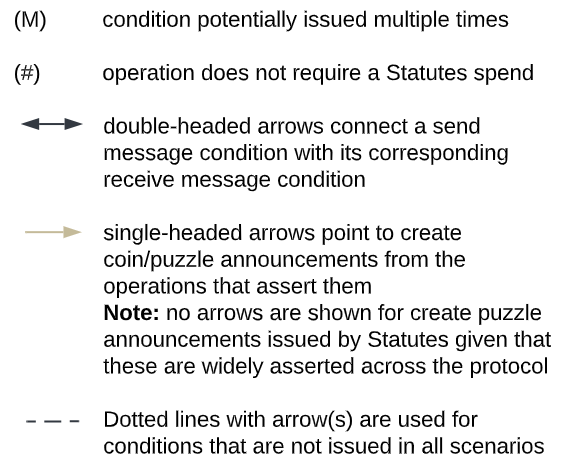

# Inter-coin communication

The protocol consists of different protocol coins. Most operations that users can perform on the protocol require multiple protocol coins, and in many cases additional non-protocol coins, to be spent together. For example, Statutes spends are required for the vast majority of operations in order to access the global state of the protocol.

The diagram below gives a complete overview of all ```CREATE_COIN_ANNOUNCEMENT```s, ```CREATE_PUZZLE_ANNOUNCEMENT```s, ```SEND_MESSAGE```s and ```RECEIVE_MESSAGE```s issued by protocol coins. Most, but not all of these are protocol conditions.

The diagram clusters coins by function. For example, Oracle, Registry, and Announcer coins form one cluster. Clusters with blue background consist of protocol coins. Red areas are related to BYC and CRT issuance and melting.

### Inter-coin communication diagram

To enlarge the diagram, you may need to right click and open the image in a new browser tab. The diagram is an SVG file and can be zoomed into without loss of quality.


### Legend

Message conditions are ```SEND_MESSAGE``` and ```RECEIVE_MESSAGE```. Information on message condition bitmasks is available at [chialisp.com](https://chialisp.com/conditions/#about-message-conditions-mode-parameter).

Where an operation requires a tail reveal, this is shown by a horizontal orange TAIL bar. For example, the Run Tail puzzle forces BYC and CRT coin spends to reveal their tail. Similarly, the settle operation of a surplus auction reveals the tail.



The diagram uses arrow to show how conditions are connected to each other. An arrow connecting two elements within the same coin type means that two coins of same coin type are communicating with each other. This occurs with Governance coins when vetoing and with Treasury coins when rebalancing.



The list of variables shown in the box below the condition name make up the condition's message. The message is the concatenation of the variables shown in bold with the treehash of the variables in regular font as a struct.

For example, the message in the body of the SEND_MESSAGE condition in the collateral vault borrow operation is

```
(concat
  PROTOCOL_PREFIX
  (sha256tree
    (c STATUTES_STRUCT
      (c ISSUANCE_PREFIX
          byc_amount_to_issue
      )
    )
  )
)
```

and the message in the body of the RECEIVE_MESSAGE conditions in treasury change ordering operation is

```
(concat
  PROTOCOL_PREFIX
  CUSTOM_CONDITION
  (sha256tree
    (c LAUNCHER_ID
        ring_prev_launcher_id
    )
  )
)
```
