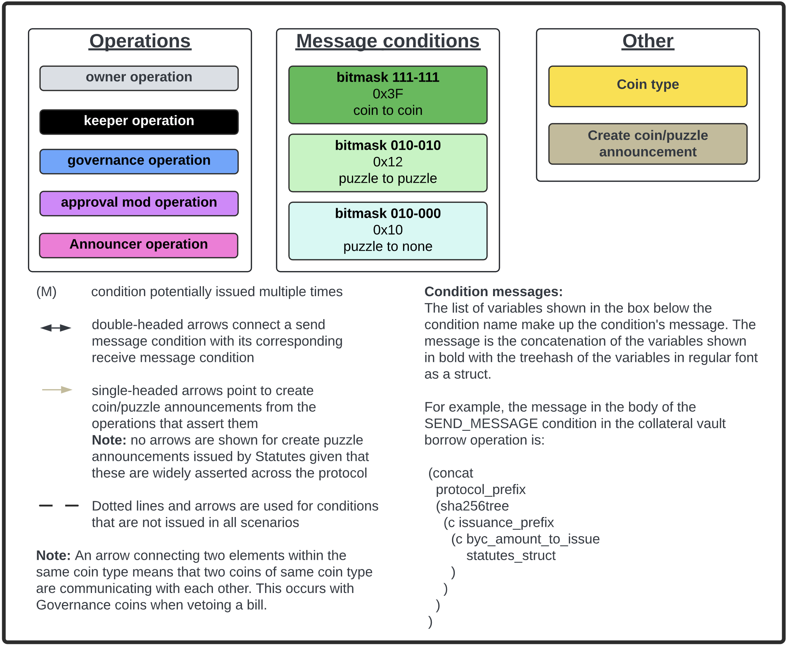

# Inter-coin communication

The protocol consists of many different protocol coins. Most operations that users can perform on the protocol require multiple protocol coins, and sometimes additional non-protocol coins, to be spent together. For example, Statutes spends are required for the vast majority of operations in order to access the global state of the protocol.

The diagram below gives a complete overview of all ```CREATE_COIN_ANNOUNCEMENT```s, ```CREATE_PUZZLE_ANNOUNCEMENT```s, ```SEND_MESSAGE```s and ```RECEIVE_MESSAGE```s issued by protocol coins. For each protocol coin, the diagram lists these grouped by operation. For additional information on how to interpret the diagram, please see the legend, which is reproduced below for convenience.

Most, but not all of the conditions in the diagram are protocol conditions.

### Inter-coin communication diagram

To enlarge the diagram, you may need to right click and open the image in a new browser tab. The diagram is an SVG file and can be zoomed into without loss of quality.


### Legend

Message conditions are ```SEND_MESSAGE``` and ```RECEIVE_MESSAGE```. Information on message condition bitmasks is available at [chialisp.com](https://chialisp.com/conditions/#about-message-conditions-mode-parameter).


