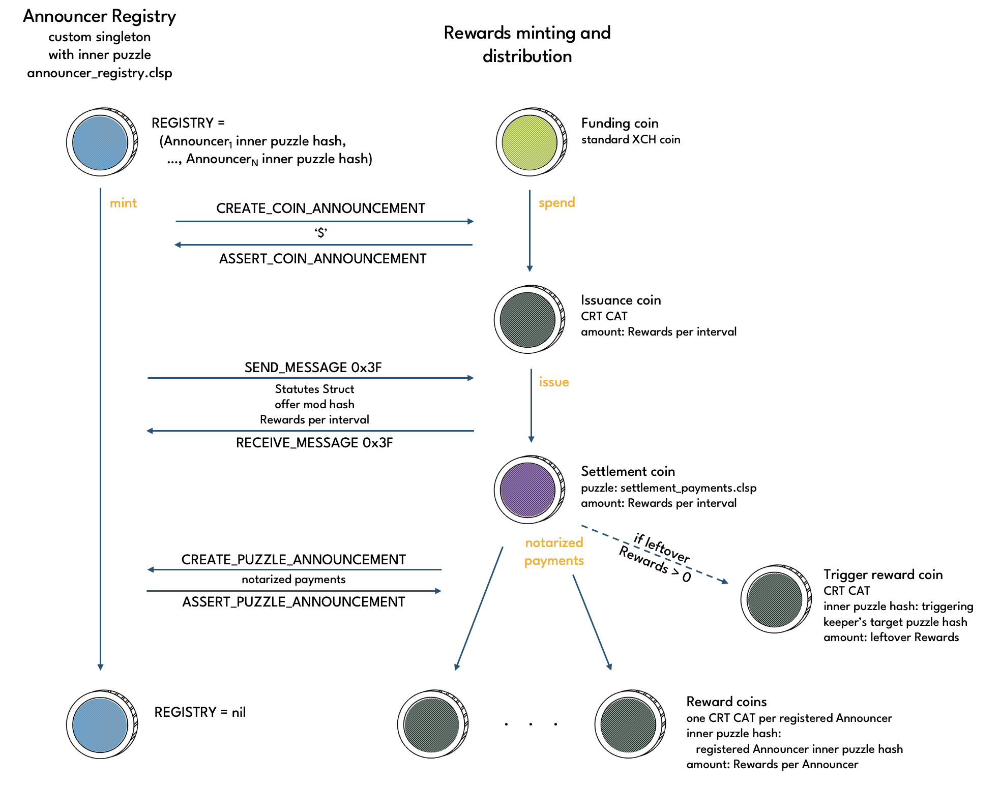

# Announcer Registry

The **Announcer Registry**, or **Registry** for short, is a custom singleton that approved Announcers can register with. The Registry keeps track of credits Announcers receive for Statutes Price updates. Announcers can periodically claim **Rewards** from the Registry in exchange for credits. Rewards are in the form of CRT tokens that are minted by the Registry.

Any Rewards claim automatically distributes CRT tokens to all registered Announcers, not just the Announcer making the corresponding spend. When Rewards are claimed, the Registry is cleared and all Announcers are required to re-register to continue to be eligible for Rewards.

:::warning
Data providers must re-register their Announcers every time Rewards are claimed to remain eligible for future Rewards.
:::

## Operations

Puzzle that operations are performed on: [announcer_registry.clsp](https://github.com/circuitdao/puzzles/blob/main/circuit_puzzles/announcer_registry.clsp)

* **Launch**: eve spend that must be executed at protocol launch - puzzle: [announcer_registry.clsp](https://github.com/circuitdao/puzzles/blob/main/circuit_puzzles/announcer_registry.clsp)
* **Register**: adds a governance-approved Announcer to the Registry - puzzle: [announcer_registry.clsp](https://github.com/circuitdao/puzzles/blob/main/circuit_puzzles/announcer_registry.clsp)
* **Mint**: claims Rewards - puzzle: [announcer_registry.clsp](https://github.com/circuitdao/puzzles/blob/main/circuit_puzzles/announcer_registry.clsp)

Although the Registry is not owned by anyone, register and mint operations can only be performed by data providers that control an approved Announcer. The launch operation must be performed by the same entity that launches the protocol.

### Launch

The Announcer Registry must be deployed and launched as part of the [protocol launch](./protocol_launch) process. As such, the launch operation is only performed once and irrelevant to protocol users and keepers.

### Register

The owner of an Announcer that has been approved by governance can register the Announcer with the Announcer Registry. Announcers are registered by prepending their inner puzzle hash to the ```ANNOUNCER_REGISTRY``` list. This means that approved Announcers with same inner puzzle hash as a registered Announcer are automatically registered too. Completely apart from the fact that governance should only ever approve one Announcer per data provider, even if there were multiple approved Announcers with same inner puzzle hash, this would not be to the detriment of the protocol as Rewards accrue based on puzzle hash, not Announcer coins.

The benefit of using inner puzzle hashes instead of launcher IDs or another way of distinguishing Announcers is that only the inner puzzle hash is needed when Rewards are claimed. This avoids inflating the state of the Registry coin.

A registered Announcer accrues Rewards every time the Statutes Price is updated.

#### State changes

* ```ANNOUNCER_REGISTRY```: inner puzzle hash of Announcer getting registered gets prepended.

### Mint

The mint operation is used to claim Rewards. The operation can be performed by any registered Announcer, and automatically sends a Rewards payment to each registered Announcer.

Note that because registration is based on the Announcer inner puzzle hash, data providers should ensure that they are still able to receive payments at the old inner puzzle hash if the Announcer gets transferred to a new inner puzzle hash. Alternatively, the Announcer should be re-registered with the new inner puzzle hash.

:::warning
When transferring an Announcer to a new inner puzzle hash, data providers should ensure that they can still receive payments at the old inner puzzle hash or immediately re-register the Announcer. Otherwise they risk losing their Rewards for the current Rewards period.
:::

The mint operation also clears the Registry, i.e. resets ```ANNOUNCER_REGISTRY``` to nil. This means that Announcers must be re-registered after a mint operation is performed to remain eligible for Rewards. It is sufficient to re-register before ```MIN_CLAIM_INTERVAL``` has elapsed, which determines the earliest point in time when the mint operation can be performed next. This gives data providers flexibility to re-register when transaction fees are low.



Since publishing up-to-date price information comes with costs for data providers, the protocol allocates credits to registered Announcers. The amount of credits allocated to an Announcer during a **CRT Claim Interval** is given by the **CRT Credits per Interval**. Announcers can claim CRT rewards that have accrued to them using the mint operation. Each credit is worth 1 CRT.

The rate at which CRT rewards can accrue is capped by the **Maximum Mint Amount** divided by the **Minimum Claim Interval**. Both values are curried into the announcer_registry.clsp puzzle at protocol launch and are immutable.

```
(mod (MAX_MINT_AMOUNT MIN_CLAIM_INTERVAL MOD_HASH ...) ...
```

The ```MOD_HASH``` curried argument refers to the mod hash of the announcer_registry.clsp puzzle curried with the Maximum Mint Amount and Minimum Claim Interval. All other curried args are curried together with the MOD_HASH.

:::note
Miniting Rewards increases the CRT supply.
:::

#### State changes

* ```ANNOUNCER_REGISTRY```: gets cleared, i.e. set to nil.
* ```CLAIM_ITERATION```: gets updated to current claim interval number.


## State and lineage

Fixed state:
* ```MAX_MINT_AMOUNT```
* ```MIN_CLAIM_INTERVAL```
* ```ATOM_ANNOUNCER_MOD_HASH```
* ```MOD_HASH```

Immutable state:
* ```STATUTES_STRUCT```

Mutable state:
* ```ANNOUNCER_REGISTRY```: List of registered Announcers. Registration is by inner puzzle hash.
* ```CLAIM_ITERATION```: Rewards claim interval number during which last claim was made. Used to prevent multiple claims per interval.

### Eve state

The eve state of the Registry may come without registered Announcers or with a number of pre-registered Announcers. In the former case, the ```ANNOUNCER_REGISTRY``` curried arg would be set to nil, in the latter case it would be a list of inner puzzle hashes of pre-registered Announcers.

### Amount

The Announcer Registry coin amount is always 0.

### Lineage

Being a singleton, the Announcer Registry requires a lineage proof when spent. In case of the eve spend, which must be performed using the launch operation, the Registry asserts the [standard launcher](https://chialisp.com/singletons/#launcher) CREATE_COIN_ANNOUNCMENT from the Statutes launcher coin. This requires the lineage proof to be the treehash of a list consisting of the Statutes eve puzzle hash (corresponding to the full puzlle including the outer standard singleton layer) and the amount of the Statutes eve coin, which is always 1 (TODO: and the key_value_list if used). It also means that the Registry's eve spend must occur at protocol launch.


## Statutes
* **CRT Credits per Interval**
    * Statute index: 28
    * Statute name: STATUTE_ANNOUNCER_CRT_CREDITS_PER_INTERVAL
    * considerations:
* **CRT Claim Interval**
    * Statute index: 29
    * Statute name:STATUTE_ANNOUNCER_CLAIM_INTERVAL
    * considerations:
