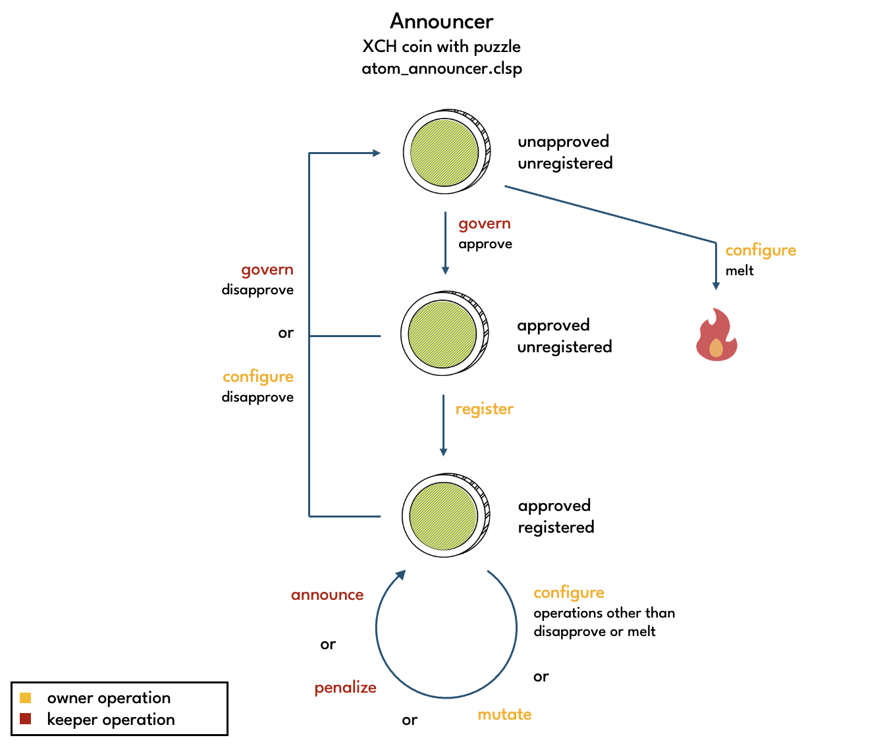
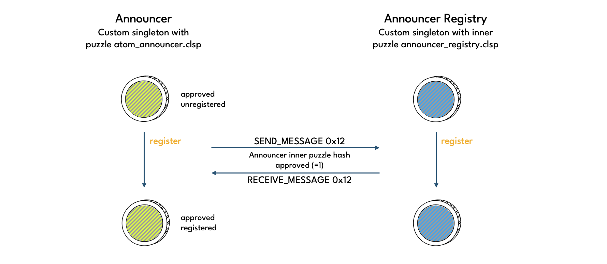
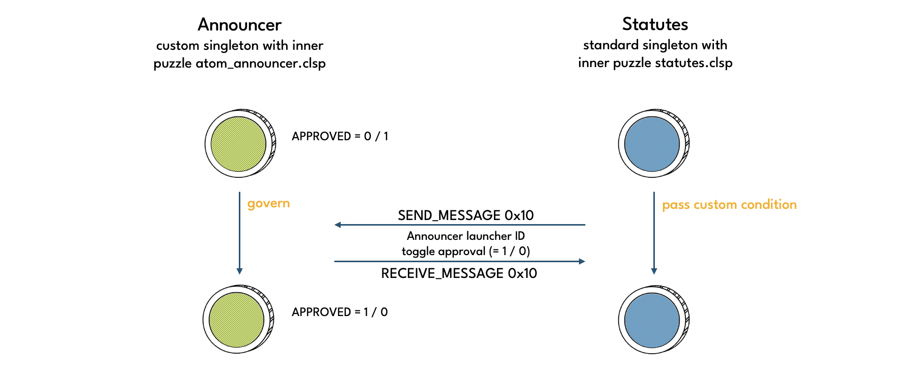

# Announcers

**Announcers** are custom singleton coins deployed and owned by **data providers**. Their purpose is to make the XCH/USD market price available on-chain. This XCH/USD market price is referred to as the **Announcer Price**.

Announcer Prices are used to update the **Oracle price**. Each such update requires a minimum of **M-of-N** Announcer Price announcements from distinct Announcers that have been **approved** by governance.

Announcers are also referred to as **Atom Announcers** because they are designed to announce a single [atom](https://chialisp.com/chialisp-primer/intro/#atoms) value. The atom value is stored in the ATOM_VALUE curried arg of the Announcer puzzle. In the case of Circuit protocol, the atom value is the Announcer Price.

Data providers must update the Announcer Price regularly. Otherwise the Announcer Price can **expire**, and the Announcer gets penalized. An Announcer Price is said to be expired if the TIMESTAMP_EXPIRES curried arg lies in the past. TIMESTAMP_EXPIRES is updated to the current time plus DELAY whenever the Announcer Price is updated. DELAY is a curried arg that can be set to any value less than or equal to [**Announcer Price TTL**](./../user-guide/price-oracle) by the Announcer's data provider. The Announcer Price is best updated using the mutate operation. It is best practice to also update the Announcer Price as part of a configure operation.


## Governance considerations

Governance is responsible for selecting data providers and monitoring the performance of their respective Announcers. Governance should require comprehensive disclosures from data providers to ensure they have the required capabilities and experience:
* Operating high availability IT infrastructure (uptime >99.9%, geographically distributed)
* Responding quickly and 24/7 to any issues
* Setting up an running Chia full nodes
* Connecting to and processing centralized cryptocurrency exchange data feeds (REST and websocket)
* Monitoring and processing on-chain data (offer files, AMM prices)
* Maintaining high operational security
* Reputation for being reliable, trustworthy and acting with integrity at all times

Governance should verify any claims made by data providers by making inquiries about their track record and requesting references.

### Number of Approved Announcers and M-of-N

In general, a larger number of approved Announcers is better than a smaller one as it provides more redundancy. This minimises the risk of multiple data providers experiencing downtime simultaneously, which could result in an unupdatable Oracle price. A larger number of approved Announcers can also lead to better Oracle Price accuracy as outlier Announcer Prices can be ignored when updating the Oracle price.

The more approved Announcers there are, the higher governance can set **M-of-N**, the minimum number of Announcer Prices required to update the Oracle price. A higher M-of-N helps dilute the effect of outlier prices, which protects against malicious actors trying to manipulate the Oracle Price by deliberately including inaccurate Announcer Prices. Note, however, that the risk of the Oracle price becoming unupdatable goes up as M-of-N goes up.

The rule that a larger number of approved Announcers is better may not hold true if the corresponding data providers cannot be trusted to publish accurate prices. In particular, if there is a suspicion that a data provider has deliberately published an inaccurate or no price, governance should consider disapproving the corresponding Announcer immediately to minimize the risk of Oracle Price manipulation attacks.

Governance should also keep in mind that having a large number of approved Announcers can potentially be costly due to the amount of blockspace taken up Announcer Price updates. Approving more than 32 Announcers would likely be excessive and a poor trade-off from a cost-benefit perspective.

## Operations

Puzzle that operations are performed on: [atom_announcer.clsp](https://github.com/circuitdao/puzzles/blob/main/circuit_puzzles/atom_announcer.clsp)

Owner operations:
* **register**: register Announcer with the [Announcer Registry](./announcer-registry) - puzzle: [announcer_register.clsp](https://github.com/circuitdao/puzzles/blob/main/circuit_puzzles/programs/announcer_register.clsp)
* **configure**: disapprove, melt, transfer or update state of Announcer - puzzle: [announcer_configure.clsp](https://github.com/circuitdao/puzzles/blob/main/circuit_puzzles/programs/announcer_configure.clsp)
* **mutate**: update Announcer Price or transfer Announcer - puzzle: [announcer_mutate.clsp](https://github.com/circuitdao/puzzles/blob/main/circuit_puzzles/programs/announcer_mutate.clsp)

Governance operations:
* **govern**: approve or disapprove Announcer - puzzle: [announcer_govern.clsp](https://github.com/circuitdao/puzzles/blob/main/circuit_puzzles/programs/announcer_govern.clsp)

Keeper operations:
* **penalize**: slash Announcer's deposit - puzzle: [announcer_penalize.clsp](https://github.com/circuitdao/puzzles/blob/main/circuit_puzzles/programs/announcer_penalize.clsp)
* **announce**: announce Announcer price - puzzle: [announcer_announce.clsp](https://github.com/circuitdao/puzzles/blob/main/circuit_puzzles/programs/announcer_announce.clsp)



#### Driver info

```LAUNCHER_ID``` plus mutable state. <!--(TODO: change order in REMARK condition to match order in state)-->

### Register

An approved Announcer can be registered with the **Announcer Registry** by its data provider. Registered Announcers are eligible for **Rewards**. Although data providers are not required to register their Announcers, there is no downside in doing so other than the transaction costs associated with registration.

:::warning
Data providers need to re-register their Announcers after every Rewards claim - be it by themselves or a third party - to continue to be eligible for Rewards.
:::

When Rewards are claimed by one of the Announcers, an automatic Reward payment is made to all registered Announcers, and the Registry cleared. This requires Announcers to re-register if they want to continue to be eligible for Rewards.

Announcers should also keep in mind that the registration is based on the Announcer's inner puzzle hash. Accordingly, Rewards payments are made in the form of CRT coins with that same inner puzzle hash. So if an Announcer get transferred to a new inner puzzle hash, the data provider should either be comfortable to still receive payments at the old inner puzzle hash, or re-register the Announcer with its new inner puzzle hash.



The register operation leaves the state of the Announcer unchanged. Registration is effected by adding the Announcer's inner puzzle hash to the Announcer Registry.

#### State changes

* ```DEPOSIT```: see amount
* amount: can be reduced to pay for fees or increased to top up deposit

### Configure

The configure operation is used to update the state of an Announcer.

State variables (curried args) that can be updated in this way are:
* ```INNER_PUZZLE_HASH```: the inner puzzle determines how the Announcer can be spent
* ```APPROVED```: indicates whether the Announcer is approved
* ```DEPOSIT```: the amount of the Announcer coin, which is used as a deposit that can be slashed under certain circumstances
* ```DELAY```: number of seconds for which an updated price is valid. used to calculate the expiry timestamp, TIMESTAMP_EXPIRES <!--(TODO: rename to TTL)-->
* ```ATOM_VALUE```: XCH/USD price published by data provider

Changing the inner puzzle hash can be used to transfer the Announcer.

An approved Announcer can be unilatally disapproved by its data provider. Before the disapproval becomes effective, the **Cooldown Period** must have passed. This gives governance time to find a replacement data provider.

The **deposit** is the amount of the Announcer coin, and must not be smaller than the **Minimum Deposit** for approved Announcers. The deposit can be slashed by keepers under certain circumstances. See [penalize](./announcers#penalize) for more details. The configure operation allows data providers to increase or decrease the deposit. Since the deposit is slashable, it is generally recommended to not exceed the Minimum Deposit by a large amount. However, a small excess on top of the Minimum Deposit can reduce costs for well-behaved Announcers as it can be used to pay for transaction fees, making a separate contribution spend unnecessary. If governance votes to increase the Minimum Deposit, data providers should top up their deposit in a timely manner to avoid getting penalized.

The **Announcer Price TTL** Statute indicates how long an Announcer Price that's just been updated may be valid for at most. The actual validity period of an Announcer is stored in the ```DELAY``` curried arg. In practice, the only reason why an Announcer would use a shorter than necessary validity period is in case of a governance vote to reduce the Announcer Price TTL. This allows Announcers to prepare for the new Statute value ahead of time and avoid getting penalized for an expired Announcer Price upon enactment of the reduced Announcer Price TTL.

If desired, the Announcer Price may also be updated in a configure operation.

Lastly, it is possible to **melt** an unapproved Announcer using the configure operation.

#### State changes

* ```INNER_PUZZLE_HASH```: can be set to desired value
* ```APPROVED```: can be set to nil
* ```DEPOSIT```: see amount
* ```DELAY```: can be set to any value smaller than Announcer Price TTL. <!--(TODO: rename to TTL)-->
* ```ATOM_VALUE```: can be set to any atom value. should be XCH/USD market price
* ```MIN_DEPOSIT```: can be set to any value greater than Minimum Deposit
* ```COOLDOWN_START```: set by puzzle
* ```TIMESTAMP_EXPIRES```: set by puzzle
* amount: can be set to any value greater than Minimum Deposit

### Mutate

For standard Announcer Price updates, the mutate operation should be used since it has a smaller cost than the more complex configure operation. The mutate operation can also be used to transfer the Announcer by switching out its inner puzzle hash.

Apart from Announcer Price and inner puzzle hash, the mutate operation does not change the state of the Announcer.

#### State changes

* ```INNER_PUZZLE_HASH```: optional
* ```DEPOSIT```: see amount
* ```ATOM_VALUE```: set to updated atom value
* ```TIMESTAMP_EXPIRES```: set by puzzle
*amount: can be reduced to pay for fees or increased to top up deposit

### Govern

Governance can **approve** or **disapprove** Announcers. An Announcer that is not approved is referred to as **unapproved**, irrespectively of whether it was never approved or was disapproved after the last time it was approved. An approved Announcer has the APPROVED curried arg set to 1, an unapproved Announcer has it set to 0.



An approved Announcer may be registered with the Announcer Registry by its data provider using the register operation. An Announcer that is being disapproved automatically loses its registered status with the Announcer Registry and may not be re-registered until approved again.

#### State changes

* ```APPROVED```: set to 1 (approve) or 0 (disapproved)
* ```DEPOSIT```: reduce by up to max penalty amount to pay for fees
* amount: reduce by up to max penalty amount to pay for fees

### Penalize

Announcers can be penalized if they are not well-behaved. Having a penalization mechanism in place protects the protocol as it sets a strong incentive for data providers to do their job well.

An Announcer is penalized by applying the **Penalty Factor** to the Announcer's deposit. This slashes XCH from the Announcer coin's amount. The slashed amount can either be claimed by the keeper performing the penalization or wholly or partly left to the farmer of the block.

Keepers can penalize approved Announcers in the following circumstances:
* Announcer Price is expired, ie current time is greater than ```TIMESTAMP_EXPIRES```
* ```DELAY``` is greater than Announcer Price TTL Statue <!--(TODO: rename DELAY to TTL?)-->
* ```DEPOSIT``` is smaller than Minimum Deposit

The second and third cases above are designed to incentivize data providers to keep the configuration of their respective Announcers in line with Announcer Price TTL and Minimum Deposit whenever these Statutes are updated by governance. In practice, it is recommended that Announcer configurations are updated well in advance of Statute enactment, in order to minimize the risk of missing the dealine and incurring penalties.

A penalization can occur at most once per **Penalty Interval** (STATUTE_ANNOUNCER_PENALTY_INTERVAL_MINUTES). Since keepers will be competing to penalize Announcers, it can generally be expected that a penalty is applied at the earliest possible point in time in each Penalty Interval, and that therefore the deposit of a penalizable Announcer will decline at an exponential rate according to the Penalty Factor.

#### State changes

* ```DEPOSIT```: see amount
* ```LAST_PENALTY_INTERVAL```: updated to current Penalty Interval
* amount: reduce according to Penalty Factor

### Announce

The announce operation creates an announcement that can be asserted by coins that wish to use the Announcer Price. Within Circuit protocol, the Oracle is the only coin that makes use of these announcements, namely when updating the Oracle price. Oracle price updates may only use approved Announcers.

The announce operation leaves the state of the Announcer unchanged.

#### State changes

None.

## State and lineage

Fixed state:
* ```OPERATIONS```
* ```MOD_HASH```

Immutable state:
* ```STATUTES_STRUCT```
* ```LAUNCHER_ID```: coin ID of eve Announcer's parent coin

Mutable state:
* ```INNER_PUZZLE_HASH```
* ```APPROVED```
* ```DEPOSIT```: amount of the Announcer coin
* ```DELAY```: <!--TODO: rename to expiration?-->
* ```ATOM_VALUE```: value to be announced. must be an atom
* ```MIN_DEPOSIT```: minimum amount of Announcer coin that should be maintained
* ```COOLDOWN_START```: timestamp of when a cooldown was initiated. 0 if not in cooldown
* ```LAST_PENALTY_INTERVAL```: <!--TODO-->
* ```TIMESTAMP_EXPIRES```: timestamp when atom value is no longer announceable

### Eve state

Announcers have an enforced eve state in which the following curried args are all set to 0:

* ```APPROVED```
* ```DEPOSIT```
* ```DELAY```
* ```ATOM_VALUE```
* ```COOLDOWN_START```
* ```LAST_PENALTY_INTERVAL```
* ```TIMESTAMP_EXPIRES```

The announcer owner is free to set ```INNER_PUZZLE_HASH``` as they desire.

<!--TODO: what is/should MIN_DEPOSIT (be) set to?-->

### Amount

The amount of an eve Announcer is enforced to be 0. After that, it's up to the Announcer's owner how big the amount is, subject to certain limitations. See [configure](./announcers#configure) for details.

### Lineage

Being singletons, Announcers require a lineage proof when spent. In case of the eve spend, the Announcer puzzle verifies that the curried arg ```LAUNCHER_ID``` matches the coin ID of the Announcer's parent coin.
