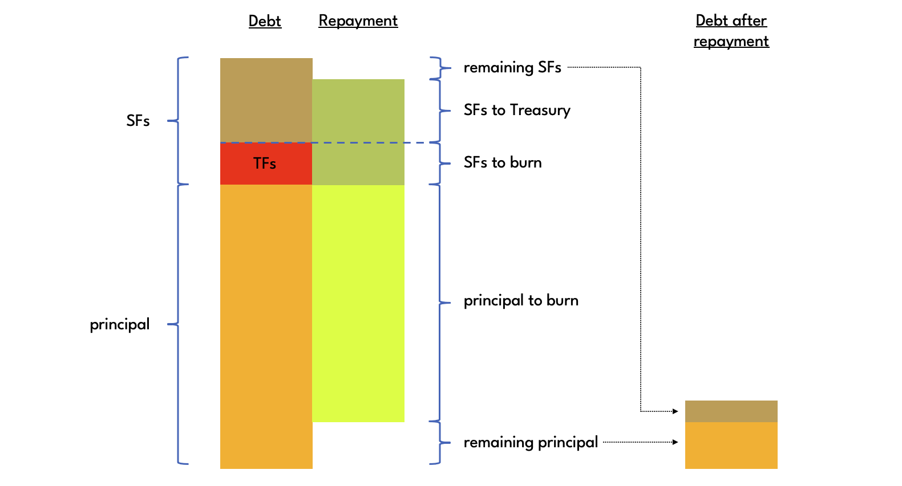
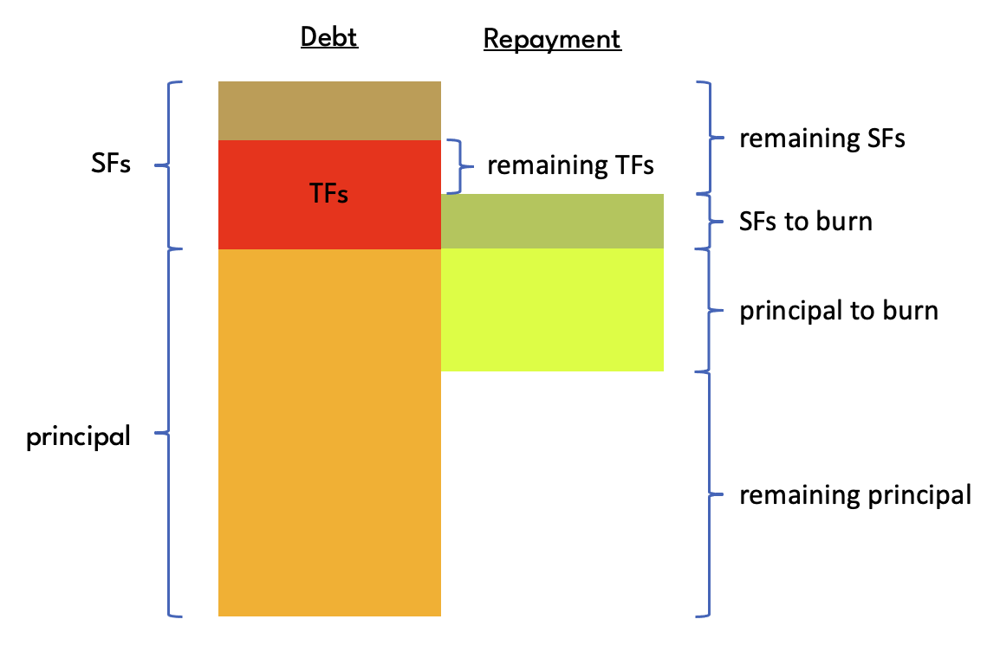

# Collateral Vaults

Collateral vaults are custom singletons that can be created permissionlessly by anyone.

Collateral vault inner puzzles must output one, and only one, protocol remark condition. The vault operation puzzle gets extracted from this remark condition. Vault owners must therefore ensure their inner puzzles are designed suitably, as otherwise some or all vault operations may become inaccessible and the collateral held in a vault could be lost.

:::warning
Collateral vault inner puzzles must be designed suitably to prevent funds from getting irretrievably locked in a vault.
:::

It is safe to use the [standard transaction puzzle](https://chialisp.com/standard-transactions/#code) for the inner puzzle of a collateral vault.

## Stability Fees

Loans taken out from collateral vaults accrue Stability Fees. The debt owed to a vault increases every minute according to the **Stability Fee Discount Factor** (SFDF) from Statutes. The corresponding annualized Stability Fee percentage rate (APR), which is the figure typically shown to the user in frontends, is calculated as

$$
Stability\ Fee\ APR = SFDF^{60\cdot24\cdot365}.
$$

For example, if SFDF is set to 1.00000018133597, then the APR is 10%.

If a loan is taken out, then the corresponding debt is simply the principal of that loan multiplied by all SFDFs from the time the loan was taken out, $t_L$, until the current time, $t_C$:

$$
debt(t_N) = principal \prod_{i=L}^{C} SFDF_{t_i},
$$

The SFDF can change over time. Storing individual historical SFDFs in the protocol would be prohibitive from a cost perspective. Instead, the protocol keeps track of the **Cumulative Stability Fee Discount Factor** (CSFDF), which is the product of all SFDFs from protocol launch $t_{P}$ until the timestamp of the current Statutes Price, $t_S$:

$$
CSFDF(t_S) = \prod_{i=P}^{S} SFDF_{t_i},
$$

This parameter is stored in Statutes and automatically updated by the protocol whenever the Statutes Price is updated. This ensures that the CSFDF is always reasonably up-to-date.

The **Current Cumulative Stability Fee Discount Factor** (CCSFDF), which is the discount factor up to the current time, $t_C$, and the discount factor most commonly used in protocol-internal calculations, is given by

$$
CCSFDF(t_C) = CSFDF(t_S)\; SFDF^{C-S}.
$$

:::warning
A change to SFDF does not automatically cause an update of the Statutes Price and hence the CSFDF. This means that in the calculation of CCSFDF, the new SFDF may be used retroactively from $t_S$ onwards.

Keepers may be able to trigger an update of the Statutes Price in the same block or shortly after a change to SFDF, but this depends on the timestamps of the Oracle prices stored in the Oracle. If new Oracle prices were always added at the earliest opportunity, i.e. no later than indicated by Oracle Price Delay (STATUTE_ORACLE_PRICE_EXPIRATION_SECONDS), then in the calculation of CCSFDF, the retroactive period over which the new SFDF is used will not be longer than twice the Oracle Price Delay.

Users should keep in mind that although any change in the CCSFDF caused by a retroactive application of the SFDF is generally fairly small due to the limited period over which any retroactivity applies, it can in theory **unexpectedly push the debt of a vault past the Liquidation Threshold**. Users with vaults close to liquidation should therefore monitor the protocol for governance proposals to modify the SFDF.
:::

Note that the vault owner passes in the current time as an argument when performing a borrow or repay operation, and is given a three minute window of flexibility vs the actual block timestamp to reduce the likelihood that an operation times out and will fail to be incluced in the blockchain. Since a malicious vault owner could exploit this flexibility by borrowing in the future and repaying in the past, the actual definition of CCSFDF in the collateral vault puzzle includes an additional factor SFDF^3 when used in repay operations.


## Loan and debt accounting

Each vault keeps track of the **principal** (P) of outstanding loans, and the **discounted principal** (DP). Both P and DP get updated whenever BYC is borrowed from or repaid to the vault.

The principal is the net amount of BYC borrowed and repaid:

$$
principal = \sum_{i=1}^A B_i - \sum_{j=1}^B R_j,
$$

where $B_i$ are the principal amounts of the loans taken out, and $R_j$ the principal amounts of the loans repaid.

The discounted principal is effectively the vault's principal valued at vault creation, and simply the sum of all principal amounts borrowed and repaid discounted by the respective CCSFDF at the time:

$$
discounted\ principal = \sum_{i=1}^A \frac{B_i}{CCSFDF_{t_{B_i}}} - \sum_{j=1}^B \frac{R_j}{CCSFDF_{t_{R_j}}},
$$

where $t_{B_i}$ are the times when loans were taken out, and $t_{R_j}$ the times when loans were being repaid.

For example, assume that the Stability Fee is 10% annualized, a vault is created, and a 1000 BYC loan taken out immediately. This is the first vertical orange line in the chart below. At this point, principal, debt, and discounted principal are all equal to 1000 BYC. As time passes, Stability Fees accrue and the debt slowly increases along the orange line. Now assume that a second loan, for 500 BYC, is taken out 36 months later. This is the second vertical orange line in the chart. Both the vault's principal and debt increase by 500 BYC. The principal is now 1500 BYC, and the debt 1000 * 1.1^3 + 500 = 1831 BYC. The discounted principal on the other hand only increases by 500 / 1.1^3 = 376 BYC, as shown by the green vertical line.


A vault does not keep track of its debt in a separate variable. Instead, it is calculated ad hoc by undiscounting the vault's discounted principal using the CCSFDF:

$$
debt(t) = discounted\ principal \cdot CCSFDF_t.
$$

Finally, it is possible to calculate accrued Stability Fees of a vault at any given time as

$$
SF = debt - principal
$$

Note that due to the coinset model, the protocol itself does not know the total principal, discounted principal or debt across all vaults. If a corresponding state variable was introduced in Statutes, it would be impossible for different vaults performing operations in the same block. Fast-forward or singleton spend aggregation could theoretically help, but since the Statues spend is rather big, this would be very costly, and ultimately not scale.

## Stability Fee transfers

It is possible to mint BYC against accrued Stability Fees. BYC minted in this way is transferred to the Treasury. Each collateral vaults keeps track of the net amount of BYC it has transferred to the Treasury in this manner in the **Transferred Fees** variable.

Transferring fees is the preferred mechanism to top up the Treasury, as it is quicker and less costly than holding a recharge auction. Keepers should transfer fees on an ongoing basis to keep the Treasury filled to near the Treasury Maximum. That way it can be ensured that savers can be paid interest on demand and Bad Debt can be extinguished as soon as it arises.

The maximum amount of fees that can be transferred from a vault is the acrrued SFs less the Transferred Fees. This ensures that all BYC in circulation remains fully backed and overcollateralised as required by the Liquidation Ratio. The protocol also enforces a minimum amount to transfer, **Minimum Stability Fee Transfer Amount** (MSFTA), to prevent collateral vault coin hogging.

It is governance's responsibility to ensure that the savings rate is set such that the protocol's liability to savers is less than the amount of accrued Stability Fees. In particular, this means that the savings should not be greater than the Stability Fee rate, as otherwise there would be an arbitrage.


## Operations

There are five collateral vault operations that can only be performed by the vault owner, and one keeper operation not related to liquidation.

Puzzle that operations are performed on: [collateral_vault.clsp](https://github.com/circuitdao/puzzles/blob/main/circuit_puzzles/collateral_vault.clsp)

Owner operations:
* **deposit**: deposit collateral - puzzle: [vault_deposit.clsp](https://github.com/circuitdao/puzzles/blob/main/circuit_puzzles/programs/vault_deposit.clsp)
* **withdraw**: withdraw collateral - puzzle: [vault_withdraw.clsp](https://github.com/circuitdao/puzzles/blob/main/circuit_puzzles/programs/vault_withdraw.clsp)
* **borrow**: take out a loan - puzzle: [vault_borrow.clsp](https://github.com/circuitdao/puzzles/blob/main/circuit_puzzles/programs/vault_borrow.clsp)
* **repay**: repay debt - puzzle: [vault_repay.clsp](https://github.com/circuitdao/puzzles/blob/main/circuit_puzzles/programs/vault_repay.clsp)
* **transfer**: transfer ownership of collateral vault - puzzle: [vault_transfer.clsp](https://github.com/circuitdao/puzzles/blob/main/circuit_puzzles/programs/vault_transfer.clsp)

Keeper operations:
* **transfer Stability Fees**: mint & transfer BYC to Treasury - puzzle: [vault_kepper_recover_bad_debt](https://github.com/circuitdao/puzzles/blob/main/circuit_puzzles/programs/vault_keeper_recover_bad_debt.clsp)
* See the [Liquidation](./liquidation#operations) page for keeper operations relating to vault liquidation and bad debt:
    * **start auction**: start a liquidation auction
    * **bid**: submit a bid in liquidation auction
    * **recover bad debt**: extinguish bad debt

### Deposit

Deposits XCH into the collateral vault. Deposited XCH is automatically used as collateral when taking out loans.

The deposit operation does not assert any Statutes and can be performed completely independently of the protocol.

#### State changes

* ```COLLATERAL```: increases by the amount deposited

### Withdraw

Withdraws XCH from the collateral vault. The operation can only succeed if after the withdrawal the vault remains sufficiently overcollateralised.

#### State changes

* ```COLLATERAL```: decreases by the amount withdrawn

### Borrow

Borrows Bytecash from the vault.

Borrowed Bytecash is minted by the Protocol. Borrowing increases the debt owed to the vault as [explained above](./collateral-vaults#stability-fees).

#### State changes

* ```PRINCIPAL```: increases by the amount of BYC borrowed
* ```DISCOUNTED_PRINCIPAL```: increases by the amount of BYC borrowed discounted back to Statutes launch

### Repay

Repays debt owed to the vault.

The first step in a debt repayment is for the protocol to split the repayment amount into principal repayment amount (bright green in the diagrams below) and SF repayment amount (dark green) proportional to the vault's principal and accrued SFs. If the SF repayment amount is greater than or equal to Transferred Fees, then an amount of BYC equal to Transferred Fees is melted, and the remaining SF repayment amount is transferred to Treasury.



If on the other hand the SF repayment amount is less than Transferred Fees, then the entire SF repayment amount is melted, and no BYC is paid into the Treasury.



In both cases, the vault is left with remaining SFs and remaining principal as shown in the diagrams. In the first case above, remaining Transferred Fees are 0, whereas in the second case, remaining Transferred Fees are equal to Transferred Fees before the repayment minus the SF repayment amount.

#### State changes

* ```PRINCIPAL```: decreases based on amount repaid according to methodology described above
* ```DISCOUNTED_PRINCIPAL```: decreases based on amount repaid according to methodology described above
* ```TRANSFERRED_FEES```: decreases based on amount repaid according to methodology described above

### Transfer

The ownership or custody arragements or a collateral vault can be changed using the transfer operation, which replaces the vault's inner puzzle hash.

#### State changes

* ```INNER_PUZZLE_HASH```


## State and lineage

Fixed state:
* ```OPERATIONS```: a two-element struct containing owner operations and keeper operation hashes
  * ```OWNER_OPERATIONS```: a list containing deposit, withdraw, borrow, repay and transfer operation hashes
  * ```KEEPER_OPERATIONS```: a list containing transfer Stability Fees, and liquidation-related operation hashes
<!--Some operations have the following fixed state args curried in:
    * ```CAT_MOD_HASH```: treehash of the [standard CAT mod](https://chialisp.com/cats/#code)
    * ```BYC_TAIL_MOD_HASH```: treehash of the [BYC tail mod](./../technical-manual/byc-tail)
-->
* ```MOD_HASH```

Immutable state:
* ```STATUTES_STRUCT```

Mutable state:
* ```COLLATERAL```: amount of collateral in vault (in mojos)
* ```PRINCIPAL```: principal amount of outstanding loans (in mBYC)
* ```AUCTION_STATE```: state of liquidation auction (if any)
* ```INNER_PUZZLE_HASH```: inner puzzle hash of vault
* ```DISCOUNTED_PRINCIPAL```: discounted principal amount of oustanding loans (in mBYC)

### Eve state

The vault puzzle enforces an eve state in which all mutable state variables except ```INNER_PUZZLE_HASH``` are 0.

Note that a non-eve collateral vault can be in eve state. This can happen either by the vault owner withdrawing all collateral from a debt-free vault, or by all bad debt being extinguished by a keeper following a failed liquidation.

A collateral vault can leave eve state only by having the deposit operation performed on it.

### Amount

The amount of an eve vault is enforced to be 0. The amount of a non-eve vault depends on the amount of collateral held in it, which is always equal to the ```COLLATERAL``` state variable.

### Lineage

Collateral vaults are singletons and as such enforce lineage. The eve lineage proof is nil. Non-eve lineage proofs are
```
lineage_proof = (parent_parent_coin_ID parent_curried_args_hash parent_amount)
```
where ```parent_curried_args_hash``` is the hash generated by [curried_values_tree_hash](https://github.com/Chia-Network/chia-blockchain/blob/76e4ea6b86e10bdbc8c25e94836e636123f2e357/chia/wallet/util/curry_and_treehash.py#L60) function applied to the list of treehashes of non-fixed state variables of the parent vault coin. From this the puzzle hash of the parent vault coin can be obtained as follows:

```
parent_puzzle_hash = (tree_hash_of_apply MOD_HASH parent_curried_args_hash)
```

where [tree_hash_of_apply](https://github.com/circuitdao/puzzles/blob/main/circuit_puzzles/include/curry.clib) is the standard function used to obtain the puzzle hash when mod hash and state hash are given.

<!--[```tree_hash_of_apply```](https://github.com/circuitdao/puzzles/blob/main/circuit_puzzles/include/curry.clib)-->
