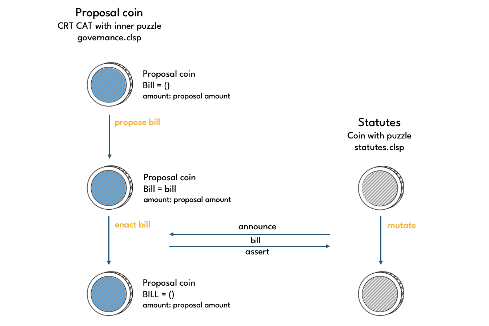

# Governance

Governance coins are CRT CATs with the [governance.clsp](https://github.com/circuitdao/puzzles/blob/main/circuit_puzzles/governance.clsp) puzzle as their inner puzzle. Governance coins are created from standard CRT coins on an ad hoc basis.

Governance can change all Statutes with a non-negative index. Governance is conducted by proposing and vetoing **bills**. A bill specifies exactly one Statute to be changed, its proposed new value, and the proposed new Constraints.

```bill = (Statute index, Statute value, Proposal Threshold, Veto Period, Implementation Delay, Maximum Delta) ```

There are two different modes governance coins can be in, **proposal mode** and **veto mode**. They both use the same puzzle, but have different operations performed on them.

## Operations

Puzzle that operations are performed on: [governance.clsp](https://github.com/circuitdao/puzzles/blob/main/circuit_puzzles/governance.clsp)

Owner operations:
* **Propose bill**: - puzzle: [governance_propose_bill.clsp](https://github.com/circuitdao/puzzles/blob/main/circuit_puzzles/programs/governance_propose_bill.clsp)
* **Reset bill**: - puzzle: [governance_reset_bill.clsp](https://github.com/circuitdao/puzzles/blob/main/circuit_puzzles/programs/governance_reset_bill.clsp)
* **Announce veto**: - puzzle: [governance_veto_announcement.clsp](https://github.com/circuitdao/puzzles/blob/main/circuit_puzzles/programs/governance_veto_announcement.clsp)
* **Veto bill**: - puzzle: [governance_veto_bill.clsp](https://github.com/circuitdao/puzzles/blob/main/circuit_puzzles/programs/governance_veto_bill.clsp)
* **Enact bill**: - puzzle: [governance_enact_bill.clsp](https://github.com/circuitdao/puzzles/blob/main/circuit_puzzles/programs/governance_enact_bill.clsp)

### Propose bill

A bill is proposed by creating an eve governance coin, which has bill = (), and spending it with a propose bill operation to set the bill to the desired value. The operation checks whether the proposed Statute change is permissible according to the Statute's Constraints. If the spend is successful, the governance coin is now in proposal mode.

### Reset bill

A governance coin in proposal mode can be reset to eve state via the reset bill operation.

### Veto bill

To veto a bill, an eve governance coin must be spent together with the proposal coin that it wants to veto. The former must be spent with the announce veto operation, the latter with the veto bill operation. The veto succeeds if the amount of CRT locked up in the veto coin is greater than the amount of CRT locked up in the proposal coin.


Note that proposal coins are able to veto other proposals. This prevents attack vectors in which a malicious actor could try to launch a number of benign proposals to get a large amount of CRT locked up in proposal mode, only to then launch a malicious proposal for which there wouldn't be enough CRT for a successful veto anymore.

### Enact bill

Once the Implementation Deplay has passed, the proposed bill can be enacted, i.e. the corresponding Statute updated as specified by the bill.


