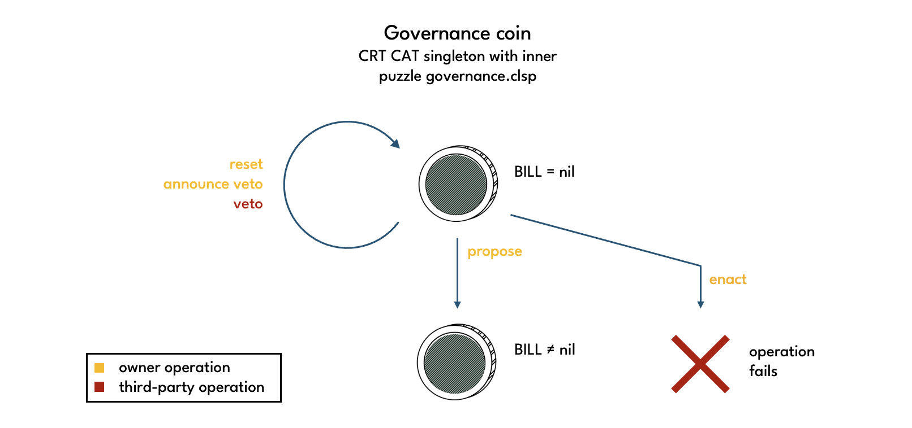
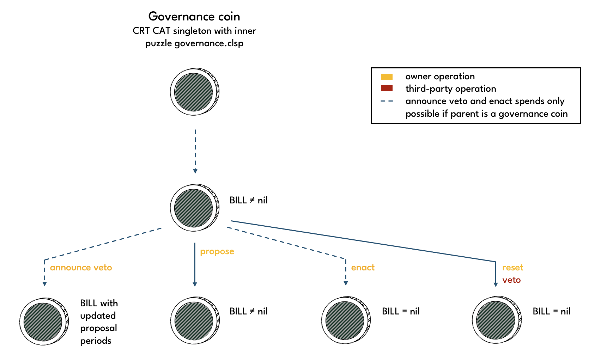
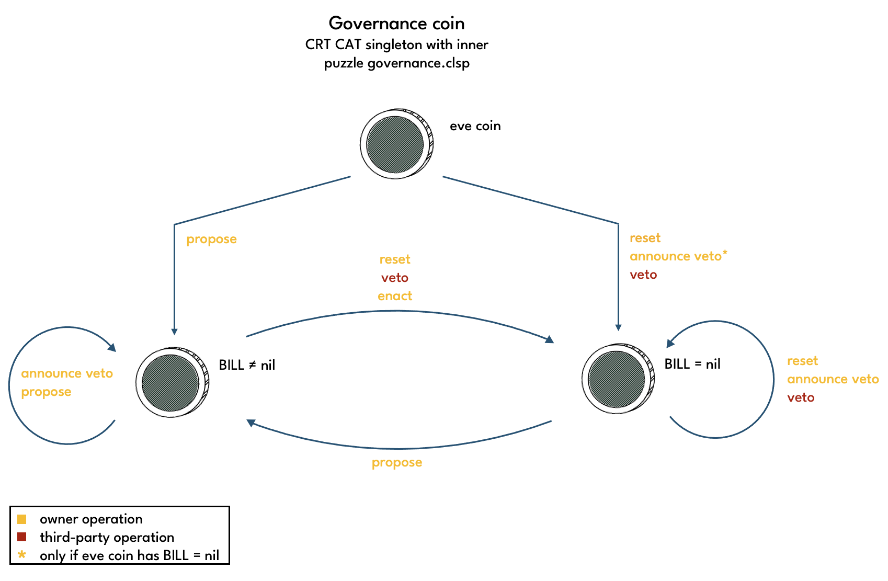
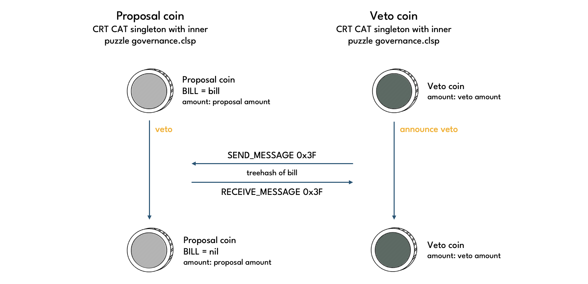
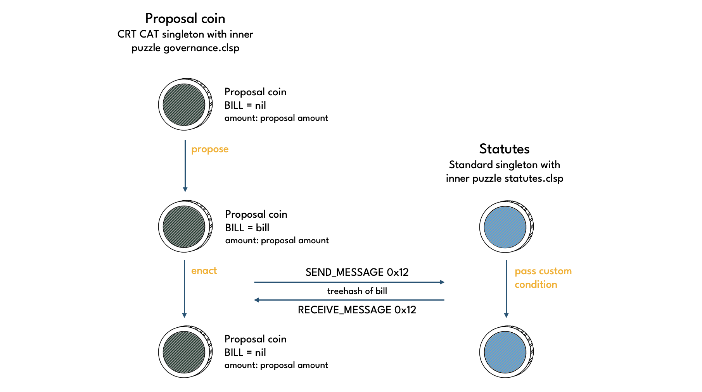

# Governance

Governance coins are CRT CAT singletons with the [governance.clsp](https://github.com/circuitdao/puzzles/blob/main/circuit_puzzles/governance.clsp) puzzle as their inner puzzle. Governance coins are created from standard CRT coins on an ad hoc basis.

Governance can change all Statutes with a non-negative index. Governance is conducted by proposing, and vetoing or enacting, **bills**. A bill specifies exactly one Statute to be changed, its proposed new value, and the proposed new Constraints. This is also referred to as the **bill proper**.

```
bill_proper = (
                statute_index
                statute_value
                proposal_threshold
                veto_period
                implementation_delay
                maximum_delta
              )
```

When a bill is proposed, it is passed to a governance coin via its solution. The proposed bill is stored in the ```BILL``` curried arg of the governance coin with two additional values prepended, the **Veto Period** and **Implementation Delay** of the Statute that the bill proposes to modify.

```
BILL =  ((veto_period . implementation_delay) bill_proper)
```

There are two different modes governance coins can be in, **proposal mode** and **veto mode**. A governance coin is in proposal mode if a propose operation was performed on it and ```BILL``` is not nil. Otherwise the governance coin is in veto mode.

A veto operation can be performed if the time that has passed since the proposal was created is less than the the Veto Period. Similarly, a proposal can be enacted only if both Veto Period and Implementation Delay have passed, and only as long as the **Enactment Period** has not ended. See the [governance process section](./governance#governance-process) in the User Guide for an illustration.

The owner of a governance coin can disable governance mode and get back a standard CRT coin by having the inner layer inner puzzle output a ```CREATE_COIN``` conditions with nil for its puzzle hash.

## Participating in governance

See the [Participating in Governance](./../category/participating-in-governance) section for information on how to participate in governance processes and considerations that should be taken into account when modifying Statutes.

## Operations

Puzzle that operations are performed on: [governance.clsp](https://github.com/circuitdao/puzzles/blob/main/circuit_puzzles/governance.clsp)

Owner operations:
* **propose**: - puzzle: [governance_propose_bill.clsp](https://github.com/circuitdao/puzzles/blob/main/circuit_puzzles/programs/governance_propose_bill.clsp)
* **reset**: - puzzle: [governance_reset_bill.clsp](https://github.com/circuitdao/puzzles/blob/main/circuit_puzzles/programs/governance_reset_bill.clsp)
* **announce veto**: - puzzle: [governance_veto_announcement.clsp](https://github.com/circuitdao/puzzles/blob/main/circuit_puzzles/programs/governance_veto_announcement.clsp)
* **enact**: - puzzle: [governance_enact_bill.clsp](https://github.com/circuitdao/puzzles/blob/main/circuit_puzzles/programs/governance_enact_bill.clsp)

Governance operations:
* **veto**: - puzzle: [governance_veto_bill.clsp](https://github.com/circuitdao/puzzles/blob/main/circuit_puzzles/programs/governance_veto_bill.clsp)

The operations enforce a number of rules that determine in which situations they can be applied. One needs to distinguish based on whether ```BILL``` is nil or non-nil and whether a governance coin is an eve coin or not.

If a governance coin has ```BILL``` equal to nil, then the only operation that will result in a non-nil bill is propose as shown in the diagram below.



When ```BILL``` is not nil, it is always possible to either propose, reset or veto. If the parent coin of the coin to be spent was a governance coin, then it is also possible to perform an announce veto or enact operation.



Combining the two diagrams it is clear that a bill can only be enacted if it was previously proposed. This prevents the creation of an eve governance coin with bill curried in and subsequent enactment without a prior proposal spend. Having a proposal spend is crucial as they place certain constraints on when enactment can take place, which for example ensures that there is veto period as defined in Statutes.



In the diagram above, a governance eve coin is shown at the top, with non-eve governance coins one level below. Enacting a bill is only possible if a propose operation was previously performed, possibly with one or more announce veto operations in between, which leave the proposed bill proper unchange and only affect the associated proposal periods.

### Propose

A bill is proposed by creating an eve governance coin, which has bill = (), and spending it with a propose bill operation to set the bill to the desired value. The operation checks whether the proposed Statute change is permissible according to the Statute's Constraints. If the spend is successful, the governance coin is now in proposal mode.

#### State changes

* ```BILL```: set to proposed bill
* ```INNER_PUZZLE_HASH```: can be changed

### Reset

A governance coin in proposal mode can be reset to eve state by its owner via the reset bill operation.

#### State changes

* ```BILL```: set to nil
* ```INNER_PUZZLE_HASH```: can be changed

### Veto

To veto a bill, the veto operation must be performed on the proposal coin containing the bill in question. At the same time, a veto coin must be spent with the announce veto operation as shown in the diagram below. The veto succeeds if the amount of CRT in the veto coin is greater than the amount of CRT in the proposal coin.



Note that proposal coins are able to veto other proposals. See the [announce veto section](./governance#announce-veto) for details.

Since the veto operation is performed not by the owner(s) of a governance coin, but an opposing group of CRT token holders, ```INNER_PUZZLE_HASH``` may not be changed. This is guaranteed by the ```validate-veto-conditions``` function.

#### State changes:

* ```BILL```: set to nil

### Announce veto

An announce veto operation is performed from a veto coin to veto the bill of a proposal coin. The veto succeeds if the amount of the veto coin is greater than the amount of the proposal coin. For details on the required coin spends see the [Veto section](./governance#veto) as both operations must be performed in parallel.

Note that it is possible to perform the announce veto operation not only from governance coins in veto mode, but also from those in proposal mode. This prevents outcomes to governance votes that do not reflect the view of all CRT holders due to CRT tokens being tied up in an existing proposal. In a worst case scenario this could be exploited by an attacker, by creating innocuous proposals only to then try to push through a nefarious proposal when a large amount of CRT is tied up in support of the innocuous proposals.

When an announce veto operation is performed on a proposal coin, the proposal periods of the bill are updated. Since proposal periods are measured relative to the timestamp of the last spend of the proposal coin, both Veto Period and Implementation Delay must be reduced to account for the time that has passed since the previous spend of the proposal coin. Note that it is the spender's responsibility to choose the reduction as large as permitted to avoid unnecessarily extending veto period or implementation delay.

#### State changes:
* ```BILL```: proposal periods get updated if Veto coin is in proposal mode
* ```INNER_PUZZLE_HASH```: can be changed

### Enact

Once the Implementation Deplay has passed, the proposed bill can be enacted, i.e. the corresponding Statute updated as specified by the bill.




#### State changes:
* ```BILL```: gets reset to nil.
* ```INNER_PUZZLE_HASH```: can be changed

## State and lineage

Fixed state:

* ```OPERATIONS```
* ```MOD_HASH```

Immutable state:

* ```CAT_MOD_HASH```: TODO: move to operations where it's needed?
* ```CRT_TAIL_HASH```
* ```STATUTES_STRUCT```

Mutable state:

* ```INNER PUZZLE HASH```
* ```BILL```

### Eve state

Governance coins do not have an enforced eve state. In practice, it is recommended to set ```BILL``` to the bill that one would like to propose in case of a proposal coin, or to to nil in case of a veto coin. This is the behaviour of the app.

### Amount

The amount of a governance coin depends on the amount of backing a proposal or veto has managed to attract.

### Lineage

By virtue of being CATs, governance coins require a standard CAT lineage proof to be spent. That governance coins are also custom singletons is enforeced by the governance mod by allowing only one ```CREATE_COIN``` condition to pass the ```filter-condition``` function.

Announce veto and enact operations both require that the coin they are being applied to had a governance coin as parent. This means that an eve governance coin cannot be spent by either operation. Reset and veto operations can be applied to an eve governance coin irrespective of the value of ```BILL```, but they both set ```BILL``` to nil. This is fine because a nil bill cannot be enacted. Effectively, the resulting governance coin can be thought of as an eve coin in its own right. This leaves propose as the only operation that can spend an eve governance coin.


If a governance coin has ```BILL``` equal to nil, only propose, announce veto and enact operations can be performed.  not equal to nil, then only propose, reset and veto operations can be performed on it.
