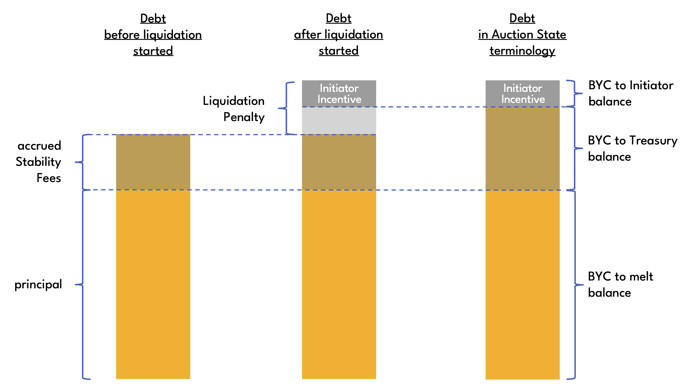
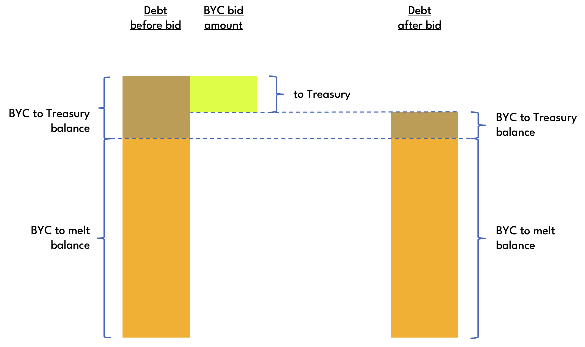

# Liquidation

To liquidate a collateral vault, a **liquidation auction** can be **start**ed. At that point, owner operations can no longer be performed on the vault, and Stability Fees stop accruing. In other words, starting a liquidation auction freezes the debt, and the borrower is relieved of their obligations. In return, the protocol seizes the collateral and auctions it off on-chain in an attempt to **recover** the debt from third parties.

The process of liquidating a vault involves one or more liquidation auctions. Liquidation auctions are Dutch auctions in which collateral is offered for BYC at successively lower prices until a **time out** is reached. If an auction fails to recover all debt and there is collateral left in the vault, it is possible to **restart** the auction.

If all debt has been recovered, the vault it returned to the control of its owner with any remaining collateral in it.

If debt remains to be recovered and there is no collateral left in the vault, then a restart is no longer possible, and the vault is said to have incurred **[Bad Debt](./bad_debt)**.

Since liquidation auctions are Dutch auctions, there is an initial **auction price**, the **Start Price**, which reduces at fixed time intervals by a fixed amount. The Start Price is defined as

```
Start Price = Statutes Price * Starting Price Factor
```

Auction price reductions take place after each **Step Interval** (```STATUTE_STEP_TIME_INTERVAL``` seconds). The amount of the reduction is **Step Size**, which is a fixed amount defined as

```
Step Size = Start Price * Auction Price Decrease Factor
```

where **Auction Price Decrease Factor** is given by ```STATUTE_AUCTION_PRICE_DECREASE_BPS```.

For example, if the Start Price is ```20.00 XCH/BYC``` and Auction Price Decrease Factor is ```5%```, then the Step Size is ```20.00 * 5% = 1.00```, and auction prices would be ```20.00```, ```19.00```, ```18.00```, ```17.00```, and so on until the auction times out.


## Operations

Puzzle that operations are performed on: [collateral_vault.clsp](https://github.com/circuitdao/puzzles/blob/main/circuit_puzzles/collateral_vault.clsp)

Keeper operations:
* **start auction**: start or restart a liquidation auction - puzzle: [vault_keeper_start_auction.clsp](https://github.com/circuitdao/puzzles/blob/main/circuit_puzzles/programs/vault_keeper_start_auction.clsp)
* **bid**: submit a bid in a liquidation auction - puzzle: [vault_keeper_bid.clsp](https://github.com/circuitdao/puzzles/blob/main/circuit_puzzles/programs/vault_keeper_bid.clsp)

### Start auction

Starts or restarts a liquidation auction. A liquidation auction can be started if the value of the collateral, valued at the **Statutes Price**, is less than or equal to the vault's outstanding debt. A liquidation auction can be restarted if it has timed out and there is both debt and collateral left.

The keeper that executes the start operation is referred to as the **initiator**. Executing the start operation entitles the initiator to the [initiator incentive](./../user-guide/liquidation#liquidation-incentives), which will get paid to the ```initiator_puzzle_hash``` supplied by the initiator.

When a collateral vault is liquidated, Stability Fees stop accruing and a **Liquidation Penalty** is added on top of the pre-liquidation debt. The Liquidation Penalty is defined to be a number of basis points of the pre-liquidation debt as given by ```STATUTE_VAULT_LIQUIDATION_PENALTY_BPS```.

Once the Liquidation Penalty has been added, the debt is split into three components for accounting purposes: **initiator incentive balance**, which is the initator incentive, **BYC to Treasury balance**, which is accrued Stability Fees plus any part of the Liquidation Penalty that wasn't allocated to the initiator incentive, and **BYC to melt balance**, which is the principal. These are reduced successively with each bid.

```
debt = initiator incentive balance + BYC to Treasury balance + BYC to melt balance
```



A vault keeps track of the state of a Liquidation Auction in the ```AUCTION_STATE``` curried arg. Auction state variables are:

* ```auction_start_time```: timestamp of when auction was (re-)started
* ```start_price```: price at which auction starts. calculated as Statutes Price * **Starting Price Factor**
* ```step_price_decrease_factor```: factor by which auction price decreases in each step of auction
* ```step_time_interval```: number of seconds for which an auction price is valid before it gets reduced again
* ```initiator_puzzle_hash```: puzzle hash at which the initiator has opted to receive the initiator incentive
* ```initiator_incentive_balance```: remaining initiator incentive to be paid to initiator
* ```auction_ttl```: amount of time before auction times out
* ```byc_to_treasury_balance```: remaining debt to be paid to treasury
* ```byc_to_melt_balance```: remaining debt to be melted
* ```minimum_bid_amount```: minimum amount of BYC that must offered in a bid
* ```min_price```: auction price below which it is not possible to place bids

Auction state variables are immutable until the auction finishes except for the three components that make up the remaining debt:
* ```initiator_incentive_balance```
* ```byc_to_treasury_balance```
* ```byc_to_melt_balance```

Note that the curried args ```PRINCIPAL``` and ```DISCOUNTED_PRINCIPAL``` are not needed while a vault is in liquidation and are set to 0 until control has been returned to the owner.

#### State changes

* ```AUCTION_STATE```: initialisation of all auction state variables
* ```PRINCIPAL```: set to 0
* ```DISCOUNTED_PRINCIPAL```: set to 0

### Bid

Once started, keepers can bid in the liquidation auction until it times out or the **Minimum Auction Price** is reached.

Although liquidation auctions have an implicit minimum auction price given by the parameters ```start_price```, ```step_price_decrease_factor```, ```step_time_interval```, and ```auction_ttl```, it needs a small calculation to determine. To make it straightforward for borrowers to verify what percentage of their collateral they can lose at most per liquidation auction, the Minimum Auction Price sets a lower bound on the auction price below which it is not possible to place bids until the auction times out and is restarted.

If it is currently possible to place a bid in a liquidation auction, the auction is referred to as **biddable**. A liquidation auction that can be restarted is referred to as **restartable**. The existence of the Minimum Auction Price means that an auction can temporarily be in a state where it is neither biddable nor restartable if Minimum Auction Price is set to a value greater than the implicity minimum auction price.

Bidders specify how much of the remaining debt they would like to repay. This is the **BYC bid amount**. The collateral vault puzzle calculates the **XCH bid amount**, which is the amount of collateral that the bidder receives in return based on the current auction price.

The auction price is calculated based on the time that has passed since the start of the auction, **Price Validity** (```step_time_interval```) and **Price Decrease Factor** (```step_price_decrease_factor```). See the [Liquidation Auction](./../user-guide/liquidation#liquidation-auction) section in the User Guide for a diagram.

BYC bid amounts are applied against any remaining debt in the following order:
* Initiator Incentive balance
* BYC to Treasury balance
* BYC to melt balance
In other words, only once the Initiator has received the full Initiator Incentive is any BYC transferred to Treasury. And only once the Treasury has received the full amount it is due does any BYC get melted.


The diagram above illustrates how the BYC amount of a bid is allocated. In this concrete example, the bid is quite large, resulting in both Initiator and Treausry getting fully paid, leaving only some debt in the form of BYC to melt balance.

The next diagram shows a mid-auction bid. The initiator has been fully paid, but the Treasury is still owed some BYC. The bid in this example is fairly small, resulting in only some of the BYC owed to Treasury to be repaid, leaving a positive BYC to Treasury balance and and unchanged BYC to melt balance.



A bid requires several coin spends. Depending on how much of the total debt has already been repaid and the size of a bid, any of the three destinations of the BYC bid amount is optional. For example if the Initiator has been fully paid already, but not the Treasury, a small bid would have its entire BYC bid amount paid into the Treasury. This means only the Treasury coin spend would be required but no BYC tail reveal for melting and no spend to a settlement coin to pay the Initiator.


Note that a bid requires a Statutes coin spend only if BYC is being repaid to Treasury. If this is the case, then the amount repaid to Treasury must exceed the **Minimum Treasury Delta**.

If a liquidation auction has timed out and all the debt has been recovered, the liquidation was successful. The vault is released back to the borrower together with any collateral that wasn't claimed in the auction.

:::danger
It is the bidder's responsibility to ensure the BYC bid amount does not exceed what is necessary to claim the remaining collateral in the vault. Any excess BYC will be lost.
:::

The amount of collateral a bidder receives is the minimum of BYC bid amount divided by the current Auction Price and the amount of collateral left in the vault. This means that if the BYC bid amount is chosen too large, the protocol will use it to extinguish debt without delivering any XCH in return, which means that effectively the bidder has acquired collateral at a price above the current Auction Price.

If a Liquidation Auction has timed out without all debt having been recovered it can be restarted via the start auction operation, unless there is no collateral left in the vault, in which case the vault is said to have incurred Bad Debt.

#### State changes

* ```COLLATERAL```
* ```AUCTION_STATE```:
  * ```initiator_incentive_balance```
  * ```byc_to_treasury_balance```
  * ```byc_to_melt_balance```
