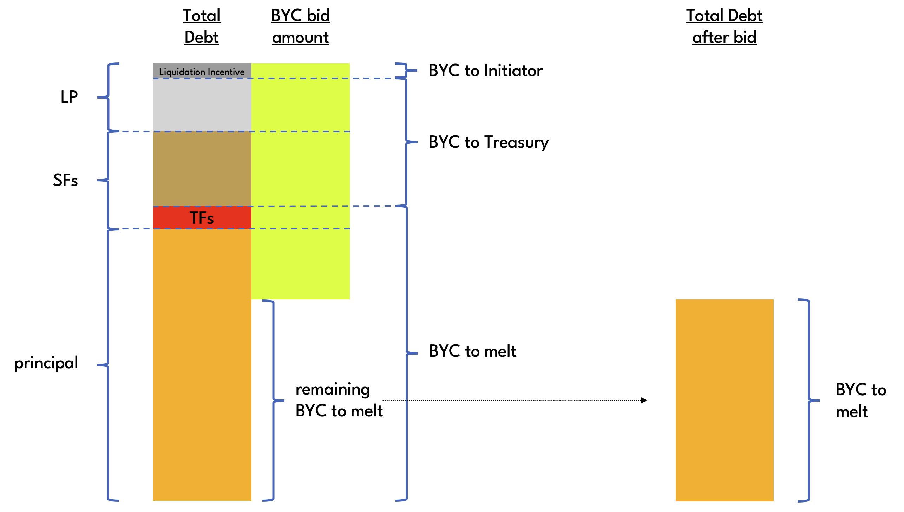
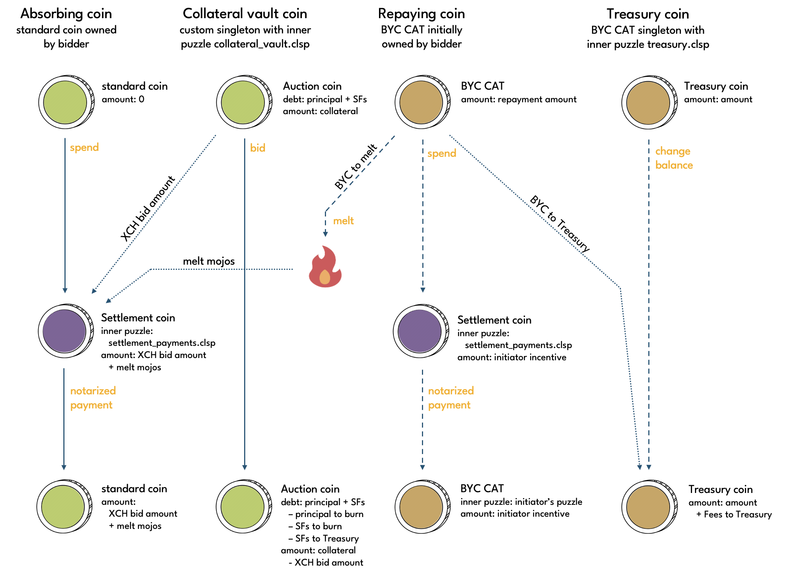
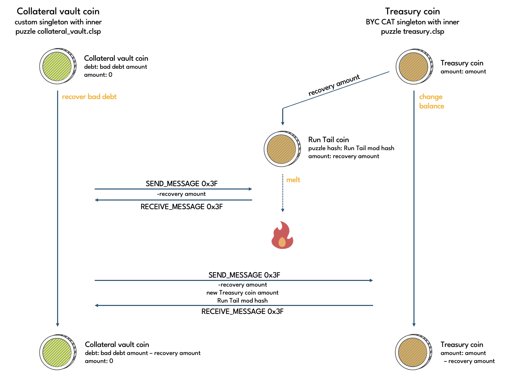

# Liquidation

When a collateral vault liquidation is triggered, owner operations can no longer be performed on the vault and Stability Fees stop accruing on the vault's outstanding debt <!--TODO: this is not currently the case. debt keeps accruing until it's either been fully repaid or bad debt is incurred-->. In other words, triggering a liquidation freezes the debt, and the borrower is relieved of their obligations. In return, the protocol seizes the collateral and auctions it off on-chain in an attempt to recover the debt from third parties.

Liquidation auctions are Dutch auctions that either recover all debt or eventually time out. If a timeout occurs without all debt having been recovered but with collateral left in the vault, then a liquidation auction can be restarted by calling the start operation again. If a timeout occurs without all debt having been recovered and with no collateral left in the vault, then a restart is no longer possible, and the vault is said to have incurred **Bad Debt**.

Throughout liquidation and bad debt recovery processes, any remaining debt is enforced to be greater than the **Minimum Debt Amount**. This prevents vaults being left with small amounts of debt that are uneconomical to recover.

## Operations

Puzzle that operations are performed on: [collateral_vault.clsp](https://github.com/circuitdao/puzzles/blob/main/circuit_puzzles/collateral_vault.clsp)

Keeper operations:
* **start auction**: start a liquidation auction - puzzle: [vault_keeper_start_auction.clsp](https://github.com/circuitdao/puzzles/blob/main/circuit_puzzles/programs/vault_keeper_start_auction.clsp)
* **bid**: submit a bid in a liquidation auction - puzzle: [vault_keeper_bid.clsp](https://github.com/circuitdao/puzzles/blob/main/circuit_puzzles/programs/vault_keeper_bid.clsp)
* **recover bad debt**: extinguish bad debt - puzzle: [vault_keeper_recover_bad_debt.clsp](https://github.com/circuitdao/puzzles/blob/main/circuit_puzzles/programs/vault_keeper_recover_bad_debt.clsp)

### Start auction

Starts or restarts a liquidation auction. A liquidation auction can be started if the value of the collateral, valued at the Statutes Price, is less than or equal to the vault's outstanding debt. The keeper that executes the start operation is referred to as the **initiator**. Executing the start operation entitles the initiator to the [liquidation incentives](./../user-guide/liquidation#liquidation-incentives).

When a Liquidation Auction is started, the vault's debt gets frozen, i.e. Stability Fees stop accruing. On top of the debt, a Liquidation Penalty is applied, which is a number of basis points as set in ```STATUTE_VAULT_LIQUIDATION_PENALTY_BPS```. The sum of debt and Liquidation Penalty is the **total debt**. The aim of the Liquidation Auction is to recover the total debt by auctioning off the vault's collateral.

```
initial_total_debt = debt + liquidation_penalty
```

When a Liquidation Auction gets started, total debt split into three components: **initiator incentive**, **BYC to Treasury**, and **BYC to melt**. These are reduced successively with each bid. Remaining balances of each are kept track of in the ```AUCTION_STATE``` curried arg.

```
remaining_total_debt = initiator_incentive_balance + byc_to_treasury_balance + byc_to_melt_balance
```

When the auction is started, initiator incentive is set to be the Liquidation Incentive, BYC to Treasury is defined as LP plus SFs minus Liquidation Incentive minus Transferred Fees, and BYC to melt is defined to be principal plus Transferred Fees. See the diagram in the [Bid](./liquidation#bid) operation section. Since these three quantities are being used to keep account of the vault's remaining total debt over the course of the Liquidation Auction, the curried args ```PRINCIPAL```, ```TRANSFERRED_FEES``` and ```DISCOUNTED_PRINCIPAL``` are no longer needed and are set to 0.

A vault keeps track of the state of a Liquidation Auction in the ```AUCTION_STATE``` curried arg. Auction state variables are:

* ```auction_start_time```: timestamp of when auction was (re-)started
* ```start_price```: price at which Dutch auction starts. calculated as Statutes Price * Starting Price Factor
* ```step_price_decrease_factor```: factor by which auction price decreases in each step of Dutch auction
* ```step_time_interval```: number of seconds for which an auction price is valid before it gets reduced again
* ```initiator_puzzle_hash```: puzzle hash at which the initiator has opted to receive the Liquidation Incentive
* ```initiator_incentive_balance```: remaining liquidation incentive still to be paid to initiator
* ```auction_timeout```: time until auction times out
* ```minimum_debt_amount```: minimum debt that must remain if not paid off entirely
* ```byc_to_treasury_balance```: remaining share of debt to be paid to treasury
* ```byc_to_melt_balance```: remaining share of debt to be melted

Auction state variables are immutable until the auction finishes except for the three components that make up remaining total debt:
* ```initiator_incentive_balance```
* ```byc_to_treasury_balance```
* ```byc_to_melt_balance```

#### State changes

* ```TRANSFERRED_FEES```: set to 0
* ```AUCTION_STATE```: initialisation of all auction state variables
* ```PRINCIPAL```: set to 0
* ```DISCOUNTED_PRINCIPAL```: set to 0

### Bid

Once started, keepers can bid in the liquidation auction until it times out.

Bidders specify how much of the remaining debt owed to the vault they would like to repay. This is the **BYC bid amount**. The collateral vault puzzle calculates the **XCH bid amount**, which is the amount of collateral that the bidder receives in return based on the current auction price.

The auction price is calculated based on the time that has passed since the start of the auction, **Price Validity** (```step_time_interval```) and **Price Decrease Factor** (```step_price_decrease_factor```). See the [Liquidation Auction](./../user-guide/liquidation#liquidation-auction) section in the User Guide for a diagram.

BYC bid amounts are applied against any remaining debt in the following order:
* Liquidation Incentive
* BYC to Treasury
* BYC to melt
In other words, only once the Initiator has received the full Liquidation Incentive is any BYC transferred to Treasury. And only once the Treasury has received the full amount it is due does any BYC get melted.



The diagram above illustrates how BYC bid amounts are allocated. In this concrete example, both Initiator and Treausry are being fully paid, and there is only some BYC left to melt to extinguish what remains of the total debt, i.e. any further bids would have their entire BYC bid amounts melted.

A coin spend diagram for a Liquidation Auction bid is shown below. Depending on how much of the total debt has already been repaid and the size of a bid, any of the three destinations of the BYC bid amount is optional. For example if the Initiator has been fully paid already, but not the Treasury, a small bid would have its entire BYC bid amount paid into the Treasury. This means only the Treasury coin spend would be required but no BYC tail reveal for melting and no spend to a settlement coin to pay the Initiator.



If a liquidation auction has timed out and all the debt has been recovered, the liquidation was successful. The vault is released back to the borrower together with any collateral that wasn't claimed in the auction.

:::danger
It is the bidders responsibility to ensure the BYC bid amount does not exceed what is necessary to claim the remaining collateral in the vault. Any excess BYC will be lost.
:::

The amount of collateral a bidder receives is the minimum of BYC bid amount divided by the current Auction Price and the amount of collateral left in the vault. This means that if the BYC bid amount is chosen too large, the protocol will use it to extinguish debt without delivering any XCH in return, which means that effectively the bidder has acquired collateral at a price above the current Auction Price.

If a Liquidation Auction has timed out without all debt having been recovered it can be restarted via the start auction operation, unless there is no collateral left in the vault, in which case the vault is said to have incurred Bad Debt.

#### State changes

* ```COLLATERAL```
* ```AUCTION_STATE```:
  * ```initiator_incentive_balance```
  * ```byc_to_treasury_balance```
  * ```byc_to_melt_balance```

### Recover Bad Debt

A liquidation fails if all collateral has been sold off to bidders without all debt having been repaid to the vault. The remaining debt minus any Stability Fees that have not been transferred to Treasury is referred to as Bad Debt. Bad Debt can be recovered via the recover Bad Debt operation, which melts BYC from the Treasury to extinguish the Bad Debt.



If there isn't enough BYC in the Treasury to cover the entire Bad Debt amount, keepers can refill the Treasury by [transferring Stability Fees](./collateral-vault#transfer-stability-fees) from collateral vaults that are neither in liquidation nor have incurred Bad Debt. Alternatively, it is possible to hold [Recharge Auctions](./recharge-auction) to refill the Treasury, or to extinguish only part of the Bad Debt.

Once all bad debt has been recovered, ```AUCTION_STATE``` is set to nil. This returns the vault to eve state and hands control back to its owner.

Note that the initiator is not entitled to any upaind initiator incentive if the vault is in bad debt.

#### State changes

* ```AUCTION_STATE```: set to nil if all bad debt extinguished
  * ```initiator_incentive_balance```
  * ```byc_to_treasury_balance```
  * ```byc_to_melt_balance```
