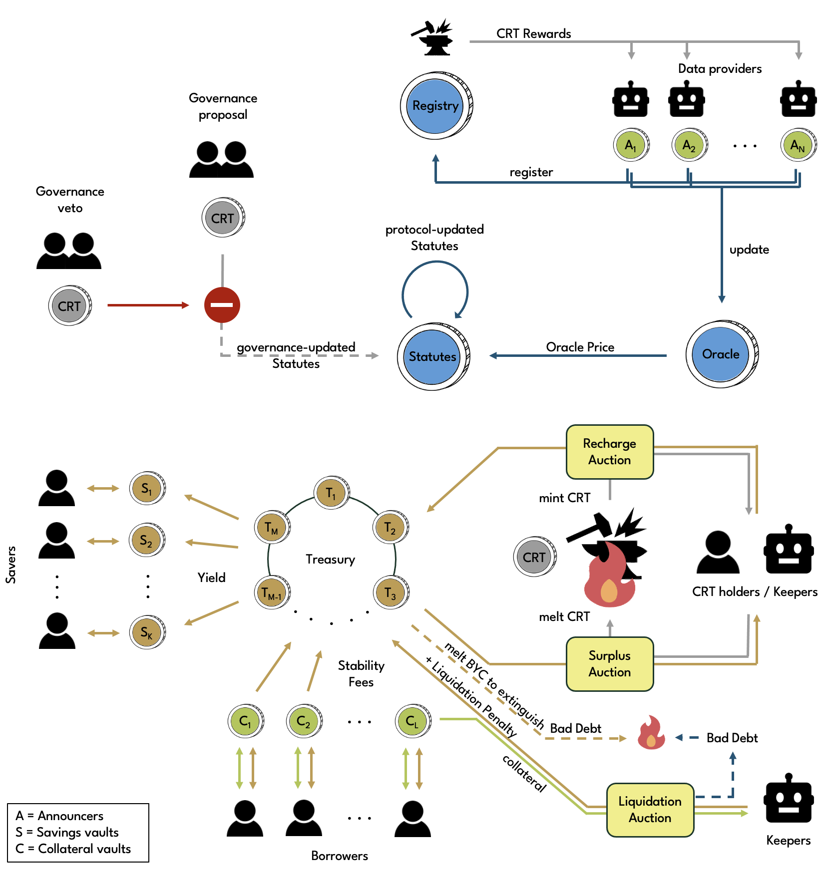

# Overview

The Technical Manual is intended for advanced users, keepers, and Oracle data providers that would like to gain an in-depth understanding of the inner workings of the protocol.

For every protocol component, the manual explains what their purpose is and which puzzles are involved.

## Protocol coins

Coins that are part of the protocol are referred to as **protocol coins**. The diagram below gives a high-level overview of how protocol coins interact with each other.

### List of protocol coins

Below is a complete list of protocol coin types. All protocol coins are singletons. Some protocol coins are unique, i.e. only one instance of the same type exists in the entire protocol, whereas there can be multiple instances of others. Unique singletons only hold a nominal amount (0 or 1 mojos), whereas the amount of other coins can vary. Some coins have an owner, which means that some or all operations on the coin can be performed only by the owner, whereas other coins can be spent by certain third parties or, in some cases, by anyone.

* [Statutes](https://github.com/circuitdao/puzzles/blob/main/circuit_puzzles/statutes.clsp) - unique standard singleton
* [Oracle](https://github.com/circuitdao/puzzles/blob/main/circuit_puzzles/oracle.clsp) - unique standard singleton
* [Announcer Registry](https://github.com/circuitdao/puzzles/blob/main/circuit_puzzles/announcer_registry.clsp) - unique custom singleton
* [Announcers](https://github.com/circuitdao/puzzles/blob/main/circuit_puzzles/atom_announcer.clsp) - custom singleton with owner
* [Treasury coins](https://github.com/circuitdao/puzzles/blob/main/circuit_puzzles/treasury.clsp) - BYC CAT singleton
* [Recharge Auction coins](https://github.com/circuitdao/puzzles/blob/main/circuit_puzzles/recharge_auction.clsp) - BYC CAT singleton
* [Surplus Auction coin](https://github.com/circuitdao/puzzles/blob/main/circuit_puzzles/surplus_auction.clsp) - CRT CAT singleton
* [Payout coin](https://github.com/circuitdao/puzzles/blob/main/circuit_puzzles/payout.clsp) - BYC CAT singleton
* [Collateral vaults](https://github.com/circuitdao/puzzles/blob/main/circuit_puzzles/collateral_vault.clsp) - custom singleton with owner
* [Savings vaults](https://github.com/circuitdao/puzzles/blob/main/circuit_puzzles/savings_vault.clsp) - BYC CAT singleton with owner
* [Governance launcher coins](https://github.com/circuitdao/puzzles/blob/main/circuit_puzzles/governance_launcher.clsp) - ephemeral CRT CAT
* [Governance coins](https://github.com/circuitdao/puzzles/blob/main/circuit_puzzles/governance.clsp) - CRT CAT singleton with owner
* [Governance exit coins](https://github.com/circuitdao/puzzles/blob/main/circuit_puzzles/governance_exit.clsp) - ephemeral CRT CAT

Ordinary Bytecash ([BYC](https://github.com/circuitdao/puzzles/blob/main/circuit_puzzles/byc_tail.clsp)) and governance ([CRT](https://github.com/circuitdao/puzzles/blob/main/circuit_puzzles/crt_tail.clsp)) coins are not considered protocol coins.

## Operations

For each protocol coin page deals with operations that can be performed on a given protocol coin. Operations are grouped by who can perform them.

* **Owner**: The person that owns or controls a coin. Applies to:
  * Collateral vaults
  * Savings vaults
  * Announcers
  * Governance
* **Keeper**: This can be anyone, but in practice are often professional trading firms that operate bots or automated trading infrastructure. Applies to:
  * Statutes
  * Oracle
  * Announcers
  * Collateral vaults
  * Recharge Auction
  * Surplus Auction
* **Governance**: A group of CRT token holders. Governance operations require a corresponding governance coin spend. Applies to:
  * Statutes
  * Announcer
  * Treasury
  * Recharge Auction
  * Governance
* **Approval mod**: One of the [Approval mods](./advanced-topics/approval-mods) is needed to authorise the operation. The corresponding Approval coin spend can be an owner, keeper or Announcer operation. Applies to:
  * Treasury
  * BYC Tail
  * CRT Tail
* **Announcer**: The owner of an Announcer must authorise the operation. Applies to:
  * Announcer Registry
* **Protocol deployer**: The person deploying the protocol. These operations must be performed at protocol launch. Applies to:
  * Announcer Registry
  * CRT Tail

For a visualisation of all operations and their interdependencies, see the [inter-coin communication](./advanced-topics/inter-coin-communication) page.

<!--Also shown is the corresponding [driver hint](./design-decisions#driver-hints).-->

## State and Lineage

On every page dedicated to a protocol coin type, there is a State and Lineage section which breaks down the curried args of the corresponding mod into fixed, immutable and mutable state variables, and provides information on eve state, amount of the coin, and required lineage proofs.
