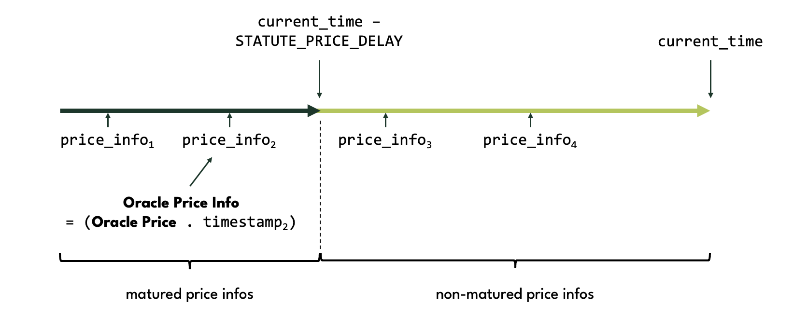
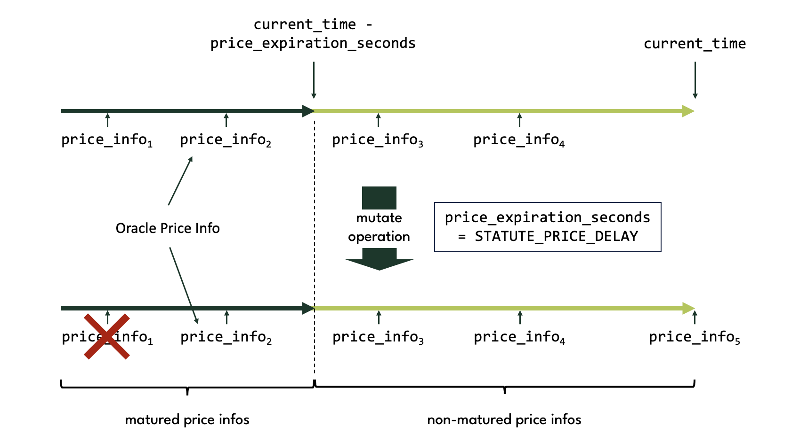

# Price Oracle

The Price Oracle, or Oracle for short, is a standard singleton with inner puzzle [oracle.clsp](https://github.com/circuitdao/puzzles/blob/main/circuit_puzzles/oracle.clsp).

It's main purpose is to provide an XCH/USD price to the Protocol. This price is referred to as the **Oracle Price**.

However, the Protocol does not dirctly query the Oracle for the Oracle Price when performing operations. Instead, it keeps a copy of the Oracle Price in the state of the Statutes coin, the **Statutes Price**, and uses this value for all protocol-internal operations that require the XCH/USD price. This has the benefit of not having to spend the Oracle coin every time an operation needs access to the XCH/USD price.

Also, note that the Oracle Price, and hence the Statutes Price, is delayed vs the XCH/USD price published by the Announcers. The delay is given by the ```STATUTE_PRICE_DELAY``` Statute. This is a last-resort protection for protocol users against failing or misbehaving Announcers, and allows them to take action before an incorrect Statutes Price becomes effective. E.g. a borrower could repay all their loans before getting liquidated on the basis of an incorrect Statutes Price.

## Price infos

Because the Statutes Price is delayed, the Oracle keeps a price history in the ```PRICE_INFOS``` state variable. ```PRICE_INFOS``` is a list of **price infos**, where each price info is a two-element struct consisting of a price and corresponding timestamp. Each such price is referred to as an **Oracle price** ('price' with a lower 'p').

```
PRICE_INFOS = (price_info_1 ... price_info_n)
            = ((price_1 . timestamp_1) ... (price_n . timestamp_n))
```

Price infos in the ```PRICE_INFOS``` state variable are ordered in ascending chronological order, i.e. the price info with the lowest (i.e. oldest) timestamp comes first, the one with the highest (i.e. most recent) timestamp last.

A price info is called **matured** if its timestamp is less than the current timestamp minus ```STATUTE_PRICE_DELAY```.

Below an example where ```PRICE_INFOS``` contains four price infos, two of them matured, two of them not matured.



The **Oracle Price Info** is defined to be the matured price info with the most recent timestamp. The price contained in this price info is the Oracle Price.

## Upgradability

The Oracle is tied to Circuit protocol more loosely than other components. Conceptually, this makes sense because providing off-chain data on-chain is at its core a standalone activity that could be performed independently of Circuit protocol.

The main contact point between the Oracle and the rest of Circuit is the [update price operation](./statutes#update-price) of Statutes. This is a fairly generic operation which could also be implemented by other protocols that want to use the prices provided by the Oracle. The operation asserts the following message from a puzzle announcement:

```
(sha256tree (c price (c updated_timestamp (c current_timestamp STATUTE_PRICE_DELAY)))))
```

It also verifies that the puzzle from which the announcement is broadcast is that of a standard singleton with launcher ID given by ```STATUTE_ORACLE_LAUNCHER_ID```. Since this Statute is mutable, governance can replace the Oracle with another standard singleton that is able to announce the above message.

In theory, it would be possible for a different Oracle to use Announcers with different announcer mod (or not have Announcers at all). In this case however a crucial feature of the Oracle design would get lost, namely the ability for the protocol to reward data providers. Since the Announcer mod hash is hardcoded in the Announcer Registry mod, which in turn is hardcoded as an Approval mod, it would no longer be possible to claim Rewards from the Announcer Registry, and would remove the incentive structure that helps retain high quality data providers.

## Operations

Puzzle that operations are performed on: [oracle.clsp](https://github.com/circuitdao/puzzles/blob/main/circuit_puzzles/oracle.clsp)

The Oracle does not have an owner.

Keeper operations:

* **mutate**: update Oracle price infos - puzzle: [oracle_mutation.clsp](https://github.com/circuitdao/puzzles/blob/main/circuit_puzzles/programs/oracle_mutation.clsp)
* **announce**: announce the Oracle Price Info - puzzle: [oracle.clsp](https://github.com/circuitdao/puzzles/blob/main/circuit_puzzles/oracle.clsp)

### Mutate

The mutate operation updates the ```PRICE_INFOS``` state variable. This is also referred to as **updating the Oracle price**.

Firstly, the mutate operation creates a new price info struct and appends it to ```PRICE_INFOS```. The new price info is generated by selecting at least **M-of-N** Announcers and announcing their prices. The mutate operation then calculates a new price as the (lower) median of the selected Announcer prices. This new price together with the current timestamp forms the new price info.

Secondly, the mutate operation also trims the ```PRICE_INFOS``` list.

The mutate operation retains only the most recent matured price info as well as all non-matured price infos. All other matured price infos are discarded. These are the **trimmed Oracle prices**.



The diagram above illustrates how the mutate operation updates ```PRICE_INFOS```. Initially, ```PRICE_INFOS``` contains four price infos, two of them matured, two of them not matured. One  discarded, and a new price info appended to ```PRICE_INFOS```. In this particular example, one price info gets discarded (```price_info_1```), leaving the total number of price infos stored in ```PRICE_INFO``` unchanged.

Note that it is possible for there to be no matured price info. This can happen immediately after protocol deployment or if governance has increased ```STATUTE_PRICE_DELAY```.

#### State changes

* ```PRICE_INFOS```: The mutate operation appends exactly one new price info to the ```PRICE_INFOS``` list. It may discard zero or more price infos from the beginning or the ```PRICE_INFOS``` list.

### Announce

The primary purpose of the announce operation is to update the Statutes Price. The Oracle coin announces the **Oracle Price Info**, which is asserted by a price update spend of the Statutes coin. When used in this way, the announce operation must use ```STATUTE_PRICE_DELAY``` for the ```price_delay``` argument of the solution, so that the price info announced by the Oracle is the most recent price info with ```timestamp < current_time - STATUTE_PRICE_DELAY```.

#### State changes

The announce operation does not change the state of the Oracle. In particular, it does not trim the ```PRICE_INFOS``` list.

## State and lineage

Fixed state:
* ```MUTATION_PROGRAM_HASH```

Immutable state:
* ```MOD_HASH```
* ```STATUTES_STRUCT```

Mutable state:
* ```PRICE_INFOS```

### Eve state

The eve state of the Oracle has ```PRICE_INFOS = (list (price . timestamp))```, which is set by the protocol deployer. Here, ```price``` should be the current price, ideally derived from Announcers that are already running and derived using the same methodology that Oracle mutate operation uses, and ```timestamp``` should simply be the current timestamp at the time of deployment.

### Amount

The amount of the Oracle coin is always 1.

### Lineage

Since the Oracle is a standard singleton, it requires a [standard lineage proof](https://chialisp.com/singletons/#code) to be spent.
