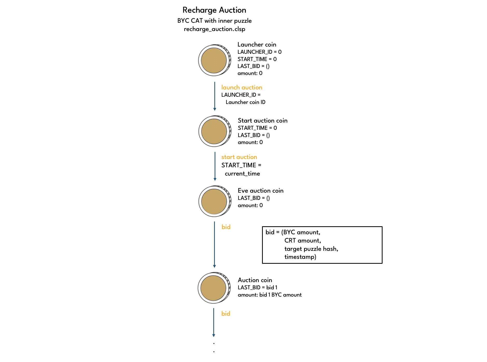
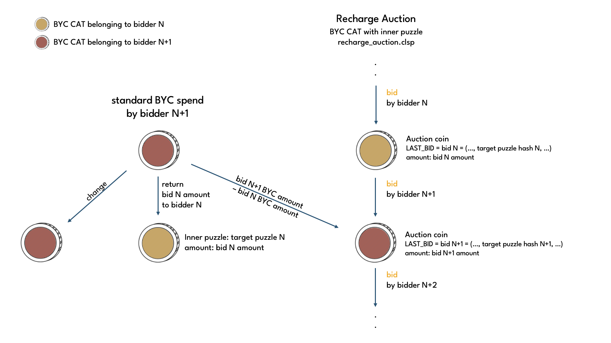
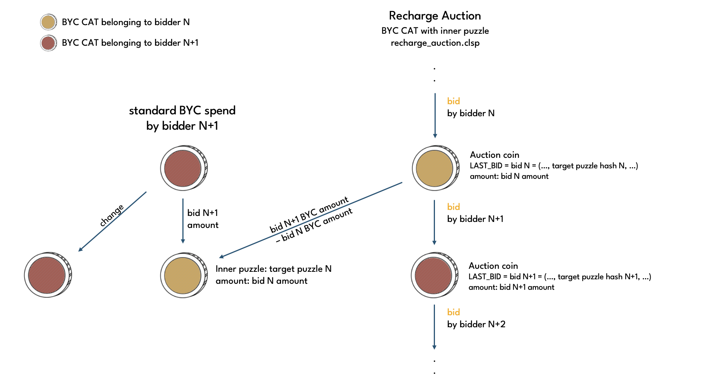
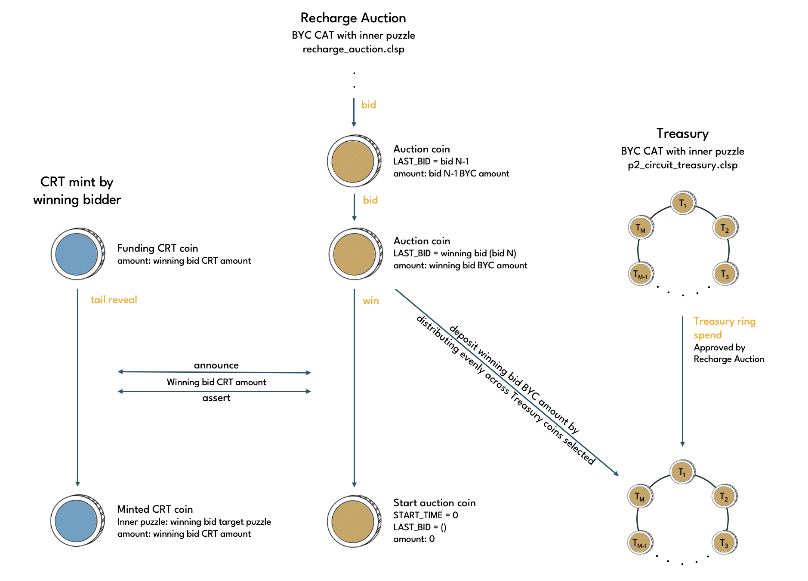

# Recharge Auction

A Recharge Auction is a BYC CAT with [recharge_auction.clsp](https://github.com/circuitdao/puzzles/blob/main/circuit_puzzles/recharge_auction.clsp) puzzle as inner puzzle. The inner puzzle turns the Recharge Auction coin into a singleton.

### Eve state and lineage

Recharge auction coins have an enforced eve state:

* LAUNCHER_ID = 0
* START_TIME = 0
* LAST_BID = ()

Recharge auction launcher, stand-by and start auction coins have amount = 0.

Due to enforced eve state and eve amount, the launch operation does not require a lineage proof. All other operations require the following lineage proof:

```(parent parent coin ID, parent curried args hash,  parent amount)```

## Operations

Puzzle that operations are performed on: [recharge_auction.clsp](https://github.com/circuitdao/puzzles/blob/main/circuit_puzzles/recharge_auction.clsp)

Keeper operations:
* **Launch**: launch a recharge auction - puzzle: [recharge_launch.clsp](https://github.com/circuitdao/puzzles/blob/main/circuit_puzzles/programs/recharge_launch.clsp)
* **Start**: start a recharge auction - puzzle: [recharge_start_auction.clsp](https://github.com/circuitdao/puzzles/blob/main/circuit_puzzles/programs/recharge_start_auction.clsp)
* **Bid**: submit a bid in recharge auction - puzzle: [recharge_bid.clsp](https://github.com/circuitdao/puzzles/blob/main/circuit_puzzles/programs/recharge_bid.clsp)
* **Win**: mint CRT into winning bidder's address, deposit BYC offered to Treasury - puzzle: [recharge_win.clsp](https://github.com/circuitdao/puzzles/blob/main/circuit_puzzles/programs/recharge_win.clsp)

Recharge auctions have a relatively long bid timeout, making it feasible to participate manually.

### Launch

To launch a Recharge Auction, first a Recharge Auction Launcher coin must be created. The launcher coin is the eve coin of the Recharge Auction. It's a BYC CAT with inner puzzle recharge_auction.clsp in eve state. The launcher coin is then spent with the launch operation to launch the Recharge Auction. The child Recharge Auction coin is referred to as the Recharge Stand-by coin.

TODO: change terminologoy in diagrams (Launcher coin (eve coin) --- launch (eve spend) ---> Stand-by coin --- start auction ---> Start auction coin --- bid ---> Auction coin --- win ---> Stand-by coin --- bid ---> ...)

TODO: explain how governance can launch Recharge Auction coins.



#### State changes

* LAUNCHER_ID: 0 -> eve coin ID

### Start

Spends a Stand-by coin to create a Start auction coin. This sets the start time of the auction. The Start auction coins does not constitute a bid yet.

#### State changes

* START_TIME: 0 -> current time

### Bid

Spends a Start auction or Auction coin to place a bid in the auction. A bid is passed in via the solution and has the following form:

```bid = ((BYC bid amount . CRT bid amount), target puzzle hash, timestamp)```

The child coin has the bid placed curried into the LAST_BID curried arg.

The target puzzle hash is a CAT inner puzzle hash. It will receive the CRT bid amount should the bid turn out to be the winning bid. If the bid is outbid, the BYC held in the Auction coin is refunded to the target puzzle hash. In either case, it is the bidder's responsibility to provide a target puzzle hash at which they can receive and access coins.

The BYC bid amount of a bid may be smaller or larger than that of the previous bid as long as it is greater than the Recharge Auction Minimum Bid Amount. If it is larger than in the previous bid, then the bidder needs to make a contribution bid.



If the new BYC bid amount is smaller than the previous one, the bidder must return the difference to the previous bidder.



#### State changes

* LAST_BID:
    * first bid: () -> ((byc_bid_amount . crt_bid_amount) target_puzzle_hash current_timestamp)
    * subsequent bids: -> ((byc_bid_amount . crt_bid_amount) target_puzzle_hash current_timestamp)
* amount:
    * first bid: 0 -> amount of BYC bid
    * subsequent bids: -> amount of BYC bid

### Win

Once the auction has concluded, the winner can mint an amount of CRT as specified in the bid by asserting the corresponding announcement from the auction coin. The BYC amount bid gets paid to the Treasury. Keepers should aim for an even distribution of BYC among Treasury coins by selecting a suitable Treasury sub-ring.

A new Stand-by coin is automatically created. If the Treasury balance is still below the Treasury Minimum, then bidding can commence immediately. Otherwise, the Recharge Auction coin stays idle until the conditions for a Recharge Auction are satisfied again.



Note that the launcher ID of the Recharge Auction coin only changes if it is melted by governance (TODO: is this possible?). Governance also has the ability to launch additional Recharge Auction coins, in which case it is possible to conduct multiple Recharge Auctions in parallel (TODO: when would governance want to do that?).

#### State changes

* START_TIME: -> 0
* LAST_BID: -> ()
