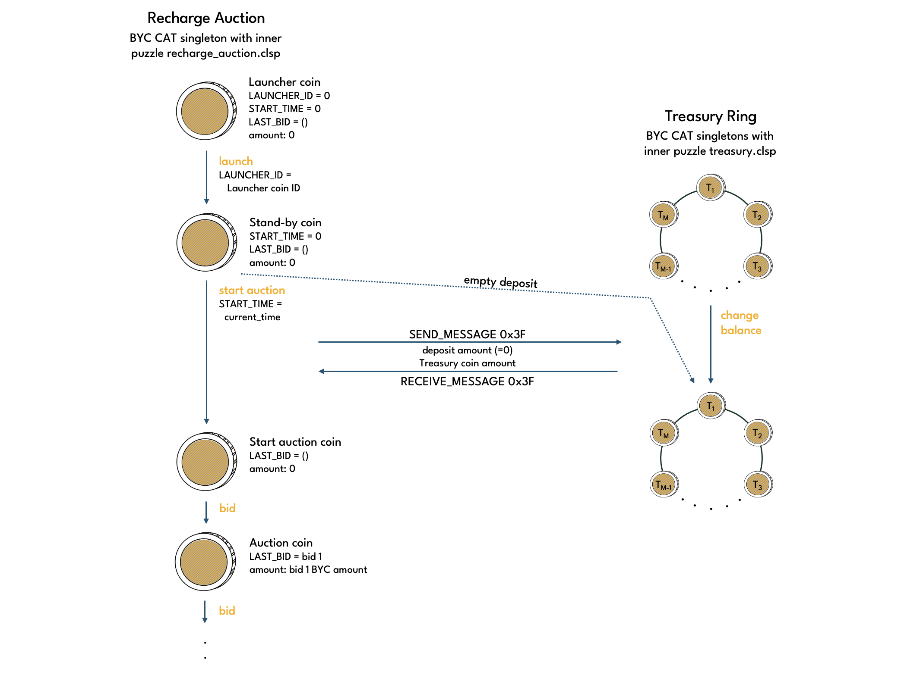
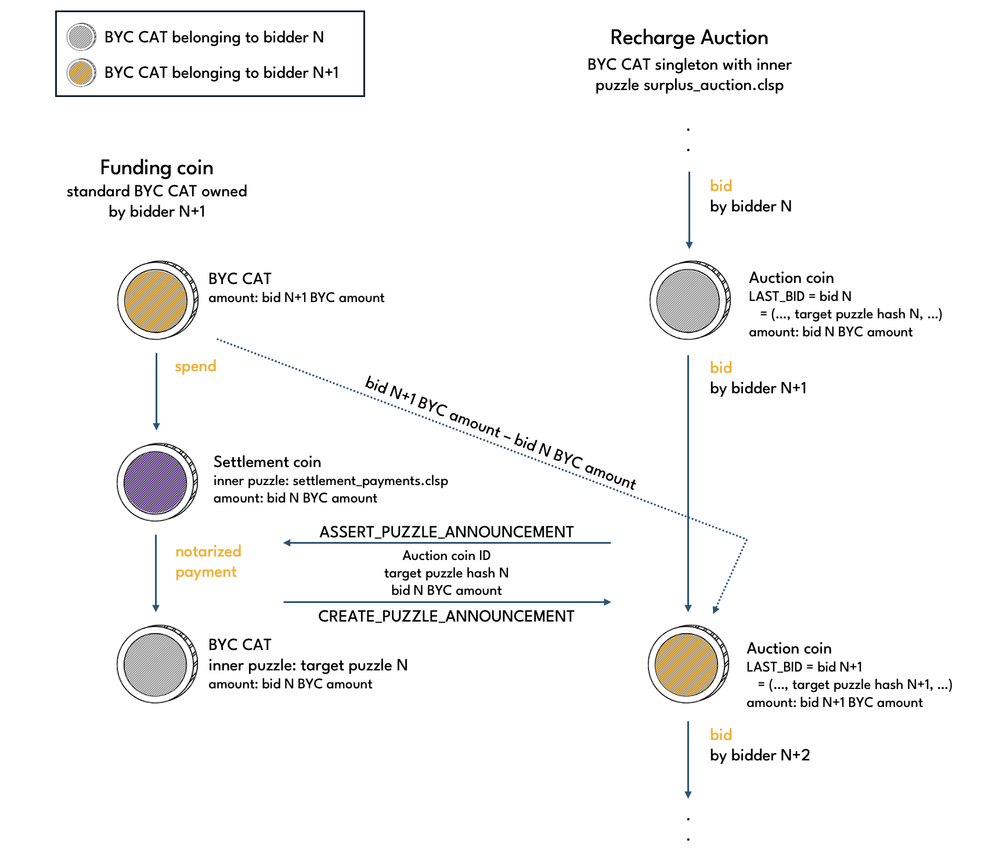

# Recharge Auction

A Recharge Auction is a BYC CAT singleton with [recharge_auction.clsp](https://github.com/circuitdao/puzzles/blob/main/circuit_puzzles/recharge_auction.clsp) puzzle as inner puzzle.

Launching a new Recharge Auction coin requires governance approval. Upon launch, a Recharge Auction coin goes into standy-by mode, and can from then on be used to run Recharge Auctions. Each individual Recharge Auction is triggered via the start operation. When a Recharge Auction concludes, the Recharge Auction coin returns to its stand-by state until it gets started again for the next auction. Multiple Recharge Auctions can run in parallel.

Note that Recharge Auction coins cannot transformed back to standard BYC CATs or be melted. Once created, they stay in existence forever.

## Operations

Puzzle that operations are performed on: [recharge_auction.clsp](https://github.com/circuitdao/puzzles/blob/main/circuit_puzzles/recharge_auction.clsp)

Governance operations:
* **launch**: launch a Recharge Auction coin - puzzle: [recharge_launch.clsp](https://github.com/circuitdao/puzzles/blob/main/circuit_puzzles/programs/recharge_launch.clsp)

Keeper operations:
* **start auction**: start a Recharge Auction - puzzle: [recharge_start_auction.clsp](https://github.com/circuitdao/puzzles/blob/main/circuit_puzzles/programs/recharge_start_auction.clsp)
* **bid**: submit a bid in Recharge Auction - puzzle: [recharge_bid.clsp](https://github.com/circuitdao/puzzles/blob/main/circuit_puzzles/programs/recharge_bid.clsp)
* **win**: settle a Recharge Auction - puzzle: [recharge_win.clsp](https://github.com/circuitdao/puzzles/blob/main/circuit_puzzles/programs/recharge_win.clsp)

Recharge auctions have a relatively long bid timeout, making it feasible to participate manually.

### Launch

Launching a Recharge Auction requires a custom condition to be output by Statutes. In other words, only governance can launch Recharge Auction coins. Note, however, that this doesn't mean that each Recharge Auction to refill the Treasury requires a governance vote. Once a Recharge Auction coin has been launched, it can be reused for individual Recharge Auctions in perpetuity.



To launch a Recharge Auction, first a Recharge Auction Launcher coin must be created. The Launcher coin is the eve coin of the Recharge Auction and has an enforced eve state and amount. The Launcher coin is then spent by launch operation, which confirms with Statutes that it is permitted to be executed.

Launching a Recharge Auction sets the ```LAUNCHER_ID``` curried arg to the Launcher coin's coin ID. The child coin of a Recharge Auction Launcher coin is a Recharge Auction Stand-by coin.

#### State changes

* ```LAUNCHER_ID```: set from 0 to Launcher coin ID

### Start auction

Spends a Stand-by coin to create a Start auction coin. This sets the start time of the auction as well as various Statute values needed during the auction in the ```AUCTION_PARAMS``` curried arg.

The Start auction coin does not constitute a bid yet.

A Recharge Auction can only be started if the Treasury balance is below the Treasury Minimum. The operation checks this by spending the Treasury Ring. (TODO: insert coin spend diagram that includes Treasury ring spend)

#### State changes

* ```AUCTION_PARAMS```:
  * ```start_time```: current timestamp
  * ```auction_ttl```: ```STATUTE_RECHARGE_AUCTION_TTL```
  * ```bid_ttl```: ```STATUTE_RECHARGE_AUCTION_BID_TTL```
  * ```min_crt_price```: ```STATUTE_RECHARGE_AUCTION_MINIMUM_CRT_PRICE```
  * ```min_byc_bid_amount```: ```STATUTE_RECHARGE_AUCTION_MINIMUM_BID```
  * ```min_price_increase_bps```: ```STATUTE_AUCTIONS_MINIMUM_PRICE_INCREASE_BPS```
  * ```max_byc_bid_amount```: ```STATUTE_RECHARGE_AUCTION_MAXIMUM_BID```

### Bid

Spends a Start auction or Auction coin to place a bid in the auction. A bid is passed in via the solution and has the following form:

```
bid = ((BYC bid amount . CRT bid amount), target puzzle hash, timestamp)
```

The child coin has the bid placed curried into the ```LAST_BID``` curried arg.

The target puzzle hash is a CAT inner puzzle hash. It will receive the CRT bid amount should the bid turn out to be the winning bid. If the bid is outbid, the BYC held in the Auction coin is refunded to the target puzzle hash. In either case, it is the bidder's responsibility to provide a target puzzle hash at which they can receive and access coins.

The BYC bid amount of a bid may be smaller or larger than that of the previous bid as long as it is greater than the Recharge Auction Minimum Bid Amount. If the BYC bid amount is smaller than the previous one, the bidder must contribute the difference to the Recharge Auction coin.

#

If the new BYC bid amount is smaller than the previous one, the bidder can withdraw the difference to the previous bid from the Recharge Auction coin.

#

#### State changes

* ```LAST_BID```:
    * first bid: set from nil to ```((byc_bid_amount . crt_bid_amount) target_puzzle_hash current_timestamp)```
    * subsequent bids: set to ```((byc_bid_amount . crt_bid_amount) target_puzzle_hash current_timestamp)```
* amount:
    * first bid: set from nil to amount of BYC bid
    * subsequent bids: set to amount of BYC bid

### Win

Once the auction has concluded, the winner can mint an amount of CRT as specified in the bid by asserting the corresponding announcement from the auction coin. The BYC amount bid gets paid to the Treasury. Keepers should aim for an even distribution of BYC among Treasury coins by selecting a suitable Treasury sub-ring.

#

The win operation resets the Recharge Auction coin to stand-by state. If the Treasury balance remains below the Treasury Minimum, then a new Recharge Auction can be started immediately. Otherwise, the Recharge Auction coin remains in stand-by mode until it is needed again.

#### State changes
* ```START_TIME```: set to 0
* ```LAST_BID```: set to nil
* amount: set to 0


## State and lineage

Fixed state:
* ```OPERATIONS```
* ```BYC_TAIL_MOD_HASH```

Immutable state:
* ```MOD_HASH```
* ```STATUTES_STRUCT```

Mutable state:
* ```LAUNCHER_ID```: coin ID of the eve Recharge Auction coin. Equal to nil in eve state
* ```AUCTION_PARAMS```: timestamp and various Statute values at time when Recharge Auction was started
* ```LAST_BID```: current best bid in Recharge Auction


### Eve state

Recharge auction coins have an enforced eve state:

* ```LAUNCHER_ID``` = nil
* ```AUCTION_PARAMS``` = nil
* ```LAST_BID``` = nil

### Amount

Recharge auction launcher, stand-by and start auction coins have amount equal to 0.

### Lineage

Due to enforced eve state and eve amount, the launch operation does not require a lineage proof (can be set to nil). All other operations require the following lineage proof:

```
lineage_proof = (parent_parent_coin_ID, parent_curried_args_hash  parent_amount)
```
