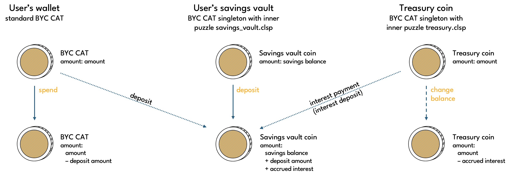
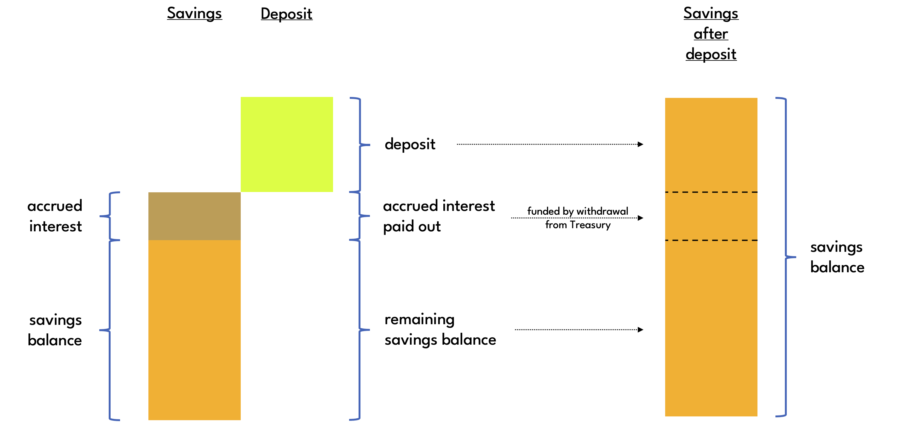
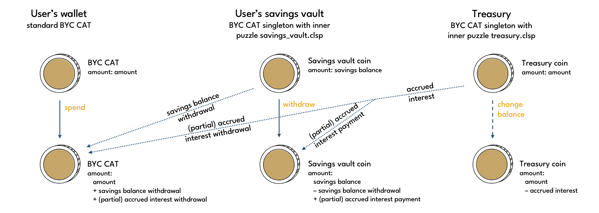
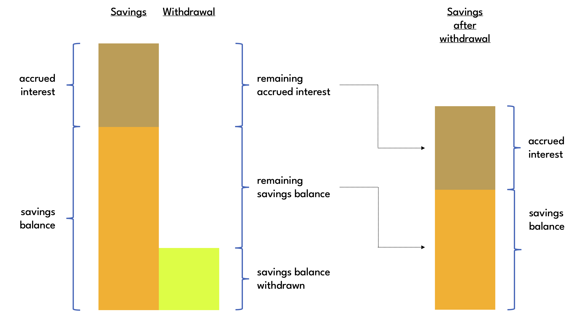
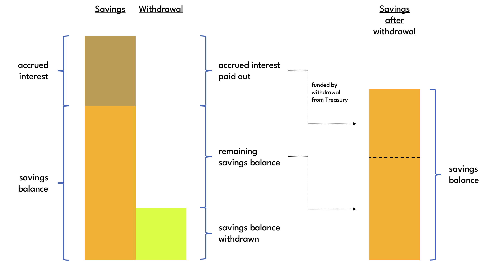
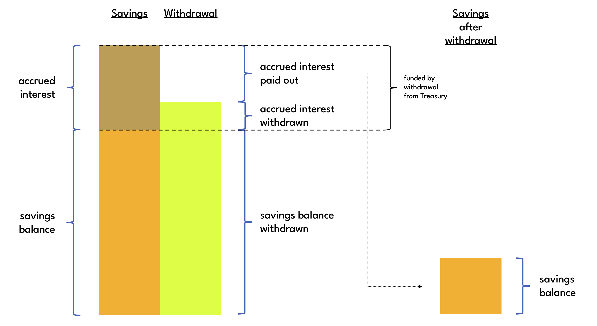

# Savings Vaults

Savings vaults are BYC CAT singletons with inner puzzle [savings_vault.clsp](https://github.com/circuitdao/puzzles/blob/main/circuit_puzzles/savings_vault.clsp). They can be permissionlessly created by anyone to earn yield on Bytecash.

The amount of a savings vault coin is referred to as the **savings balance**. The amount of interest that has accrued in the vault is the **accrued interest**. Accrued interest is an accounting variable. To get paid this interest, the vault owner needs to request a payment to be made from Treasury. The app pays interest whenever an amount greater than the savings balance is being withdrawn. Otherwise, the entire withdrawal amount will be covered from the savings balance.

The savings vault puzzle has itself an inner puzzle, which can be chosen freely by the savings vault owner. In case of a withdrawal, the inner puzzle may output multiple create coin conditions. The first of these yields the savings vault's child vault (inner puzzle, amount and memo are all preserved), whereas the other child coins would receive the amount withdrawn from the vault.

:::info
It is possible to use the [standard transaction puzzle](https://chialisp.com/standard-transactions/#code) for the inner puzzle of a savings vault.
:::

Savings vaults can be created on a standalone basis, i.e. without requiring a simultaneous spend of any protocol coins. Once created, a savings vault coin remains a savings vault forever. There is no way to turn it back into a standard BYC coin or even melt the CAT.

## Interest accrual and accounting

Savings interest compounds by the minute, i.e. the prevailing Interest Discount Factor (IDF) is successively applied to the aggregate of the savings vault's balance and accrued savings interest. The balance is the amount locked up in the Savings Vault coin. The protocol keeps track of accrued interest only indirectly via the ```DISCOUNTED_DEPOSIT``` state variable.

The ```DISCOUNTED_DEPOSIT``` value is effectivley the vault's balance valued at vault creation, and is defined as the sum of all amounts deposited and withdrawn from the Savings Vault coin discounted by the respective **Current Cumulative Interest Discount Factor** (CCIDF) at the time:

$$
discounted\ deposits = \sum_{i=1}^A \frac{B_i}{CCIDF_{t_{B_i}}} - \sum_{j=1}^B \frac{R_j}{CCIDF_{t_{R_j}}},
$$

where $t_{B_i}$ are the times when deposits were made, and $t_{R_j}$ the times when withdrawals occurred.

This is analogous to how [collateral vaults](./collateral_vault) account for accrued Stability Fees. Accordingly, the Current Cumulative Interest Discount Factor is calculated as

$$
CCIDF(t_C) = CIDF(t_S)\; IDF^{C-S},
$$

where $t_C$ is the current time, $t_S$ is the timestamp of the current Statutes Price, and the **Cumulative Interest Discount Factor** (CIDF) at time $t_S$ is defined as

$$
CIDF(t_S) = \prod_{i=P}^{S} IDF_{t_i}
$$

:::info
Similarly to the situation with collateral vaults, it is possible for CCIDF to change retroactively when the IDF is updated by governance. However, since there is no risk of liquidation with savings vault, the impact is limited to the amount of interest earned, which is generally uncritical. See the Danger box on the [collateral vaults](./collateral_vaults) page for additional info.
:::

As with collateral vaults, savers are given a three minute window of flexibility for specifiying the current timestamp vs the actual block timestamp when making depsoits or withdrawals to reduce the likelihood that an operation times out and will fail to be included in the blockchain. Since a malicious vault owner could exploit this flexibility by making deposits in the past and withdrawing in the future to boost their effective savings rate, the actual definition of CCIDF in the savings vault puzzle includes an additional factor IDF^(-3) to reduce the interest accrued by the maximum that can be gained from the timestamp flexibility.


## Operations

Puzzle that operations are performed on: [savings_vault.clsp](https://github.com/circuitdao/puzzles/blob/main/circuit_puzzles/savings_vault.clsp)

Owner operations:
* **change balance**: deposit or withdraw BYC - puzzle: [savings_vault.clsp](https://github.com/circuitdao/puzzles/blob/main/circuit_puzzles/savings_vault.clsp)
  * **deposit**: deposit BYC
  * **withdraw**: withdraw BYC

Savings vault operations are part of the savings vault's main puzzle since deposit and withdrawal operations have the same implementation. Whether an operation on a savings vault is a deposit or withdrawal can be inferred from how it changes the savings balance and accrued interest of the vault.

Vault owners can receive accrued interest as part of both deposit and withdrawal operations. In case of a deposit, interest is paid to the savings vault. In case of a withdrawal, interest is paid to the savings vault or to the user's wallet. An interest payment to a savings vault is referred to as an **interest deposit**, whereas an interest payment directly to a user's wallet is referred to as an **interest withdrawal**.

If interest is paid, it's always for the entire accrued interest. The protocol obtains the funds for interest payments from the Treasury. The user must select one Treasury coin from which to make the withdrawal. In particular, this means that a user can only get paid interest if there is a Treasury coin with amount at least as big as the accrued interest. When accessing the protocol via the app, a suitable Treasury coin is chosen automatically.

An interest payment can only be made if accrued interest is less than the **Minimum Interest Withdrawal Amount**. This protects the protocol against Treasury coin hogging attacks.

Both deposit and withdraw operations can be performed without an interest payment. This is important as it allows users to increase or decrease their savings balance without the need to spend a Treasury coin. This means that many more vaults can access their savings balance per block than would be possible otherwise. Although it is possible to spend Treasury coins repeatedly in the same block, the block limit still means that there's a maximum on the number vaults that can make a withdrawal, and this number is greater if no simultaneous Treasury coin spend is required.

### Deposit

When depositing to a savings vault, the user needs to make a contribution spend to top up the vault's savings balance. An additional Treasury coin spend is optional depending on whether the depositor would like to have accrued interest paid out to them or not.



The deposit amount is added to the savings balance. Accrued interest remains unchanged if no interest payment is requested.


If an additional interest payment is requested, the entire accrued interest amount is withdrawn from Treasury and deposited in the savings vault, momentarily leaving the vault without any accrued interest.



#### State changes

* ```DISCOUNTED_DEPOSIT```: gets updated according to [methodology described above](./savings-vault#interest-accrual-and-accounting) based on interest paid out and amount deposited
* ```INNER_PUZZLE```: can be changed by vault owner
* amount: increases based on deposit amount and interest payment

### Withdraw

On the protocol level, when making a withdrawal from a savings vault, the user can choose to withdraw from their savings balance only or to receive an interest payment at the same time. If an interest payment is requested, the user is free to decide how much of it to receive as standard BYC in their wallet as an interest withdrawal and how much of it gets paid to the savings vault as an interest deposit.

If interest payment is requested, the entire accrued interest gets paid out. If accrued interest is less than the Minimum Interest Withdrawal Amount, then no interest payment can be made.

Interest payments are made from Treasury. An interest payment is only possible if there is a Treasury coin whose amount is at least as big as the accrued interest.



Although the savings vault puzzle gives the user flexibility over how interest is paid, the app currently does not. If the user withdraws an amount less than the savings balance, the app will always withdraw the entire amount from the savings balance and not request an interest payment from Treasury.



On the protocol-level it would also be possible to receive an interest payment at the same time. This can lead to a situation in which despite a withdrawal being made from the vault, the savings balance actually increases, as shown in the diagram below.



If the user withdraws an amount greater than the savings balance, then an interest payment is required. Any accrued interest that isn't withdrawn remains in the vault as the new savings balance.




#### State changes

* ```DISCOUNTED_DEPOSIT```: gets updated according to [methodology described above](./savings-vault#interest-accrual-and-accounting) based interest paid out and amount withdrawn
* ```INNER_PUZZLE```: can be changed by vault owner
* amount: decreases based on withdrawal amount and interst payment

## State and lineage

Fixed state:

* ```CAT_MOD_HASH```
* ```MOD_HASH```

Immutable state:

* ```BYC_TAIL_HASH```
* ```STATUTES_STRUCT```

Mutable state:
* ```DISCOUNTED DEPOSIT```
* ```INNER PUZZLE```

### Eve state

Savings vaults have an enforced eve state in which ```DISCOUNTED_DEPOSIT``` is 0.

By withdrawing the entire savings balance and all accrued interest from a savings vault, the vault attains its eve state. An eve savings vault coin is therefore a savings vault in eve state whose parent coin is not a savings vault.

### Amount

Savings vaults have an enforced eve amount of 0. After that, a savings vault's amount is whatever its savings balance is.

### Lineage

For the eve spend the lineage proof is nil. For non-eve spends the lineage proof is

```
lineage_proof = (parent_parent_id parent_amount parent_discounted_deposit parent_inner_puzzle_hash)
```

<!--TODO: can we simplify this to (parent_parent_id parent_amount parent_curried_args_hash)?-->
