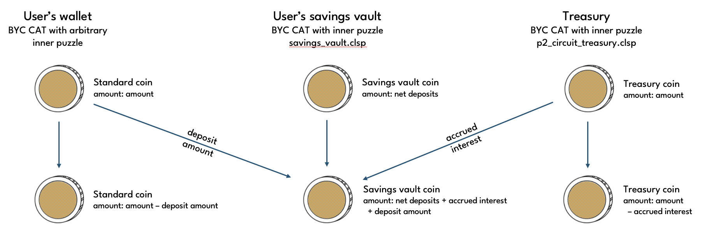
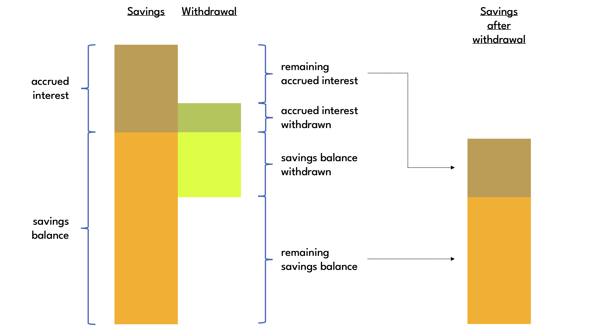
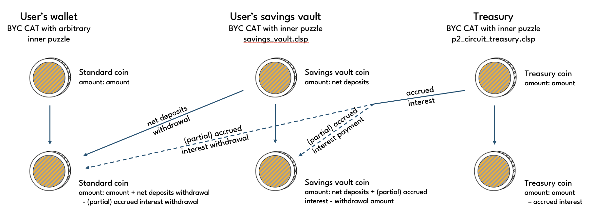

# Savings Vaults

Savings vaults are BYC CAT with inner puzzle savings_vault.clsp. The savings vault inner puzzle has itself an inner puzzle, which users can choose freely. This allows savings vaults to be held in using Chia's custody primitives (link?).

Savings vaults can be created on a stand-along basis, ie without requiring a simultaneous spend of any protocol coins.

## Deposits

When depositing to a savings vault, the user needs to make a contribution spend to add to the vault's net deposits. It is also possible to increase net deposits by requesting Treasury to pay out the accrued interest. In this case, the Treasury will always pay the full accrued interest as a protective measure against coin hogging.

## Interest accrual

Savings interest compounds by the minute, i.e. the Interest Discount Factor is applied to the aggregate of net deposits and accrued savings interest. Net deposits are the amount locked up in the Savings Vault coin. The protocol keeps track of accrued interest only indirectly via the **discounted deposits** state variable.

Discounted deposits are effectivley the vault's net deposits valued at vault creation, and are calculated as the sum of all amounts deposited and withdrawn from the Savings Vault coin discounted by the respective **Current Cumulative Interest Discount Factor** (CCIDF) at the time:

$$
discounted\ deposits = \sum_{i=1}^A \frac{B_i}{CCIDF_{t_{B_i}}} - \sum_{j=1}^B \frac{R_j}{CCIDF_{t_{R_j}}},
$$

where $t_{B_i}$ are the times when deposits were made, and $t_{R_j}$ the times when withdrawal occurred.

This is analogous to how the collateral vault accounts for accrued Stability Fees. See the [collateral vault](./collateral_vaults) page for further into and a chart.

## Withdrawals

The number of savings vaults from which interest can be withdrawn in any given block is limited, as each withdrawal requires its own Treasury coin spend, and there is only a fixed number of [Treasury Coins](./treasury). Although it is possible to spend Treasury coins repeatedly in the same block, the block limit still means that there's a max of about X interest withdrawals per block.

To prevent depositors from having to wait for a Treasury coin to become available in times of high demand, it is possible to make a withdrawal from net deposits only, which does not require a treasury spend.

:::note
On a protocol level, savers can choose any split between net deposits and interest they like when making a withdrawal, but this is not currently supported by the app.
:::
