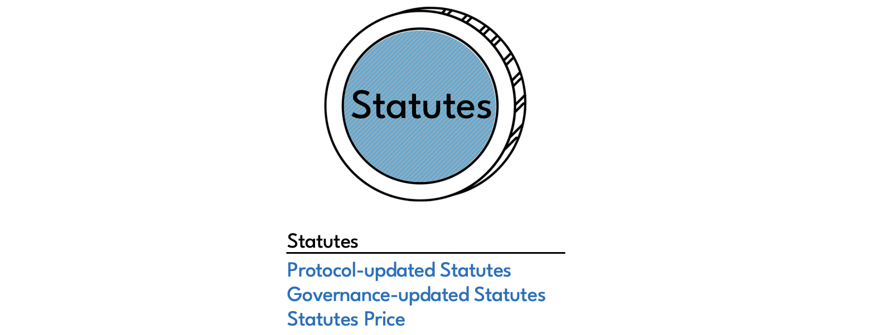
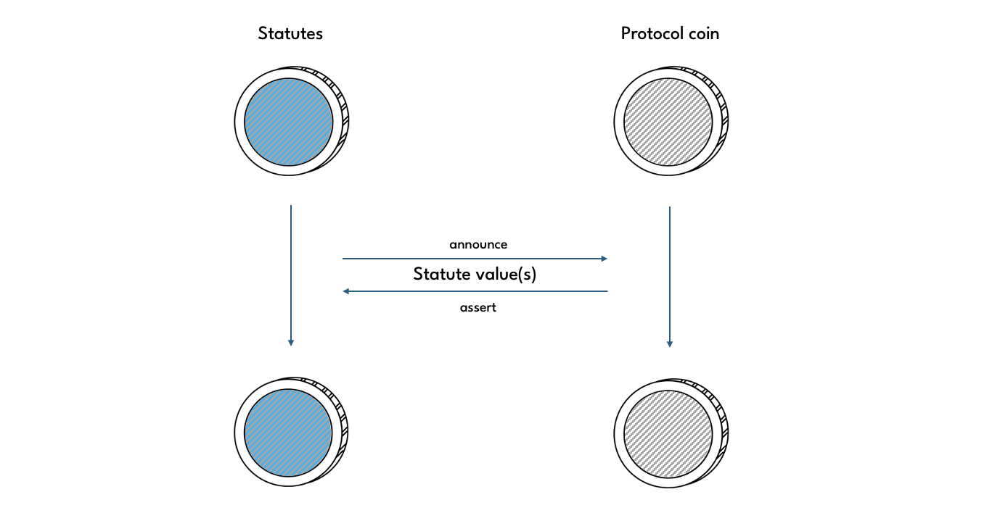

# Statutes

**Statutes** are a set of mutable parameters, that define the behaviour of Circuit protocol. Statutes are the global state variables of the protocol.

There are three different types of Statutes:
* protocol-updated
* governance-updated
* the [Statutes Price](./price-oracle)

Protocol-updated Statutes are those that the protocol keeps track of automatically by enforcing updates as part of certain protocol coin spends. Governance-updated Statutes require a governance vote to be updated. For details see the [governance](./governance) page. The Statutes Price is a delayed version of the Oracle Price.



Each Statute has an index, value and a name by which it can be identified. In addition, Governance-updated Statutes have a set of **Constrainsts** associated with them, which place certain constraints on how a Statute may be updated.

## Statutes singleton

Statutes are kept is a [standard singleton](https://chialisp.com/singletons/), referred to as the **Statutes singleton**. The Statutes singleton's inner puzzle can be found in [statutes.clsp](https://github.com/circuitdao/puzzles/blob/main/circuit_puzzles/statutes.clsp).

When a protocol coin is spent, required Statutes values are passed to the coin's puzzle via its solution. Puzzles of protocol coins must be written so that for every Statute value they use, there is a statement that asserts a corresponding Statute announcement from the Statutes singleton. This ensures that Statute values passed to protocol coins cannot be faked.

In practice, this means that Statute announcements from the Statutes singleton are needed by almost every spend in the protocol. Since users interact with the protocol independently of each other, the Statutes singleton preemptively announces all Statutes values with every spend. Thanks to [identical spend aggregation](https://docs.chia.net/faq/#what-is-identical-spend-aggregation), which allows multiple spend bundles to include the same spend of a coin in the same block, this means that at most one Statutes singleton spend is required per block, no matter the number of protocol operations performed by users.



For example, a borrower taking out a new loan, another withdrawing collateral, and a third having their vault liquidated, all while savers go about their business depositing and withdrawing from their savings vaults, can all happen simultaneously in the same block and requires only one spend of the Statutes singleton.

Protocol coins know how to assert Statute announcements by having the **Statutes struct** curried into them. This is the conventional singleton struct:

```Statutes struct = (MOD_HASH . (LAUNCHER_ID . LAUNCHER_PUZZLE_HASH))```

In combination with the Statutes singleton's inner puzzle hash, which is passed in via the solution, protocol coins can construct the Statutes puzzle hash using the ```calculate-statutes-puzzle-hash``` function found in [statutes_utils.clib](https://github.com/circuitdao/puzzles/blob/main/circuit_puzzles/include/statutes_utils.clib#L52). Protocol coins use this puzzle hash to send a message to the Statutes singleton to assert the relevant Statute value.

The Statutes singleton can only be spent once per block. This prevents attack vectors in which a Statute could be announced twice, but with different values, in the same block pursuant to a governance proposal to change the Statute value.


## Constraints

Governance-updated Statutes come with Constraints that define limitations on how Statute values may be modified:

* **Proposal Threshold**: minimum amount of CRT required to make a proposal
* **Veto Period**: time period (in seconds) during which a proposal can be vetoed
* **Implemenation Delay**: time (in seconds) that needs to pass before the new Statute value becomes effective after the end of the veto period
* **Maximum Delta**: the maximum absolute amount by which the Statute value may change

For further information on Constraints, see the [governance](./governance) page.


## Operations

There are three operations that can be performed on the Statutes singleton.

Keeper operations:
* **Announce Statutes**: announces all Statutes without doing anything else - puzzle: [statutes.clsp](https://github.com/circuitdao/puzzles/blob/review3_fixes/circuit_puzzles/statutes.clsp)
* **Update Statute**: changes a Statute value and its Constraints and announces all Statutes - puzzle: [statutes_mutation.clsp](https://github.com/circuitdao/puzzles/blob/review3_fixes/circuit_puzzles/programs/statutes_mutation.clsp)
* **Update Statutes Price**: updates the Statutes Price and announces all Statutes - puzzle: [statutes_update_price.clsp](https://github.com/circuitdao/puzzles/blob/review3_fixes/circuit_puzzles/programs/statutes_update_price.clsp)

In practice, the Statutes Price would typically be updated by a Data Provider as they get rewarded for this. See the [Oracle](./oracle) page for details. Since the protocol offers no direct incentives for performing the other two operations, those are typically performed by parties that benefit indirectly from them. Announcement spends are required by various protocol operations that assert Statutes announcements, and a Statute update would typically be paid for by a CRT holder that initiated or supported the corresponding governance vote.


## List of Statutes

Below is a complete list of Statutes, including their index, name in [statutes_utils.clib](https://github.com/circuitdao/puzzles/blob/main/circuit_puzzles/include/statutes_utils.clib), and a brief explanation of their respective function and data type.

Current Statute values are shown on the dashboard (TODO: add links for testnet and mainnet).

### Protocol-updated Statutes:

(-4) **CREDITS_BALANCE**: credits available to be claimed by Announcers

(-3) **TREASURY_COIN_APPROVER_MOD_HASHES**: treasury coin mod hashes

(-2) **PAST_CUMULATIVE_INTEREST_DF**: cumulative interest discount factor

(-1) **PAST_CUMULATIVE_STABILITY_FEE_DF**: cumulative stability fee discount factor

### Governance-updated Statutes:

(0) **STATUTE_PRICE_ORACLES**:

(1) **STATUTE_STABILITY_FEE_DF**: per-minute stability fee discount factor in millionths of a pip (100th of a basis point), e.g. 1.000 000 000 190, roughly equivalent to an annual DF of 1.05, which in turn is equivalent to a 5% APY

(2) **STATUTE_INTEREST_DF**: per-minute interest discount factor in millionths of a pip (100th of a basis point), e.g. 1. 000 000 000 190, roughly equivalent to an annual DF of 1.05, which in turn is equivalent to a 5% APY

(3) **STATUTE_CUSTOM_ANNOUNCEMENTS**:

(4) **STATUTE_LIQUIDATION_RATIO**:

(5) **STATUTE_ORACLE_M_OF_N**:

(6) **STATUTE_ORACLE_PRICE_UPDATABLE_AFTER_SECONDS**:

(7) **STATUTE_ORACLE_PRICE_UPDATABLE_PERCENT_THRESHOLD**:

(8) **STATUTE_ORACLE_PRICE_EXPIRATION_SECONDS**:

(9) **STATUTE_MINIMUM_VAULT_DEBT_AMOUNT**: (TODO: rename to STATUTE_VAULT_MINIMUM_DEBT?)

(10) **STATUTE_VAULT_AUCTION_STEP_TIME_INTERVAL**:

(11) **STATUTE_VAULT_AUCTION_STEP_PRICE_DECREASE_FACTOR**:

(12) **STATUTE_VAULT_AUCTION_TIMEOUT**:

(13) **STATUTE_VAULT_AUCTION_STARTING_PRICE_FACTOR**:

(14) **STATUTE_VAULT_INITIATOR_FLAT_INCENTIVE**:

(15) **STATUTE_VAULT_INITIATOR_RELATIVE_INCENTIVE_PERCENT**:

(16) **STATUTE_VAULT_LIQUIDATION_PENALTY_PERCENT**:

(17) **STATUTE_TREASURY_MINIMUM**:

(18) **STATUTE_TREASURY_MAXIMUM**:

(19) **STATUTE_MINIMUM_SF_TRANSFER_AMOUNT**:

(20) **STATUTE_RECHARGE_AUCTION_TIMEOUT**:

(21) **STATUTE_RECHARGE_AUCTION_MIN_CRT_PRICE**:

(22) **STATUTE_RECHARGE_AUCTION_BID_TTL**:

(23) **STATUTE_RECHARGE_AUCTION_MINIMUM_BID_AMOUNT**:

(24) **STATUTE_SURPLUS_AUCTION_TIMEOUT**:

(25) **STATUTE_SURPLUS_AUCTION_LOT_AMOUNT**:

(26) **STATUTE_SURPLUS_AUCTION_BID_TTL**:

(27) **STATUTE_SAVINGS_MINIMUM_INTEREST_AMOUNT_TO_WITHDRAW**:

(28) **STATUTE_ANNOUNCER_CRT_CREDITS_PER_INTERVAL**:

(29) **STATUTE_ANNOUNCER_CLAIM_INTERVAL**:

(30) **STATUTE_ANNOUNCER_MIN_DEPOSIT**:

(31) **STATUTE_ANNOUNCER_DELAY**:

(32) **STATUTE_ANNOUNCER_PENALTY_INTERVAL_MINUTES**:

(33) **STATUTE_ANNOUNCER_PENALTY_FACTOR_PER_INTERVAL**:

(34) **STATUTE_ENACTMENT_TIMEOUT_SECONDS**:

### Statutes Price:

* **PRICE_INFO**: copied from Oracle once Oracle Price Delay has passed
  * **price**: XCH/USD price * 1000, e.g. 34025 means a price of 34.025 USD per XCH
  * **last_updated**: [Unix timestamp](https://en.wikipedia.org/wiki/Unix_time) of when the price was recorded in the Oracle
