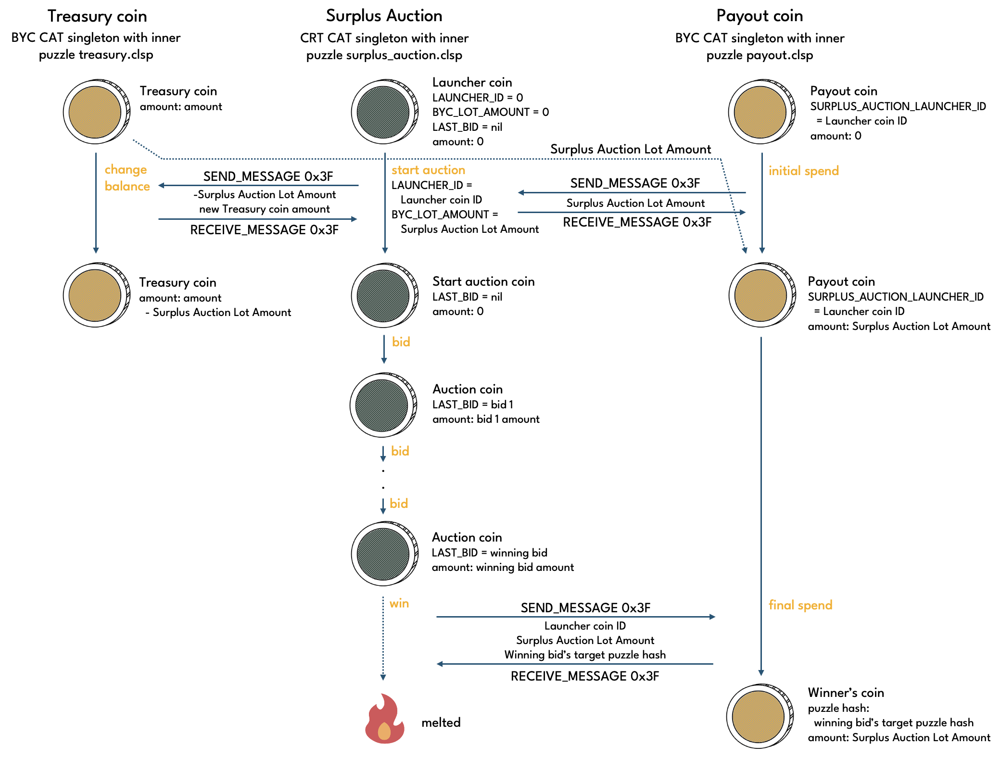
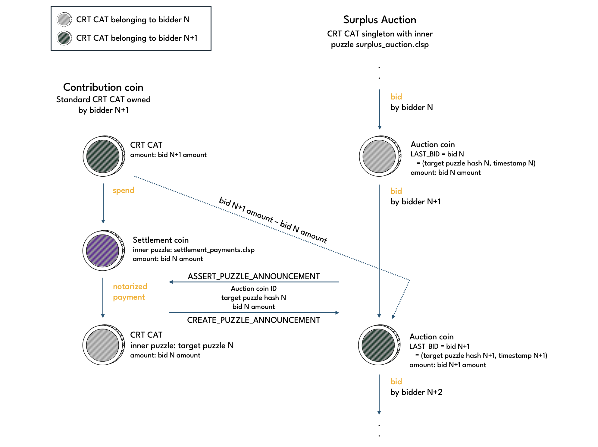

# Surplus Auction

Surplus Auction is a CRT CAT with [surplus_auction.clsp](https://github.com/circuitdao/puzzles/blob/main/circuit_puzzles/surplus_auction.clsp) puzzle as its inner puzzle. The inner puzzle turns the Surplus Auction into a singleton.

A Surplus Auction coin is accompanied by a **Payout coin**. The Payout coin, is a BYC CAT singleton with [payout.clsp](https://github.com/circuitdao/puzzles/blob/main/circuit_puzzles/payout.clsp) as its inner puzzle. The Payout coin receives the amount of BYC being auctioned off from the Treasury when a Surplus Auction is started.

When the auction concludes, the winning bidder is paid the BYC from the Payout coin in return for burning an amount of CRT as offered in the winning bid.

Surplus Auctions have a relatively long bid timeout, making it feasible to participate manually.

### Starting Surplus Auctions

It is possible to have multiple Surplus Auctions run in parallel. It is even possible to start more than one Surplus Auction in the same block as long as the Treasury has sufficient surplus and there are suitable Treasury coins available to be spent.

However, having Surplus Auctions run simultaneously is not desireable as keepers may not have sufficient capital on stand-by to participate in all of them at competitive prices, and it would make it even harder for manual bidders to keep up with those using bots.

Since both eve state and eve amount of the eve coin are enforced, Surplus Auction Launcher coins cannot share a parent coin. Instead, each Surplus Auction Launcher coin needs to be created from a separate parent coin spend. This is by design, in order to not set an incentive for keepers to wait until the Treasury Maximum has been exceeded by such a large amount that multiple Surplus Auctions can be triggered at once, leading to a saving on transaction costs. The desired behaviour is for keepers to trigger a Surplus Auction as soon as possible once the Treasury Maximum has been exceeded by more than the **Surplus Auction Lot Amount**, and thereby avoiding simultaneous Surplus Auctions.

<!--TODO: do we need a SF transfer incentive, do we need a surplus auction trigger incentive, do we want a minimum bid amount increase (for recharge auction too)?-->

## Operations

Surplus Auctions involve two different coins, a Surplus Auction coin and a Payout coin.

### Surplus Auction coin

Puzzle that operations are performed on: [surplus_auction.clsp](https://github.com/circuitdao/puzzles/blob/main/circuit_puzzles/surplus_auction.clsp)

Keeper operations:
* **start auction**: start a Surplus Auction - puzzle: [surplus_start_auction.clsp](https://github.com/circuitdao/puzzles/blob/main/circuit_puzzles/programs/surplus_start_auction.clsp)
* **bid**: submit a bid in a Surplus Auction - puzzle: [surplus_bid.clsp](https://github.com/circuitdao/puzzles/blob/main/circuit_puzzles/programs/surplus_bid.clsp)
* **win**: settle a Surplus Auction - puzzle: [surplus_win.clsp](https://github.com/circuitdao/puzzles/blob/main/circuit_puzzles/programs/surplus_win.clsp)

### Payout coin

Puzzle that operations are performed on: [payout.clsp](https://github.com/circuitdao/puzzles/blob/main/circuit_puzzles/payout.clsp)

Keeper operations:
* **fund**: receive funds from Treasury - puzzle: [payout.clsp](https://github.com/circuitdao/puzzles/blob/main/circuit_puzzles/payout.clsp)
* **pay out**: pay winner of Surplus Auction - puzzle: [payout.clsp](https://github.com/circuitdao/puzzles/blob/main/circuit_puzzles/payout.clsp)

The diagram below shows how Surplus Auction coin, Payout coin and Treasury coin interact with each other over the course of a Surplus Auction. In this example, the Payout coin is funded from only one Treasury coin. In general, the keeper starting a Surplus Auction is free to select any number of Treasury coins. In fact, this is usually necessary, since no individual Treasury coin is likely to hold an amount in excess of the Treasury Maximum, which is a prerequisite for starting a Sruplus Auction. It is recommended to select different withdrawal amounts for each Treasury coin to even out any imbalances between Treasury coin amounts as much as possible.



### Start + Fund

To start the Surplus Auction, a keeper executes the start operation on a Surplus Auction coin in eve state, also referred to as a Surplus Auction launcher coin.

At the same time, a Payout coin and one or several Treasury coins must be spent to transfer an amount of BYC equal to the Surplus Auction Lot Amount from the Treasury to the Payout coin.

#### State changes

Surplus Auction Coin:
* ```LAUNCHER_ID```: from nil to eve coin ID
* ```BYC_LOT_AMOUNT```: from 0 to Surplus Auction Lot Amount

Payout coin:
* amount: from 0 to Surplus Auction Lot Amount

### Bid

Bidding occurs by spending the Surplus Auction coin using the bid operation. A bid involves the bidder increasing the amount of CRT offered, specifying a **target puzzle hash**, and supplying the current timstamp. The amount of CRT offered is the amount of the Surplus Auction coin.



Target puzzle hash and current timestamp are stored in the LAST_BID curried arg:

```
LAST_BID = (target_puzzle_hash . current_timestamp)
```

The **target puzzle**, i.e. the puzzle whose treehash is the target puzzle hash, must be a CAT inner puzzle. If the bid turns out to be the winning bid, an amount of BYC equal to the Surplus Auction Lot Amount is sent to the target puzzle hash. If the bid is outbid, i.e. is not the winning bid, then the bidder has the CRT they locked up in the Surplus Auction coin returned to them at the target puzzle hash.

The Payout coin stays idle during the bidding phase.

#### State changes

Surplus Auction coin:
* ```LAST_BID```:
    * first bid: nil -> (target_puzzle_hash . current_timestamp)
    * subsequent bids: -> (target_puzzle_hash . current_timestamp)
* amount:
    * first bid: 0 -> amount of CRT offered
    * subsequent bids: -> amount of CRT offered

Payout coin:
Does not get spent until win operation is performed on Surplus Auction coin.

### Win + Pay out

A Surplus Auction ends when either **Surplus Auction TTL** has been reached or if a bid doesn't get outbid within the **Surplus Auction Bid TTL**. When the auction has ended, the win operation on the Surplus Auction coin in parallel to a pay out operation on the Payout coin can be executed.

The winning bid is the bid recorded in the Surplus Auction coin when the auction ends. The Surplus Auction coin is melted, reducing the supply of CRT in existence, and in return the winner receives the Surplus Auction Lot Amount from the Payout coin at the target puzzle hash specified in the winning bid.

#### State changes

Surplus Auction coin:
* coin gets melted

Payout coin:
* inner puzzle hash: set to target puzzle hash of winning bid, which transforms the Payout coin to a (standard) BYC CAT.


## State and lineage of Surplus Auction coin

Fixed state:
* ```OPERATIONS```
* ```CAT_MOD_HASH```
* ```MOD_HASH```

Immutable state:
* ```STATUTES_STRUCT```
* ```BYC_TAIL_HASH```
* ```CRT_TAIL_HASH```

Mutable state:
* ```LAUNCHER_ID```: coin ID of the eve Surplus Auction coin. Equal to nil in eve state
* ```BYC_LOT_AMOUNT```: amount of BYC being auctioned off in a Surplus Auction
* ```LAST_BID```: current best bid in Surplus Auction

### Eve state

The eve Surplus Auction coin has an enforced eve state:

* ```LAUNCHER_ID``` = 0
* ```BYC_LOT_AMOUNT``` = 0
* ```LAST_BID``` = nil

The eve spend sets ```LAUNCHER_ID``` to the coin ID of the eve coin, and the BYC_LOT_AMOUNT to the Surplus Auction Lot Amount. LAST_BID remains unchanged until a subsequent bid operation is performed.

Because the LAUNCHER_ID curried into Surplus Auction coins is the coin ID of the eve coin, the eve coin is referred to as the **Surplus Auction Launcher coin**.

### Amount

The eve coin has an enforced amount of 0, as does the resulting Start auction coin.

### Lineage

No lineage proof is required (i.e. can be set to nil) for the Surplus Auction coin eve spend since it has an enforced eve state and amount.

The lineage proof for bid and win operations has the following format:

```lineage proof = (parent_coin_id parent_amount parent_cat_inner_puzzle_hash)```

## State and lineage of Payout coin

Fixed state:

* ```CAT_MOD_HASH```
* ```SURPLUS_AUCTION_MOD_HASH```: hash of the Surplus Action mod

Immutable state:

* ```CRT_TAIL_HASH```
* ```SURPLUS_AUCTION_LAUNCHER_ID```: Launcher coin ID of the Surplus Auction

Mutable state:
None.

### Eve state

The Payout coin is tied to a Surplus Auction coin via the curried arg ```SURPLUS_AUCTION_LAUNCHER_ID```, which must be curried correctly in the eve Payout coin. no other Surplus Auction coin can receive funds from the Payout coin.

### Amount

The eve Payout coin must have an amount of 0. The fund operation increases the amount to the Surplus Auction Lot Amount.

### Lineage

The Payout coin does not require a lineage proof as it its operations are unambiguously tied to Surplus Auction operations.
