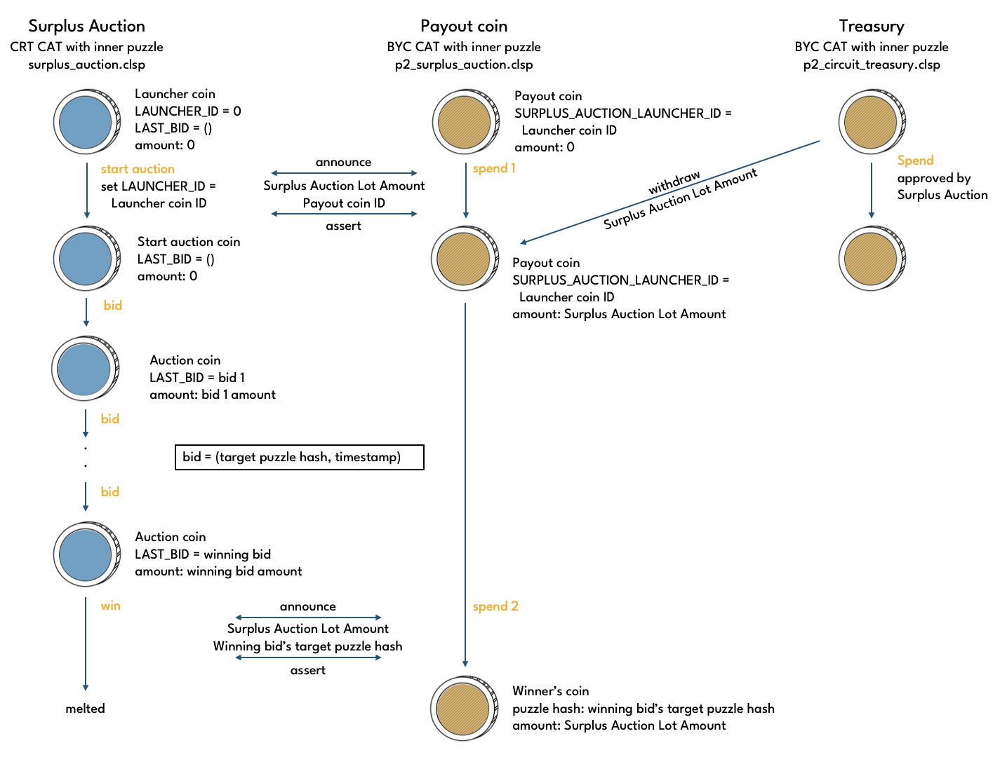
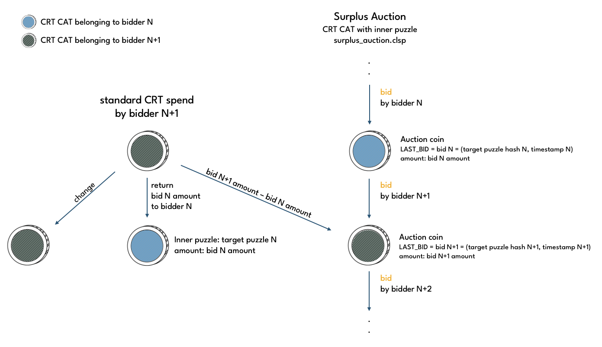

# Surplus Auction

Surplus Auction is a CRT CAT with surplus_auction.clsp puzzle as its inner puzzle.

## Operations

Puzzle: recharge_auction.clsp
Operations:
* Start - puzzle: surplus_start_auction.clsp
* Bid - puzzle: surplus_bid.clsp
* Win - puzzle: surplus_win.clsp

All three operations can be executed by anyone. Surplus auctions are typically run by keeper bots, but due to relatively long bid timeouts, it's also feasible to participate manually.

### Start

To start the surplus auction, a keeper executes the start operation on a surplus auction launcher coin, which has an enforced state. At the same time, a payout coin is spent in order to make a Treasury withdrawal and transfer the **Surplus Auction BYC Lot Amount** to it.

The payout coin, which is a BYC CAT with p2_surplus_auction.clsp as its inner puzzle, stays idle while during the bidding phase of the auctino. Eventually, the winner of the auction will receive the BYC amount held in the payout coin.

### Bid

Bidding occurs by spending the Surplus Auction coin using the surplus bid operation. A bid involves the bidder to increase the amount of CRT in the Surplus Auction coin and setting a target puzzle hash and current timstamp. The target puzzle hash must be a CAT inner puzzle hash. If the bid turns out to be the winning bid, the bidder receives an amount of BYC equal to the Surplus Auction Lot Amount at the target puzzle hash. Otherwise, the bidder has the CRT they locked up in the Surplus Auction coin returned to them to the target puzzle hash.

### Win

A Surplus Auction ends when either **Surplus Auction Timeout** has been reached or if a bid doesn't get outbid within the **Surplus Auction Bid TTL**. When the auction has ended, the win operation can be executed.

The winning bid is the bid recorded in the Surplus Auction coin when the auction ends. The CRT of the Surplus Auction coin is melted, and in return the winner receives the Surplus Auction Lot Amount from the Payout coin to the target puzzle hash specified in the winning bid.
