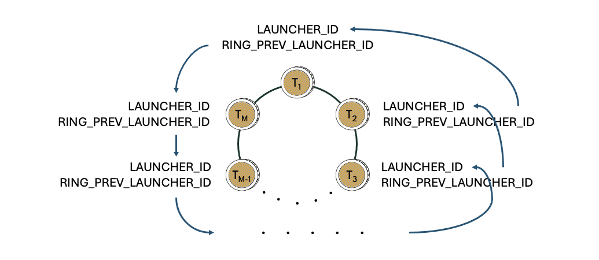

# Treasury

The Treasury is a set of BYC coins with a special inner puzzle, [p2_circuit_treasury.clsp](https://github.com/circuitdao/puzzles/blob/main/circuit_puzzles/p2_circuit_treasury.clsp), that allows Treasury coins to be spent only in very specific ways.

The number of Treasury coins can be changed by goverance. Having several Treasury coins is necessary for savers to be able to withdraw interest simultaneously. Since each withdrawal requires a Treasury coin spend, savers would have to coordinate their withdrawals at the mempool level if they wanted to withdraw from the same Treasury coin in the same block. Although this is not impossible - even a unilateral replace-by-fee allows savers to attach their withdrawal to an existing withdrawal spend bundle in the mempool - it becomes increasingly difficult to reliably coordinate the more savers are involved. With multiple Treasury coins, these problems can be avoided as each saver can pick their own Treasury coin as long as there are no more savers wanting to withdraw interest than Treasury coins.

A Treasury coin's eve spend requires a custom announcement from Statutes to succeed, which in turn requires approval from governance.


## Operations

Puzzle that operations are performed on: [p2_circuit_treasury.clsp](https://github.com/circuitdao/puzzles/blob/main/circuit_puzzles/p2_circuit_treasury.clsp)

Keeper operations:
* **Update lineage**: switch Treasury coin lineage - puzzle: [p2_circuit_treasury.clsp](https://github.com/circuitdao/puzzles/blob/main/circuit_puzzles/p2_circuit_treasury.clsp)
* **Change balance**: withdraw from or deposit to Treasury and announce new balance - puzzle: [p2_circuit_treasury.clsp](https://github.com/circuitdao/puzzles/blob/main/circuit_puzzles/p2_circuit_treasury.clsp)

The balance of a Treasury coin can be changed by either depositing or withdrawing BYC from it. Whether a balance change is a deposit or withdrawal is inferred from the amount of a ```CREATE_COIN``` condition with same puzzle hash as the Treasury coin being spent. This condition must be passed to the puzzle via the ```input_conditions``` argument of the solution. The ```parse-conditions``` function guarantees that exactly one such condition exists, i.e. that exactly one descendant coin with identical puzzle hash is created from the Treasury coin being spent.

In case of a withdrawal, either additional ```CREATE_COIN``` conditions must be present that send the entire withdrawn amount to other addresses, or the entire withdrawal amount must be melted. A combination of the two is not possible.

A change balance operation announces the Treasury coin's new amount. To get an announcement of a Treasury coin's amount, a neutral change balance operation that doesn't change the coin's amount can be performed.

Every change balance operation needs to be approved by a coin that has one of the Approver Mods as its puzzle.

Operations that can withdraw from Treasury:
* Pay savings interest (withdraw)
* Recover Bad Debt (melt)
* Start surplus auction (withdraw)

Operations that deposit to Treasury:
* Repay debt (share of Stability Fees)
* Bid in liquidation auction (SFs + LP)
* Win recharge auction

There is no direct incentive for transferring Stability Fees. Savers that want to withdraw interest and keepers wanting to trigger a surplus auction have an incentive to transfer Stability Fees to keep the Treasury filled. CRT holders are also incentivised to keep the the Treasury filled to prevent Recharge Auctions from being triggered as they are dilutive to them.


## Treasury Ring

The inner puzzle prevents Treasury coins from being divided, effectively making them singletons. Since Treasury coins are also BYC CATs, Treasury coins must be arranged in a ring when spent, just like any other CATs.



Although Treasury coins cannot be divided, it is possible to increase or decrease their amounts. This allows BYC to be deposited to and withdrawn from the Treasury. It is not necessary to include all Treasury coins in a spend. Just as with ordinary CATs, any subset of Treasury coins, including a single coin, is sufficient as long as they are arranged in a ring.


