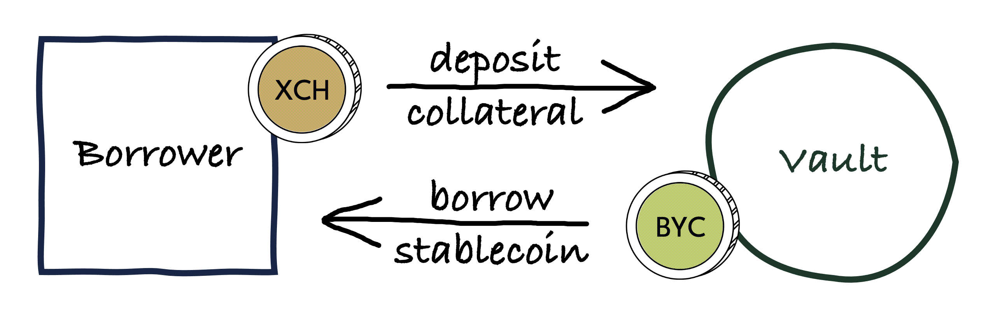
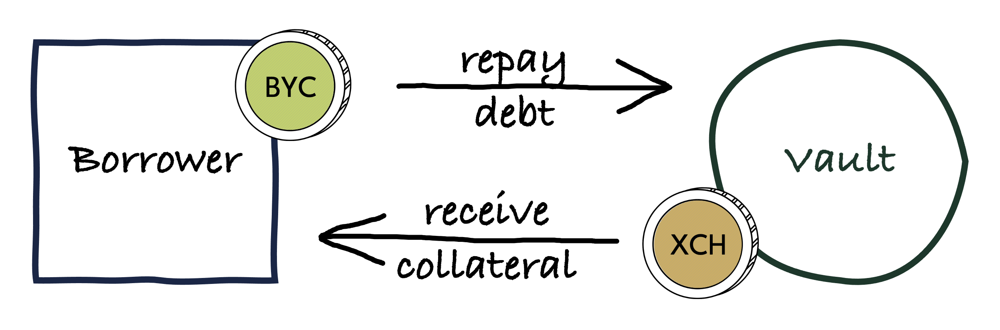

# Collateral Vaults

A **collateral vault** is a smart coin in which XCH can be deposited and from which BYC can be borrowed. XCH deposited in a vault is used as **collateral** to back any BYC borrowed.

Collateral vaults can be created premissionlessly by anyone. Whoever creates a vault automatically becomes its owner.

## Borrowing

Once collateral has been deposited in a vault, the vault owner can take out a loan by borrowing BYC from it.

The BYC borrowed when a loan is taken out is called the **principal**. While a BYC loan remains outstanding, it accrues a **Stability Fee** (SF). This is similar to how interest accrues on traditional loans. The sum of principal and accrued Stability Fees is the **debt** owed to the collateral vault.

The ratio of outstanding debt over collateral value of a vault is the **loan-to-value** (LTV) ratio. There is a **maximum loan-to-value** (Max LTV) that is enforced across all vaults to ensure that BYC remains sufficiently overcollateralized. For additional information see the [Liquidation](.liquidation) section.

:::info

The Max LTV determines how much BYC can be borrowed at most against the collateral in a vault.

:::

## Stability Fee

The Stability Fee can be thought of as an interest rate charged on BYC loans. It accrues by the minute on the outstanding debt. As such, the SF is a compounding rate.

The SF is one of the primary mechanisms by which BYC maintains its 1:1 peg to the US Dollar.

* If BYC trades at > 1 USD in the market, the price can be brought down by lowering the SF, so that borrowing BYC becomes more attractive, thereby increasing the BYC supply.
* If BYC trades at < 1 USD in the market, the SF can be increased in order to make holding BYC more expensive, encouring repayment of BYC loans, which tightens the supply and pushes up the price of BYC.

Given that supply-demand dynamics for BYC are driven by the market, the SF needs to be adjusted on an ongoing basis. For this reason, governance should closely monitor market developments and vote to adjust the SF as needed.

The protocol does not directly use the SF. Instead, there is a **Stability Fee Discount Factor** (SFDF) parameter in Statutes, which is defined as SFDF = 1 + SF. Using the SFDF instead of the SF simplifies calculations.

## Repaying loans

A borrower can repay their debt partially or fully by returning BYC to the vault. A partial repayment will be applied to principal and accrued SFs proportionally to their respective sizes.

For example, if a vault is owed 1000 BYC in principal and has accrued 20 BYC in SFs, the borrower can reduce their debt of 1020 BYC by 25% by repaying 255 BYC. This will recude the principal by 250 BYC and accrued SFs by 5 BYC.

Repaying loans lowers the Liquidation Threshold, which frees up collateral for the vault owner to withdraw.

## Liquidation

If the value of collateral in a vault drops below the Liquidation Threshold, the vault becomes eligible for liquidation. Liquidations ensure that BYC remains overcollateralized. When a liquidation is triggered, the protocol effectively seizes the vault from its owner, and auctions off the collateral it holds to recover the debt owed to the vault.

For details on the liqudation process please see the [Liquidation](./liquidation) page.

## Vault constraints

The protocol enforces a **Minimum Debt** (MD) on vaults. A vault's debt must either be zero or avove MD. This prevents too many small loans from being taken out, which could be used as an attack on the protocol by clogging up block space with liquidations.

If the Minimum Debt parameter is raised by governance, vaults may be left with outstanding debt below MD. In this case the next borrow or repay operation performed on an affected vault must lift the outstanding debt above the MD or repay all outstanding debt respectively.

## Notes

:::note

When a loan is taken out from a vault, the BYC borrowed is minted ad hoc by the protocol. When a loan is repaid, the principal gets melted and the Stability Fees goes to the [Protocol Treasury](./protocol-treasury.md).

:::

## Parameters

* **Stability Fee Discount Factor (SFDF)**
    * Statutes index: 1
    * initial value: 105% of loan principal, payable in CRT
    * updatable: yes
    * votes requied: tbd CRT
    * considerations: The SFDF needs to be adjusted based on market conditions, i.e. according to supply and demand for Bytecash, to maintain the peg.

* **Minimum Debt (MD)**
    * Statutes index: 9
    * initial value: 100 BYC
    * updatable: yes
    * votes requied: tbd CRT
    * considerations: Should be high enough to discourage spam attacks in which an attacker creates many small vaults in the hope of them all getting liquidated at once, clogging up Chia block space, and preventing timely liquidation of vaults. MD should also be high enough to prevent the harvesting of Absolute Liquidation Incentives, i.e. MD > ALI / Liquidation Penalty. Otherwise the MD should be kept as small as possible in order not to make it economically unviable for legitimate users to take out small loans.
