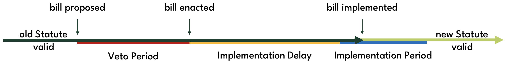

# Governance

Circuit protocol is goverend by CRT token holders. Token holders can use their CRT tokens to vote on changes to **Statutes**, which are global state parameters that define the protocol's behaviour. Statutes are stored in the [Statutes singleton](../../technical-manual/statutes). Other than the Statutes, Circuit protocol is fully immutable.

The reason that Circuit requires goverance is to keep the 1:1 peg of Bytecash to the US Dollar. This cannot be fully automated, as the protocol needs to respond to changing market conditions. Governance's responsibilities consist of the following:

* Selecting data providers for the Oracle
* Monitoring the market price of Bytecash for deviations from the peg
* Adjusting relevant Statutes to maintain the peg

### Oracle Selection

It is crucial for the functioning of the protocol that it has access to accurate and timely XCH/USD prices, as liquidations hinge on this. Governance should only whitelist trusted data providers that have a track record of publishing XCH/USD prices in an Announcer coin on-chain. Data provider performance should be monitored on an ongoing basis, and in case of poor performance, governance should unwhitelist the data provider's Announcer. For further details on Oracle and Announcers, see the [Oracle](../price-oracle) page.

### Monitoring Bytecash market price

As a stablecoin pegged 1:1 to the US Dollar, Bytecash is meant to be valued at 1 USD in the market. If Bytecash trades at a premium or discount to 1 USD for an extended period of time, governance should intervene to push the market price of Bytecash back to its peg.

Since small oscillations of the price around the peg are to be expected, governance only needs to take action is there is a structural deviation from the peg that lasts for days or weeks. An upshot of this is that there is no need for the protocol to have a BYC/USD Oracle.


### Updating Statutes

The two primary tools governance has at its disposal to maintain the peg are Stability Fee and Savings Rate. Raising the Stability Fee makes it more expensive for borrowers to take out Bytecash loans, incentivising repayments and disincentivising the creation of new Bytecash. Similarly, a higher Savings Rate incentivises users to acquire Bytecash to lock it up in savings vaults, reducing the amount of Bytecash in circulation. Both measures put upwards pressure on the BYC price. Vice versa, governance can put downwards pressure on the BYC price by lowering the Stability Fee and/or Savings Rate.

In addition to Stability Fee and Savings Rate, governance is able to update a few dozen additional Statutes. Those additional Statutes are not sensitive to market conditions, and are expected to rarely change, if ever. For example, M-of-N, the Statute that defines the minimum number of Announcer prices that must be included in an Oracle Price update, typically only needs to be updated when a data provider is whitelisted or unwhitelisted. Other Statutes, for example those that define auction formats may never need to be updated, although changes in the liquidity for assets being auctioned off, TVL of the protocol, as well as the number of bidders regularly participating in auctions could make occasional tweaks beneficial.

## Governance process

Circuit protocol governance is conducted fully on-chain via CRT coins in **governance mode**. A CRT holder can propose to change a Statute by locking up CRT in a **proposal coin**. The CRT amount must exceed the **Proposal Threshold**. Making a proposal also requires a **Proposal Fee** to be paid. The proposal coin contains a **bill**, which either specifies the Statute to be changed and the proposed new value and Constraints, or a set of custom conditions to be announced by Statutes.



Once a proposal has been made, a **Veto Period** starts during which other CRT holders have the opportunity to veto the proposal. A veto succeeds if it is backed by more CRT than the original proposal. If the bill has not been vetoed by the end of the Veto Period, it is referred to as **enacted**. Once the **Implementation Delay** has passed, the bill can be **implemented**. Implementation replaces the existing Statute in the Statutes singleton with the bill, or, in the custom conditions case, announces the bill's value. If the bill is not implemented within the **Implementation Period** it **lapses**. A bill can be **reset**, i.e. cancelled, by the proposer at any time as long as it has not been implemented yet.

Once all governance operations have concluded, governance mode can be exited subject to a **Governance Cooldown** period.

## Constraints

Given that Statutes differ in terms of criticality and required update frequency, each Statute comes with a set of **Constraints** that impose limitations on how it can be updated:

* **Proposal Threshold**: minimum amount of CRT required to make a proposal
* **Veto Period**: time period (in seconds) during which a proposal can be vetoed
* **Implemenation Delay**: time (in seconds) that needs to pass before the new Statute value becomes effective after the end of the veto period
* **Maximum Delta**: the maximum absolute amount by which the Statute value may change

Just like Statutes themselves, governance can update the Constrainsts, subject to the same limitations.

:::info
Constraints are an important safety measure, as they prevent sudden Statute changes.
:::

The Proposal Threshold protects the protocol against spam proposals.

A proposal can be blocked if within the Veto Period the proposal is vetoed by an amount of CRT larger than is backing the proposal. Once the Veto Period has passed without a successful veto, the protocol waits until the Implementation Delay period has passed before implementing the new Statute value (including any changes to the corresponding Constraints).

The Implementation Delay gives users time to withdraw their assets from the protocol in an orderly manner if they are unhappy with the changes made by the proposal. In particular, it protects users from a malicious governance takeover in which an attacker secretly accumulates a CRT stake large enough to make a proposal that cannot be vetoed. As governance takeovers are in general impossible to detect in advance, users of the protocol should keep in mind that a Statute may change to a value unacceptable to them after the Implementation Delay has passed. For example, a borrower may want to ensure that they can repay their loan within the Implementation Delay period for relevant Statutes.

The Maximum Delta Constraint is designed to give users assurances about the size of changes to Statute values that need to have a relatively short Implementation Delay, for example to respond to changing market conditions. Statutes for which this is relevant are Stability Fee, Savings Rate, and Treasury Maximum. For other Statutes, Maximum Delta would typically be set to 0, allowing updates of any size.

## User considerations

Before interacting with the protocol, users should consider how they intend to use the protocol and whether the Constraints are set to acceptable values. In particular, implementation delays should be long enough to allow users to exit their positions should a proposal get enacted that would change one or more Statutes or Constraints to values unacceptable to the user.

:::warning
Protocol users should consider whether they are comfortable with Statutes and Constraints, and whether changes to them would adversely affect them.
:::

For example, consider a user who borrows BYC at an 8% Stability Fee to invest in a fund that offers monthly redemptions. Assume the user expects the fund to deliver a return of 10% per annum in any given month. If the Stability Fee has a Veto Period and Implementation Delay of one week each, the borrower could not be certain what the SF is going to be in the last two weeks before they have an opportunity to redeem from the fund and repay their loan. Unless they have other sources of capital to repay the BYC loan after two weeks if governance changes the SF to 12% or more, they cannot protect themselves against their investment making a loss. If on the other hand the fund offered weekly redemptions, the borrower could always exit the fund and repay their BYC debt on time before the new SF is effective.

## Statutes
* **Proposal Fee**
    * Statue index: 40
    * Statute name: ```STATUTE_GOVERNANCE_BILL_PROPOSAL_FEE_MOJOS```
    * considerations: should be big enough to prevent spam proposals. should be small enough to shut out all but the largest CRT holders from participation in governance processes.
* **Implementation Period**
    * Statute index: 41
    * Statute name: ```STATUTE_GOVERNANCE_IMPLEMENTATION_INTERVAL```
    * considerations: should be long enough to allow manual implementation in a low-fee period. should be short enough to avoid attacks in which successful proposals are kept lingering and forgotten about only to be implemented unexpectedly in a changed environment.
* **Governance Cooldown**
    * Statute index: 42
    * Statute name: ```STATUTE_GOVERNANCE_COOLDOWN_INTERVAL```
    * considerations: should be long enough to disincentivise mindless activations of governance mode. should be short enough to not unduly disincentivise participation in governance.
