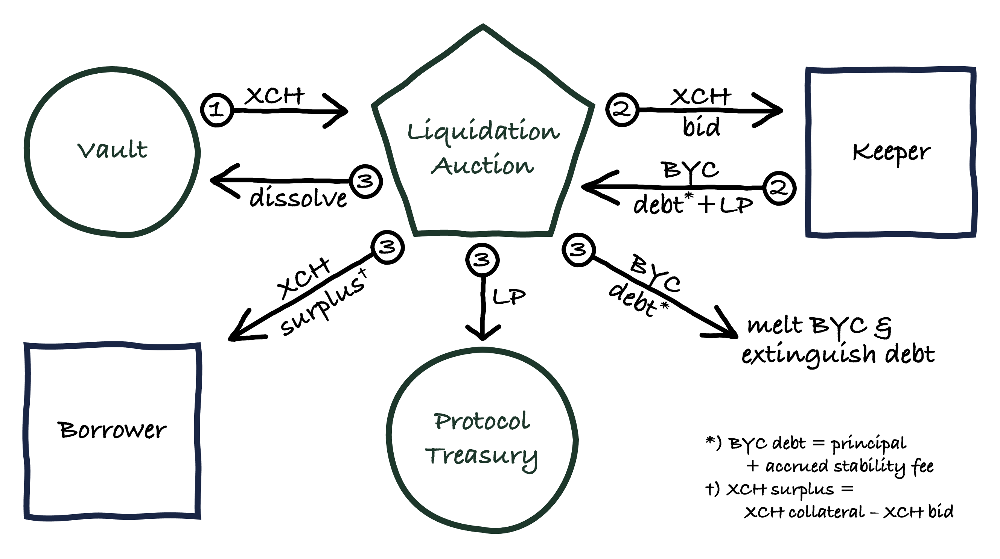
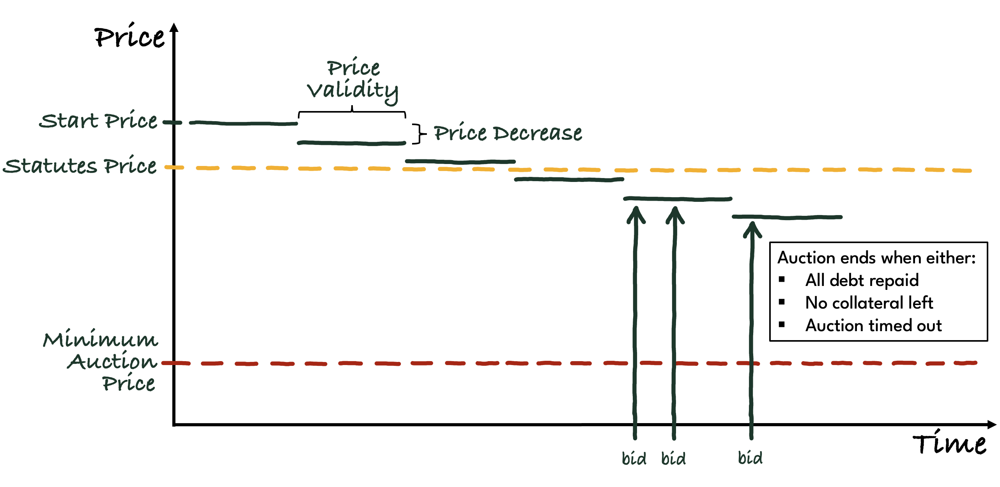

# Liquidation

In a **liquidation**, the system recovers debt from a vault by auctioning off its collateral. A vault gets liquidated if the value of the collateral locked-up in a vault drops below the **Liquidation Threshold** (LT).

The Liquidation Threshold is calculated as the **Liquidation Ratio** (LR) multiplied by the debt of the vault. The Liquidation Ratio is a global parameter that applies to all vaults.

:::info

The Liqudiation Ratio is the inverse of the loan-to-value (LTV) ratio.

:::

## Liquidation Penalty

The protocol incentivizes borrowers to keep their vaults in a sufficiently overcollateralized state by charging a **Liquidation Penalty** (LP) whenever a vault gets liquidated. The Liquidation Penalty is a percentage of the BYC owed to the vault at the time when the liquidation is triggered.

:::warning

If a vault gets liquidated, borrowers are charged a Liquidation Penalty. Borrowers can avoid getting liquidated by repaying loans or topping up collateral. 

:::

## Liquidation Process

The liquidation process consists of three steps:
1. Liquidation gets triggered by a keeper. Collateral in the vault is seized by the protocol.
2. Keepers submit bids in a liquidation auction until the debt owed has been recovered.
3. The auction gets settled, and the vault is dissolved.

Note that it is possible for a liquidation auction to fail to recover all BYC owed to a vault. In this case the protocol incurs [Bad Debt](./bad-debt).

Liquiation of a vault can be triggered as soon as the value of the collateral drops below the liquidation threshold (valued at the oracle price contained in the statutes).

When a liquidation is triggered, a liquidation auction begins (-> see liquidation auction) in which the vault's collateral is auctioned off for BYC. A liquidation is successful if the system manages to obtain BYC in the amount of the outstanding debt (principal + accrued stability fees) plus liquidation penalty. Otherwise, the liquidation is a (partial) failure, and the system accrues bad debt (-> see bad debt auction)

Liquidations are a crucial feature of CircuitDAO, as they ensure that vaults remain overcollateralized at all times. This guarantees that any outstanding BYC is backed by value exceeding its own value.

:::info

Liquidation is the key mechanism by which the protocol ensures that BYC remains fully backed.

:::

Note that for the purposes of determining whether the outstanding BYC debt is below or above the liquidation threshold, BYC is always valued at 1 USD. This ensures that if BYC depegs to the downside the effective Liquidation Ratio is higher, which is desirable. If BYC depegs to the upside, the effective Liquidation Ratio is lower, which is acceptable since BYC trading above its peg indicates high confidence in the protocol and the amount of collateral backing BYC.

## Liquidation Incentives

The system relies on keepers to trigger liquidations. Altough there is potentially money to be made from liquidations, there is no guarantee that this will be a sufficient incentive for keepers to trigger a liquidation. For example, in periods of high transaction costs, keepers might prefer to wait and see if somebody else is willing to trigger a liquidation. Given the system- and time-critial nature of liquidations, keepers are paid an incentive to trigger a liquidation. The incentive consists of two components:

* **Absolute Liquidation Incentive** (ALI): a fixed amount of BYC (e.g. 10 BYC)
* **Relative Liquidation Incentive** (RLI): a percentage amount of the debt owed (principal + accrued stability fees) to the vault being liquidated (e.g. 0.1%)

ALI and RLI are paid to the keeper once the liquidation auction has concluded. ALI and RLI are to be set such that they can be paid from the liquidation penalty in case the auction concludes sucessfully. If bad debt was incurred and the liquidation penalty doesn't cover ALI + RLI, the difference owed is paid from the System Buffer.

## Liquidation Auction

Once a liquidation has been triggered, a liquidation auction starts in which the vault's collateral is sold for BYC to recover the debt owed to the vault. Liquidation auctions are descending price auctions, also known as [Dutch auctions](https://en.wikipedia.org/wiki/Dutch_auction).

The purpose of a Liquidation Auction is to recover debt as quickly as possible to avoid an undercollateralization of the vault. Dutch auctions are particularly well suited for this as they largely prevent tactical bidding and drawn out bidding wars. As soon as a bidder is happy with the latest auction price they can repay all or part of the outstanding debt at this price. Bids can be settled immediately as there is no need to wait for counter-offers as is the case with [English auctions](https://en.wikipedia.org/wiki/English_auction).

The auction starts with a **Start Price** (SP), calculated as the latest oracle price multiplied by the **Start Price Factor** (SPF). The SPF is a factor slightly greater than 100% to account for scenarios a potential rebound in the XCH market price by the time the auction starts.

As the auction goes on, the auction price automatically decreases step-by-step every few blocks as defined by the **Price Validity** (PV) parameter.

The amount by which the auction price is lowered in each step is given by the **Price Decrease** (PD) parameter. The PD is calculated as a percentage of the Start Price, and gets substracted from the latest auction price.

The auction ends when either
* the vault's debt was fully repaid; or
* the auction price drops below the **Minimum Auction Price** (MAP), which is defined as a **Minimum Price Factor** (MPF) multiplied by the Start Price.

Liquidation Auctions can be restarted when they fail to recover the vault's entire debt. This process can be repeated multiple times, until the **Maximum Liquidation Duration** (MLD) is exceeded, at which point any remaining debt becomes Bad Debt.

### Bid

Bid operation takes: 
the amount of XCH is willing to bid
Target puzzle hash to send XCH to
It calculates current price base on amount of time passed since auction started
Where current_price is delayed price in statutes.

For bid to succeed it needs to:
* Burn (XCH amount in bid) * xch_price(t) of BYC
* Transfer XCH to themselves
* Update the auction state and xch deposited + byc minted state 

Auction can end if it reaches MAP (see System variables) or all BYC in debt has been paid for. If MAP is reached, it can be restarted instantly.

## Notes

No new liquidations may be triggered during an Emergency Shutdown.

## Parameters

* **Liquidation Ratio (LR)**
    * recorded in: Statutes
    * initial value: 150% of outstanding debt (valued at 1 BYC = 1 USD)
    * updatable: yes
    * votes requied: XYZ CRT
    * considerations: The higher the LR, the more overcollateralized the system becomes, and the less likely a depeg to the downside becomes. On the other hand, a higher LR makes it less attractive to borrow BYC, due to the higher associated capital costs of having to lock up more XCH.
* **Liquidation Penalty (LP)**
    * recorded in: Statutes
    * initial value: 13% of BYC owed to vault
    * updatable: yes
    * votes required: XYZ CRT
    * considerations: Needs to be high enough to set a strong incentive to borrowers to keep vaults sufficiently collateralized without being unreasonably punitive.
* **Absolute Liquidation Incentive (ALI)**
    * recorded in: Statutes
    * initial value: 10 BYC
    * updatable: yes
    * votes required: XYZ CRT
    * considerations: Needs to be high enough to incentivize keepers to trigger liquidation of small vaults that pay a negligible RLI (see below).
* **Relative Liquidation Incentive (RLI)**
    * recorded in: Statutes
    * initial value: 0.1% of debt owed to vault
    * updatable: yes
    * votes required: XYZ CRT
    * considerations: Needs to be high enough to incentivize keepers to trigger liquidation of large vaults even in extremely high fee environments, without being so high that it discourages borrowers to use the protocol.
* **Starting Price Factor (SPF)**
    * recorded in: Statutes
    * initial value: 110% of latest oracle price
    * updatable: yes
    * votes required: XYZ CRT
    * considerations: A higher value enables keepers to bid in more scenarios in which there's been a rebound of the market price between the latest oracle update and start of bidding. A lower value makes it more likely that the auction will finish quickly if the collateral price continues to fall after the latest oracle price was published.
* **Price Decrease (PD)**
    * recorded in: Statutes
    * initial value: 2% of Starting Price
    * updatable: yes
    * votes required: XYZ CRT
    * considerations: A higher value results in a shorter auctions, which reduces the probability that the price drops further while the auction hasn't concluded. It also leaves bidders with a higher profit margin. A lower value results in longer auctions with smaller margins for keepers.
* **Price Validity (PV)**
    * recorded in: Statutes
    * initial value: 1 block
    * updatable: yes
    * votes required: XYZ CRT
    * considerations: A higher value gives keepers more time to bid, but increases the risk that the value of the collateral falls further until the auction has completed. A low value might make it difficult for keepers that bid manually to keep up.
* **Minimum Price Factor (MPF)**
    * recorded in: Statutes
    * initial value: 20% of Starting Price
    * updatable: yes
    * votes required: XYZ CRT
    * considerations: A higher value might prevent the auction price from reaching a level at which keepers are willing to bid if the market price continues to fall. The primary risk of a low value is that collateral gets sold below market value if unusual conditions prevent keepers from bidding. Such conditions may include extreme transaction fees or clogged blocks, technical difficulties experienced by keepers participating in auctions, etc.
* **Maximum Liquidation Duration (MLD)**
    * recorded in: Statutes
    * initial value: 6 hours
    * updatable: yes
    * votes required: XYZ CRT
    * considerations: A higher value allows keepers more time to participate in a liquidation auction, but increases the risk that more bad debt accrues. However, if there are no keepers available to participate in liquidation auctions, it is unlikely that a bad debt auction will see bids.
    
<!--
MakerDAO:
* Supports different types of auction price function. linear step, exponential, and step exponential
* Local Liquidation Limit: max amount of debt for which collateral auctions for a given collateral type can be active. -> Needed? Maybe not as long as we have just one vault type.
* Global Liquidation Limit: max amount of debt for which collateral acutions can be active. -> Needed? Maybe not as long as we have just one vault type.
* Breaker Price Tolerance: Limits the amount by which successive oracle prices can deviate from each other. -> Needed?

For an analysis of possible parameter choices in the case of ETH collateral, see https://maker-report.gauntlet.network/
-->