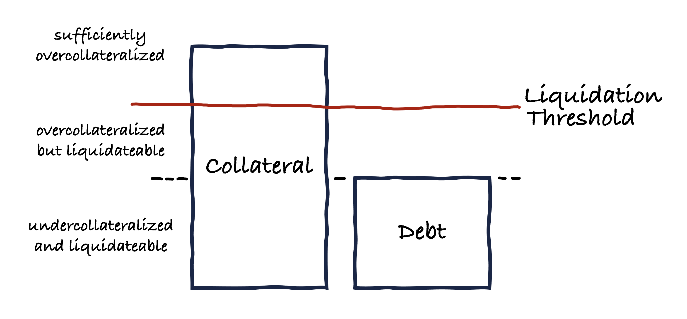
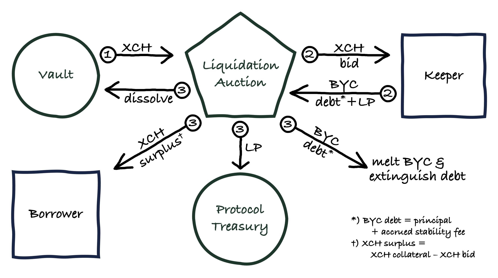
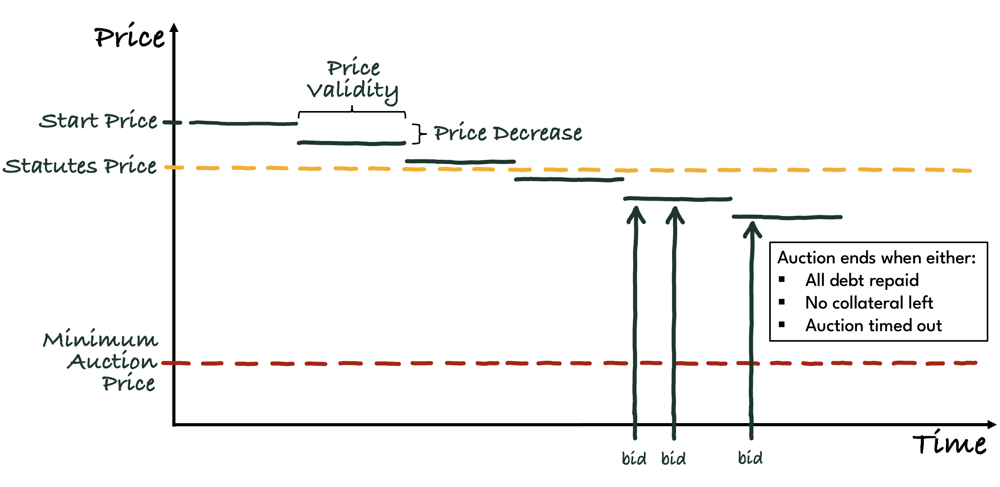

# Liquidation

In a **liquidation**, the system recovers debt from a vault by auctioning off its collateral. A vault becomes eligible for liquidation if the value of the collateral locked up in the vault drops below the **Liquidation Threshold**.



The Liquidation Threshold is the **Liquidation Ratio** (LR) multiplied by the debt of the vault. The Liquidation Ratio is a global parameter that applies to all vaults and can be changed by governance. The inverse of the Liqudiation Ratio is referred to as the **maximum loan-to-value** or **Max LTV** ratio.

The **Liquidation Price** is the XCH price at which a collateral vault with given amount of debt becomes liquidatable. It is appproximately equal to

```
Liquidation Ratio * debt / collateral
```
Borrowers should keep in mind that Stability Fee accrual slowly increases debt over time, so that the Liquidation Price also slowly increases over time even when no new loans are taken out.


## Liquidation Penalty

The protocol incentivizes borrowers to keep their vaults in a sufficiently overcollateralized state by charging a **Liquidation Penalty** (LP) whenever a vault gets liquidated. The Liquidation Penalty is a percentage of the debt owed to the vault at the point when the liquidation is triggered. The sum of debt and Liquidation Penalty is the **total debt**.

:::warning

When a vault gets liquidated, borrowers are charged a **Liquidation Penalty**, which is added to the vault's debt. Borrowers can avoid getting liquidated by repaying loans or topping up collateral.

:::

## Liquidation Process

The liquidation process consists of three steps:
1. Liquidation gets triggered by a [keeper](../../technical-manual/advanced-topics/keepers). The vault is seized by the protocol
2. Keepers bid on collateral in an attempt to recover the vault's total debt
3. Once the total debt is recovered, the vault is released back to the borrower

If a liquidation auction fails to recover the total debt, it will eventually time out and can be restarted. This continues until either the total debt does get recovered or all collateral has been sold off. In the former case, the vault and any remaining collateral in it is released back to the borrower. In the latter case, the protocol is said to incur **bad debt**. Bad debt can be extinguished by melting an equivalent amount of BYC from the [Treasury](../treasury).



Liquidations are a crucial feature of the protocol. They ensure that vaults remain overcollateralized, so that outstanding debt is backed by collateral exceeding its value.

:::info

Liquidation is a key mechanism by which the protocol ensures that BYC remains fully backed.

:::

Collateral is valued using the [Statutes Price](../price-oracle#statutes-price). Debt, which is denominated in BYC, is valued at a 1:1 exchange rate to the US Dollar, independent of the market price of BYC. If BYC depegs to the downside, the effective Liquidation Ratio increases, which is desirable. If BYC depegs to the upside, the effective Liquidation Ratio decreases, which is acceptable since BYC trading above its peg indicates high confidence in the protocol and the amount of collateral backing BYC.


## Initiator Incentives

The keeper that triggers a liquidation is referred to as the **initiator**. Altough it is possible for bidders to turn a profit in a liquidation auction, there is no guarantee that this will be a sufficient incentive for keepers to start a liquidation auction. For example, in periods of high on-chain transaction costs, keepers might prefer to wait and see if somebody else is willing to trigger a liquidation. Given the system- and time-critial nature of liquidations, the initiator is paid an **initiator incentive**, which consists of two components:

* **Absolute Initiator Incentive** (AII): a fixed amount of BYC (e.g. 10 BYC)
* **Relative Initiator Incentive** (RII): a percentage of the debt owed to the vault (e.g. 8%)

When bids are placed in a liquidaiton auction, the initiator incentive is paid before any of the debt owed to the vault is repaid.

AII and RII must be set such that they can be paid from the Liquidation Penalty in all circumstances, which requires the Minimum Debt Statute to be taken into account.

If bad debt is incurred, the initiator loses out on any unpaid initiator incentive.


## Liquidation Auction

Once a liquidation has been triggered, a liquidation auction starts in which the vault's collateral is sold for BYC to recover the debt owed to the vault. Liquidation auctions are descending price auctions, also known as [Dutch auctions](https://en.wikipedia.org/wiki/Dutch_auction).

The purpose of a Liquidation Auction is to recover debt as quickly as possible to avoid an undercollateralization of the vault. Dutch auctions are particularly well suited for this as they largely prevent tactical bidding and drawn out bidding wars. As soon as a bidder is happy with the latest auction price they can repay all or part of the outstanding debt at this price. Bids can be settled immediately as there is no need to wait for counter-offers as is the case with [English auctions](https://en.wikipedia.org/wiki/English_auction).



The auction starts with a **Start Price** (SP), calculated as the [Statutes Price](../../technical-manual/statutes) multiplied by the **Starting Price Factor** (SPF). The SPF is a factor slightly greater than 100% to account for a potential rebound in the XCH price before the auction starts.

As the auction is underway, the auction price automatically decreases step-by-step every few blocks as defined by the **Step Time Interval** (PV) parameter.

The amount by which the auction price is lowered in each step is specified by the **Price Decrease Factor** parameter. The PD is calculated as a percentage of the Start Price, and gets substracted from the previous auction price at each step.

The auction ends when either
* the vault's debt is fully repaid
* there is no collateral left in the vault; or
* the auction has timed out.

An auction ends the latest when the **Liquidation Auction Timeout** has been reached. Since Start Price, Step Time Interval and Price Decrease Factor are deterministic, there is an implicit minimum auction price that the auction price cannot fall below before the auction times out. Governance should set auction parameters such that the minimum auction price is low enough that a liquidation is highly likely to succed even in the case of extreme price drops. As an easily verifiable backstop to the implicit minimum auction price serves the **Minimum Auction Price**. This parameter should be equal to or close to the implicit price and is intended to protect against misconfigured auction parameters that result in a lower implicit price than intended.

A timed out auction can be restarted. This process continues ad infinitum until either the debt gets fully repaid, or there is no collateral left, at which point any remaining debt becomes bad debt.


## Statutes

* **Liquidation Ratio (LR)**
    * Statute index: 9
    * Statute name: `STATUTE_VAULT_LIQUIDATION_RATIO_PCT`
    * considerations: The higher the LR, the more overcollateralized the system becomes, and the less likely a depeg to the downside becomes. On the other hand, a higher LR makes it less attractive to borrow BYC, due to the higher associated capital costs of having to lock up more XCH.
* **Liquidation Penalty (LP)**
    * Statute index: 10
    * Statute name: `STATUTE_VAULT_LIQUIDATION_PENALTY_BPS`
    * considerations: Needs to be high enough to set a strong incentive to borrowers to keep vaults sufficiently collateralized without being unreasonably punitive.
* **Absolute Initiator Incentive**
    * Statute index: 11
    * Statute name: `STATUTE_VAULT_INITIATOR_INCENTIVE_FLAT`
    * considerations: Needs to be high enough to incentivize keepers to trigger liquidation of small vaults that pay a negligible RLI (see below).
* **Relative Initiator Incentive**
    * Statute index: 12
    * Statute name: `STATUTE_VAULT_INITIATOR_INCENTIVE_BPS`
    * considerations: Needs to be high enough to incentivize keepers to trigger liquidation of large vaults even in extremely high fee environments, without being so high that it discourages borrowers from using the protocol.
* **Liquidation Auction Timeout (LAT)**
    * Statute index: 13
    * Statute name: `STATUTE_VAULT_AUCTION_TTL`
    * considerations: A higher value allows the auction price to go lower, which in some cases increases the likelihood that at least some of the debt can be recovered. However, it also increases the risk that the borrower will lose a substantional amount of assets needlessly if no bidders show up quickly enough. This is especially a risk as long as there are no professional market making firms running automated bots on Chia yet.
* **Starting Price Factor (SPF)**
    * Statute index: 14
    * Statute name: `STATUTE_VAULT_AUCTION_STARTING_PRICE_FACTOR_BPS`
    * considerations: A higher value enables keepers to place a bid in more scenarios in which there's been a rebound of the market price between the latest Statutes Price update and the beginning of the auction. A lower value makes it more likely that the auction will finish quickly if the collateral price has continued to fall after the last Statutes Price update.
* **Step Time Interval (STI)**
    * Statute index: 15
    * Statute name: `STATUTE_VAULT_AUCTION_PRICE_TTL`
    * considerations: A higher value gives keepers more time to bid, but increases the risk that the value of the collateral falls further until the auction has completed. A low value might make it difficult for keepers that bid manually to keep up.
* **Step Price Decrease Factor (PD)**
    * Statute index: 16
    * Statute name: `STATUTE_VAULT_AUCTION_STEP_PRICE_DECREASE_BPS`
    * considerations: A higher value results in a shorter auctions, which reduces the probability that the price drops further while the auction hasn't concluded. It also leaves bidders with a higher profit margin. A lower value results in longer auctions with smaller margins for keepers.
* **Minimum Auction Price**
    * Statute index: 17
    * Statute name: `STATUTE_VAULT_AUCTION_MINIMUM_PRICE_FACTOR`
    * considerations: This value serves as an easily verifiable backstop to the implicit minimum auction price. As such it should be identical or very close to the implicit value.
