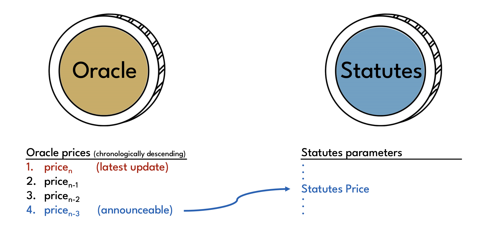
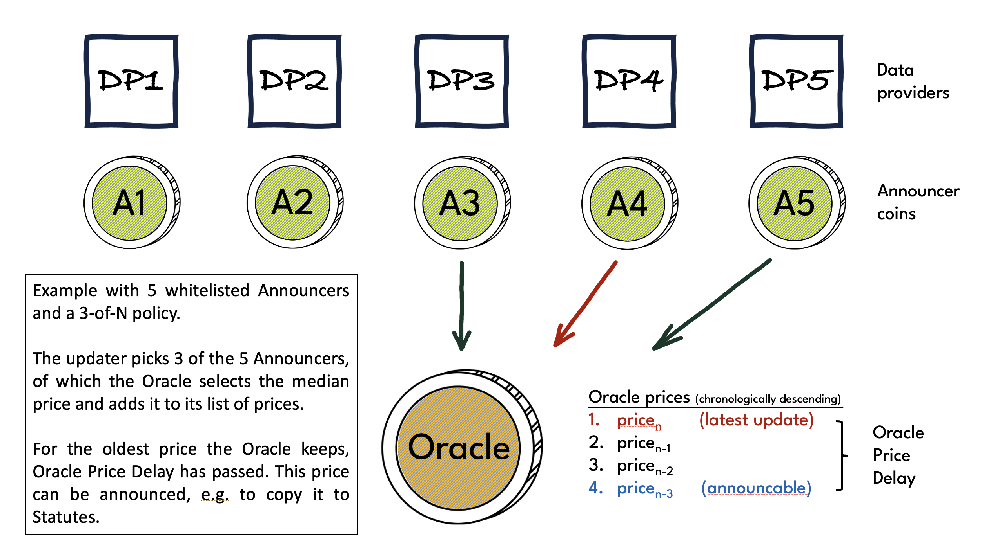

# Price Oracle

The protocol needs to know the market price of XCH in US Dollars to value the XCH deposited in collateral vaults. It does this by reading from an **Oracle**, a singleton coin that keeps track of the XCH/USD price. This **Oracle Price** is regularly updated using price data supplied by **data providers**.

## Statutes Price

The Oracle Price is not used directly by the protocol. Instead, it stores its own copy of the Oracle Price, the **Statutes Price**, with a delay of **Oracle Price Delay** seconds. The Oracle Price Delay is a safety feature that allows protocol users to anticipate the next Statutes Price.

The Statutes Price is stored in the Statutes singleton. See the [Technical Manual](./../technical-manual/statutes) for more information.

Using the Stautes Price, the protocol can value XCH held in collateral vaults. This is relevant in the following three situations:

* Borrowing: When taking out a loan, the Liquidation Threshold must remain below the value of the vault's collateral
* Withdrawing collateral: When withdrawing collateral, the Liquidation Threshold must remain below the value of the vault's collateral
* Triggering a liquidation: If the value of collateral in a vault drops below the Liquidation Threshold, the vault becomes eligible for liquidation

## Oracle price updates

As shown in the diagram above, the Oracle may store multiple prices, which are referred to as **Oracle prices** (with a lower case 'p'). This is necessary due to the Oracle Price Delay. Whenever a new price is added to the list of Oracle prices, all but one of the prices which are older than Oracle Price Delay get discarded. This oldest price in the list is the Oracle Price (with a capital 'P'). At any given time, it is the only of the prices that can be announced and copied to Statutes to become the Statutes Price.

A new Oracle price can be calculated and added to the list Oracle prices whenever

* at least **Price Update Delay** seconds have passed since the previous price was added; or
* the price has changed by more than **Price Update Delta** basis points

The XCH/USD market price is an off-chain metric. As such it cannot be obtained in a fully trustless manner. Instead, Oracle prices are calculated based on prices provided by data providers. Each data provider obtains XCH/USD prices from crypto exchanges or other trading venues and publishes them on-chain in an **Announcer** singleton coin. Announcers don't keep a price history, they only store the latest price supplied by their respective data provider, the **Announcer Price**.

Oracle prices are calculated as the median price of a number of whitelisted Announcers. Whoever performs the update is free to choose which Announcers to use, as long as the number of Announcers selected is no less than **Oracle M-of-N** (M-of-N).

## Data providers and Announcers

Before the price of an Announcer can be used in an Oracle price calculation, governance must whitelist the Announcer and the corresponding data provider must register the Announcer with the **Announcer Registry**, another singleton coin.

:::info

The Technical Manual contains additional information on [Announcers](./../technical-manual/announcers) and the [Announcer Registry](./../technical-manual/announcer-registry).

:::

Data providers are expected to provide regular, timely and accurate updates of the XCH/USD market price, and publish it in their respective Announcer. In particular, Announcer prices must be updated no less often than given by the **Announcer Validity**. Otherwise the Anncouncer price is considered expired and can no longer be used to update the Oracle Price.

Governance should closely monitor the performance of data providers, and replace those that perform poorly or can no longer be trusted. The larger the number of high-quality whitelisted Announcers, the larger M-of-N can be chosen, and the lower the risk that the Oracle Price is not reflective of the market price.

:::warning

Data providers are real-world entities that publish off-chain data on-chain. As such, the Oracle introduces an element of trust to Circuit protocol.

:::

To incentivize data providers to do their job well, the protocol lets them claim rewards in the form of CRT tokens. For details please see the [**Announcer Registry**](./../technical-manual/announcer_registry) page in the Technical Manual.

In addition, data providers are required to post a bond in their respective Announcer coins. The bond is an amount of XCH no less than the **Announcer Minimum Deposit**. If an Announcer price is expired, an Announcer can be penalized by slashing an amount of XCH equal to the **Penalty Factor** multiplied by the share of the **Penalty Interval** that has passed since expiry or the last penalization event from the bond.

## Data sources and Announcer prices

It is up to governance to decide what data sources data providers should take into account and how to aggregate them to arrive at the price to publish.

For example, as of the time of writing, the majority of XCH trading occurs on OKX. As a result, governance should require all data providers to incorporate OKX data in the XCH/USD price they publish.

Given that XCH trading volumes are still relatively small, there is a risk that a malicious actor could attempt to manipulate the XCH/USD market price in order to force or prevent the liquidation of collateral vaults. In order to mitigate this risk, the Oracle price should be based on a volume-weighted average price over a trailing time window. The longer the window over which the average price is calculated, the more capital is required to execute a price manipulation attack.

:::info

Thanks to [identical spend aggregation](https://docs.chia.net/faq/#what-is-identical-spend-aggregation), other protocols built on Chia can use the Oracle Price at no additional cost.

:::

## Statutes

* **Oracle M-of-N**
    * Statute index: 5
    * Statute name: STATUTE_ORACLE_M_OF_N
    * considerations: a higher value leads to a larger sample size and hence generally better Oracle Price quality. Care must be taken to not choose M-of-N too close to the number of whitelisted Announcers so that it creates a risk that the Oracle Price can no longer be updated if multiple Announcers fail to publish a price or publish inaccurate prices.
* **Oracle Price Update Delay**
    * Statute index: 6
    * Statute name: STATUTE_ORACLE_PRICE_UPDATABLE_AFTER_SECONDS
    * considerations: should give protocol users enough time to manage their positions should the value seem incorrect. should be short enough that it does not unduly delay liquidations. The delay needs to be factored into the the Liquidation Ratio
* **Oracle Price Update Delta**
    * Statute index: 7
    * Statute name: STATUTE_ORACLE_PRICE_UPDATABLE_PERCENT_THRESHOLD
    * considerations: needs to be small enough so that liquidations can get triggered in a timely manner. should be large enough to prevent unnecessary oracle updates and oracle coin hogging attacks
* **Oracle Price Delay**
    * Statute index: 8
    * Statute name: STATUTE_ORACLE_PRICE_EXPIRATION_SECONDS
    * considerations: a longer delay gives users of the system more time to perform mitigating actions should the oracle price be incorrect. it also gives governance more time to disable price updates in such a scenario. a shorter delay leads to more timely liquidations and more accurate limits on borrowing, both of which reduce risk of the system becoming insufficiently or under-collateralised.
* **Announcer Validity**
    * Statute index: 31
    * Statute name: STATUTE_ANNOUNCER_DELAY
    * considerations:
* **Announcer Minimum Deposit**
    * Statute index: 30
    * Statute name: STATUTE_ANNOUNCER_MIN_DEPOSIT
    * considerations: should be high enough to set a strong incentive for Announcers to run high availablity infrastructure to not fail to update the price. should not be so high as to expose Announcers to unreasonable financial risk. either way, the deposit should be commensurate with the amount of TVL that the protocol secures.
* **Penalty Factor**
    * Statute index: 33
    * Statute name: STATUTE_ANNOUNCER_PENALTY_FACTOR_PER_INTERVAL
    * considerations: similar considerations as with Announcer Minimum Deposit.
* **Penalty Interval**
    * Statute index: 32
    * Statute name: STATUTE_ANNOUNCER_PENALTY_INTERVAL_MINUTES
    * considerations: similar considerations as with Announcer Minimum Deposit.
