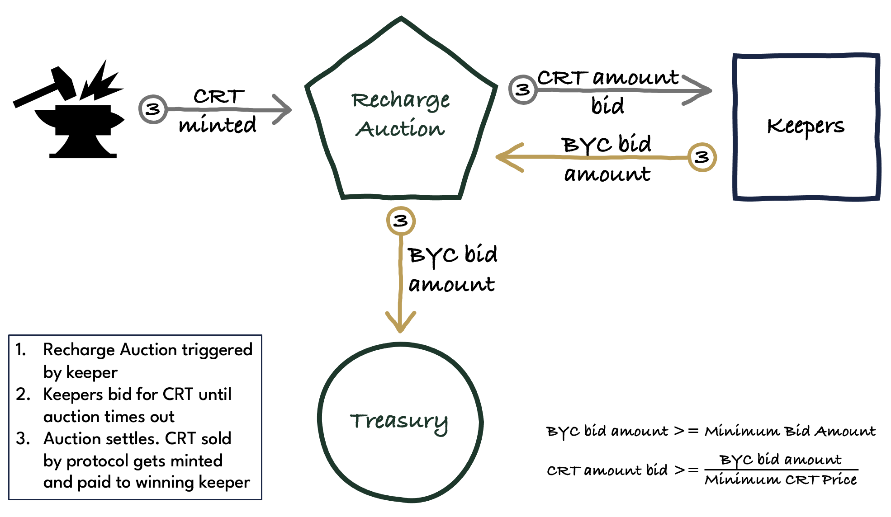

# Recharge Auction

A Recharge Auction can be launched whenever the BYC balance of the Treasury drops below the Treasury Minimum (?).

In a Recharge Auction the protocol acquires BYC to refill the Treasury by auctioning off CRT. Bidders must submit bids offering at least the **Recharge Auction Minimum Bid Amount** of BYC. Bids must also include the CRT price at which the BYC is offered. The CRT price of a bid must be greater than the **Recharge Auction Minimum CRT Price**, and greater than the CRT price of any previous bid. Bids can be placed as long as the **Recharge Auction Timeout** has not been reached yet.

Note that the amount of BYC offered by a bid can be chosen to be smaller than that of a previous bid. This ensures that keepers with only small amounts of working capital can continue to participate in auction without being pushed out by better capitalised bidders.

The auction concludes if a bid sees no higher bid within **Recharge Auction Bid TTL** seconds or if there is no bid and the **Recharge Auction Timeout** has been reached.

The winning bidder receives an amount of CRT equal to the BYC amount offered divided by the CRT price bid. In return, the Treasury receives the BYC amount offered.

:::info
Recharge Auctions increase the CRT supply.
:::

## Parameters

* **Recharge Auction Minimum Bid Amount**
    * recorded in: Statutes
    * initial value: 50,000 BYC
    * updatable: yes
    * votes required: XYZ CRT
    * considerations: should be small enough to allow keepers with little working capital to participate in the auction. should be large enough to allow the protocol to refill the Treasury at a reasonable rate so that liabilities can be covered in a timely manner.
* **Recharge Auction Minimum CRT Price**
    * recorded in: Statutes
    * initial value: 0.01 BYC per CRT
    * updatable: yes
    * votes required: XYZ CRT
    * considerations: should be set high enough to prevent unreasonable amounts of CRT being minted (without a minimum CRT price, CRT holders could get infinitely diluted), for example in cases where only one keeper shows up to participate in the auction. should be set low enough that it is highly likely that the Treasury can be refilled. Since Recharge auctions are generally a last resort measure to cover protocol liabilities, and in particular Bad Debt, a failure to raise BYC could result in a loss of confidence in the protocol and a death spiral for BYC.
* **Recharge Auction Timeout**
    * recorded in: Statutes
    * initial value: 8 hours
    * updatable: yes
    * votes required: XYZ CRT
    * considerations: should be long enough to allow keepers to show up for the auction to achieve a competitive bidding process and minimize the amount of CRT that gets minted.
* **Recharge Auction Bid TTL**
    * recorded in: Statutes
    * initial value: 4 hours
    * updatable: yes
    * votes required: XYZ CRT
    * considerations: should be long enough to allow keepers to show up for the auction to achieve a competitive bidding process and minimize the amount of CRT that gets minted.

