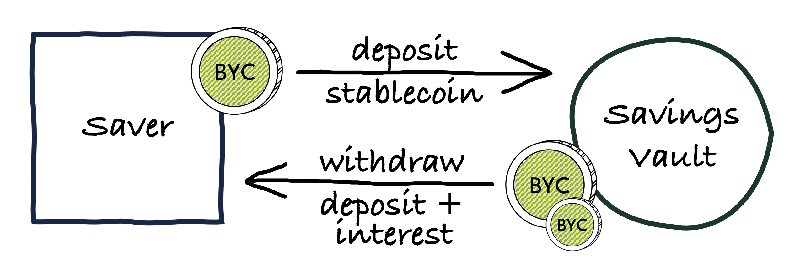

# Savings Vaults

By depositing BYC into a **savings vault**, BYC holders can earn interest on their stablecoins. Interest accrues on the balance in the savings vault by the minute according to the prevailing **Savings Rate** (SR). The SR is shown as an annual percentage rate (APR), for example 4%.



### Savings

The **savings** in a savings vault consist of two components, **savings balance** and **accrued interest**. The savings balance is the amount of "physical" BYC locked up in a savings vault, i.e. the amount of the savings vault coin. This is the sum of all BYC deposited into the vault minus the sum of all BYC withdrawn from the vault. Accrued interest is the amount of interest that has accrued to the vault.

```Savings = savings balance + accrued interest```

Interest compounds, i.e. accrues on the vault's entire savings. The protocol does not directly use the SR. Instead, there is an **Interest Discount Factor** (IDF) parameter in Statutes, which is defined as IDF = 1 + SR. Using the IDF instead of the SR simplifies calculations.

### Deposits

When making a deposit the savings balance is increased by the amount of BYC deposited, while accrued interest remains unchanged.

### Withdrawals

When making a withdrawal, the user automatically receives an interest payment from the Treasury for the entire accrued interest. The savings balance is increased by the amount of BYC deposited plus the accrued interest, while accrued interest is reset to 0. This is true unless accrued interest does not exceed the **Treasury Minimum Delta**, in which case the user can withdraw at most the savings balance.

:::info

Savings can only be fully withdrawn if accrued interest exceeds the Treasury Minimum Delta.

:::


## Savings Rate

The Savings Rate is a mechanism by which the protocol passes on Stability Fees received from borrowers to savers. It sets an incentive for savers to buy BYC and deposit it in a savings vault, which supports the BYC peg from below.

The Savings Rate is set by governance. Although it is not directly tied to the Stability Fee, both parameters play an important role in balancing supply and demand for BYC, and therefore in maintaining the peg. This should be the primary consideration for governance when setting the SR.


## Parameters

* **Interest Discount Factor**
    * Statute index: 2
    * Statute name: `STATUTE_INTEREST_DF`
    * considerations: The higher this value is set, the more support is given to the BYC-USD peg from below. If the value is set too high, it may slow down the rate at which the System Buffer fills up. The SR should not be greater than the Stabiliy Fee, as this would present an arbitrage that could lead to unlimited losses to the protocol.
* **Treasury Minimum Delta**
    * Statutes index: 22
    * Statutes name: `STATUTE_TREASURY_MINIMUM_DELTA`
    * considerations: Choose large enough to prevent Treausry coin hogging. Choose small enough to allow small scale savers to make regular interest withdrawals
