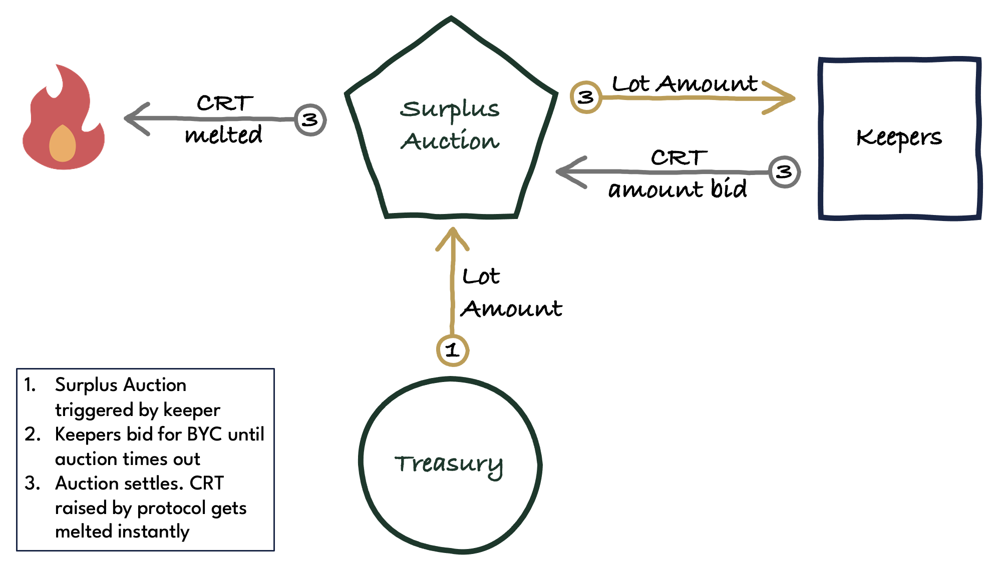

# Surplus Auction

In a Surplus Auction, the protocol auctions off a fixed amount of BYC as specified by the **Surplus Auction Lot Amount** parameter for CRT in an English auction.

A Surplus Auction can be triggered whenever the BYC balance of the Treasury exceeds the [Treasury Maximum](./treasury) plus the Surplus Auction Lot Amount. Once the auction has been started, bidders can bid increasing amounts of CRT for the Surplus Auction Lot Amount.

The auction concludes if a bid sees no higher bid within **Surplus Auction Bid TTL** seconds (TTL = time to live) or if there is no bid at all and the **Surplus Auction Timeout** has been reached. Bids can only be placed before the Surplus Auction Timeout has been reached.

The winning bidder receives an amount of BYC equal to the Surplus Auction Lot Amount, and the amount of CRT offered in the winning bid gets melted.

:::info

Surplus Auctions reduce the CRT supply.

:::

There can only ever be one Surplus Auction at a time. If the Treasury Maximum is still exceeded after a Surplus Auction has concluded, another auction can be launched right away.

## Statutes

* **Surplus Auction Lot Amount**
    * Statutes index: 25
    * Statutes name: STATUTE_SURPLUS_AUCTION_LOT_AMOUNT
    * considerations: should be small enough to allow keepers with little working capital to participate in the auction. should be large enough to allow the protocol to discharge BYC at a reasonable rate so that BYC accumulation in Treasury doesn't cause upwards pressure on the BYC peg.
* **Surplus Auction Timeout**
    * Statutes index: 24
    * Statutes name: STATUTE_SURPLUS_AUCTION_TIMEOUT
    * considerations: should be long enough to allow keepers to show up for the auction to achieve a competitive bidding process and maximize the amount of CRT that gets melted.
* **Surplus Auction Bid TTL**
    * Statute index: 26
    * Statute name: STATUTE_SURPLUS_AUCTION_BID_TTL
    * considerations: should be long enough to allow keepers to show up for the auction to achieve a competitive bidding process and maximize the amount of CRT that gets melted.
