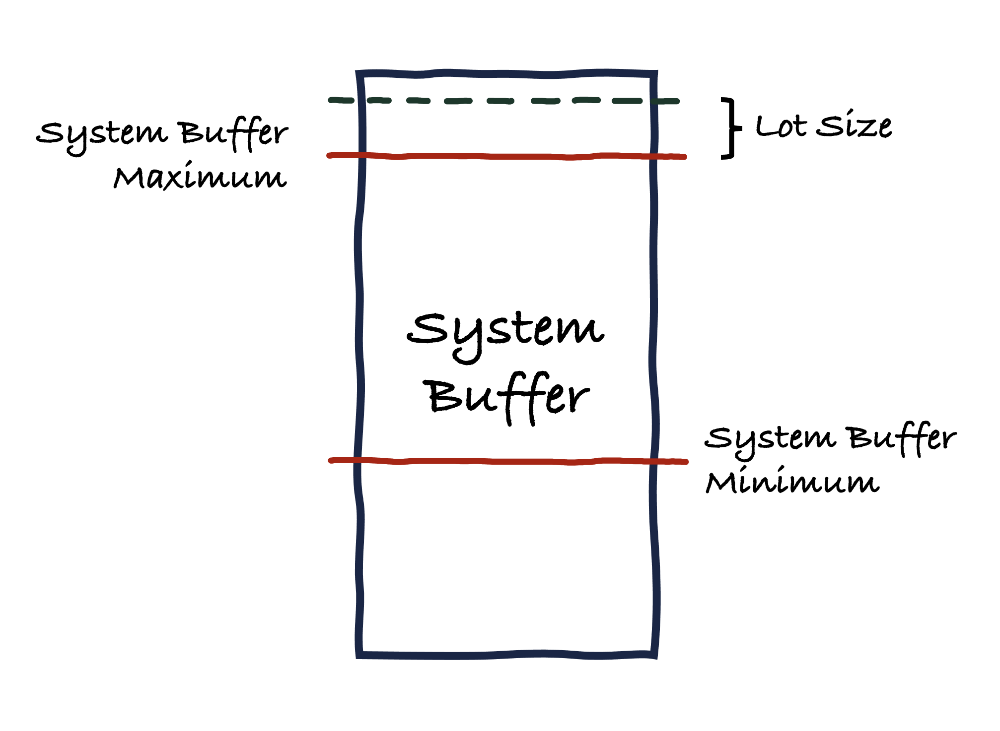

# System Buffer

The **System Buffer** (SB) accumulates BYC from Stability Fees and Liquidation Penalties.

Funds from the System Buffer are used to pay for
* Interest on Savings Vault deposits
* Bad Debt incurred by the protocol
* Liquidation Incentives

The SB maintains a **System Buffer Minimum Balance** (SBMin) to ensure it can generally cover for these expenses instantly. If this is not the case, Savers cannot withdraw their funds (without forfeiting their interest), Bad Debt cannot be extinguished directly (requires a Bad Debt Auction instead), and no Liquidation Incentives are paid out (but still accrue to keepers that triggered a liquidation).

IF the SB Balance drops below the SBMin, a Refill Auction can be triggered in which the system auctions off CRT in return for BYC to top up the SB.

If the System Buffer exceeds the **System Buffer Maximum Balance** (SBMax), the system will auction off BYC for CRT, and in turn burn the CRT obtained this way.

In the diagram above, the SB Balance exceeds the SBMax + LS, so that a Surplus Auction can be triggered.

Note that the SB may occasionally also accumulate XCH. This can occur as a result of bad debt incurred by vaults that had collateral left in them.

<!-- Seb: auction off XCH and CRT together, or separately? I.e. do we want to define a separate XCH SBMax, which when exceeded results in an XCH surplus auction (for BYC)? -->

## Refill Auction

As soon as the amount of BYC in the buffer drops below the SBMin - **Lot Size** (LS), a Refill Auction is triggered in which an amount of LS BYC is acquired for CRT. Any CRT auctioned off in this way will be minted ad hoc by the protocol, thereby increasing the CRT supply.

Refill Auctions use the same mechanism and paramters as Bad Debt auctions.

## Surplus Auction

If the amount of BYC in the system buffer exceeds SBMax + Lot Size, then an amount of Lot Size of BYC will be auctioned off in the market for CRT. Any CRT obtained this way will be melted immediately, thereby reducing the CRT supply.

In a surplus auction, keepers submit bids that specify how much CRT they demand for LS BYC. The auction ends if an existing bid is not outbid within the **Bid Validity Period** (BVP), or if the **Surplus Auction Duration** (SAD) has been exceeded.

Surplus auctions use the same mechanism as Bed Debt auctions.

## Notes

:::info

Refill (incl Bad Debt) and Surplus Auctions are the only way by which the CRT supply can vary past the Initial Supply (see Tokenomics). Refill Auctions increase the CRT supply, whereas Surplus Auctions reduce the CRT supply.

:::

## Parameters

* **System Buffer Minimum Balance (SBMin)**
    * recorded in: Statutes
    * initial value: 100% of interest accrued to savers
    * updatable: yes
    * votes requied: XYZ CRT
    * considerations: A low value might provide the system with insufficient BYC inventory to pay Liquidation Incentives, cover Bad Debt, and promptly repay Savers wishing to withdraw their BYC plus accrued interest from the Savings Vault, and lead to an unnecessary number of Refill Auctions. A higher value removes more BYC from circulation, putting upwards pressure on the BYC price. 
* **System Buffer Maximum Balance (SBMax)**
    * recorded in: Statutes
    * initial value: max(1% of outstanding debt, 120% * SBMin) -> Split into two parameters?!
    * updatable: yes
    * votes requied: XYZ CRT
    * considerations: A value too close to SBMin might lead to an unnecessary number of Surplus Auctions. A higher value results in the removal of BYC from circulation, putting upwards pressure on the BYC price.
* **Lot Size (LS)**
    * recorded in: Statutes
    * initial value: 50k BYC (-> check what Maker uses. Might want to go lower, esp in the beginning. 5k, 1k?)
    * updatable: yes
    * votes requied: XYZ CRT
    * considerations: Should be large enough that auctions don't need to get triggered constantly. Should be small enough that a reasonable number of keepers have access to the amount of capital required to participate in Refill and Surplus Auctions.
* **

<!-- Comment
MakerDAO:
* Does not have a SBMin, only a SBMax, which is an absolute Dai amount (50m, ca. 1% of oustanding BYC currently)
* Lot Size is ?
* Smart Burn Engine: supplies MKR/DAI liquidity to Uniswap v2. still ramping up it seems. -> Has the smart burn engine completely replaced bad debt auctions?!
  * Longer-terms plan seems to be to sell system surplus DAI for MKR using Uniswap v2 in smaller granularity (time- and lot-size-wise) and lower cost than would be possible with surplus auctions (which presumably will be reserved for large surplus spikes):
  * Smart Burn Engine Lot Size (10k Dai used as example in manual, initial value was 5k (https://vote.makerdao.com/polling/QmQmxEZp#poll-detail)
  * Smart burns have a cool down period (100 seconds example given in manual)
  For details on the Smart Burn Engine see: https://forum.makerdao.com/t/introduction-of-smart-burn-engine-and-initial-parameters/21201
-->