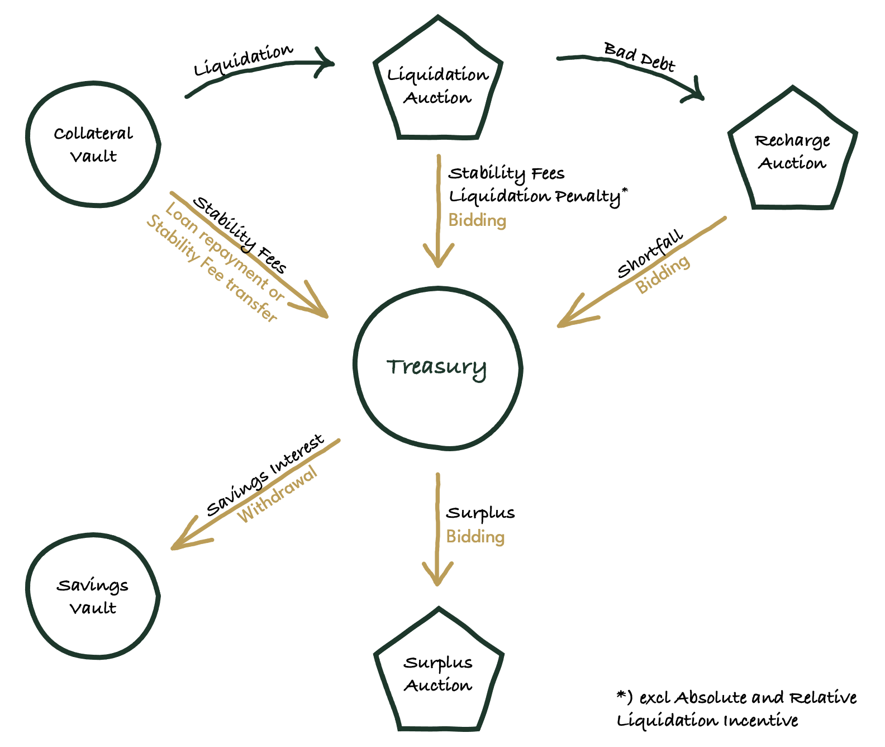
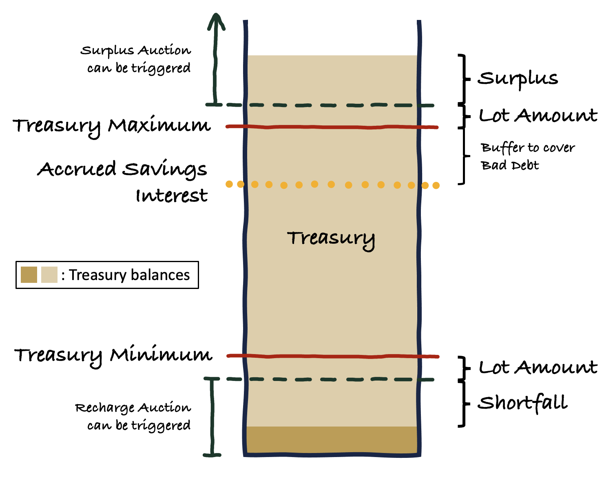
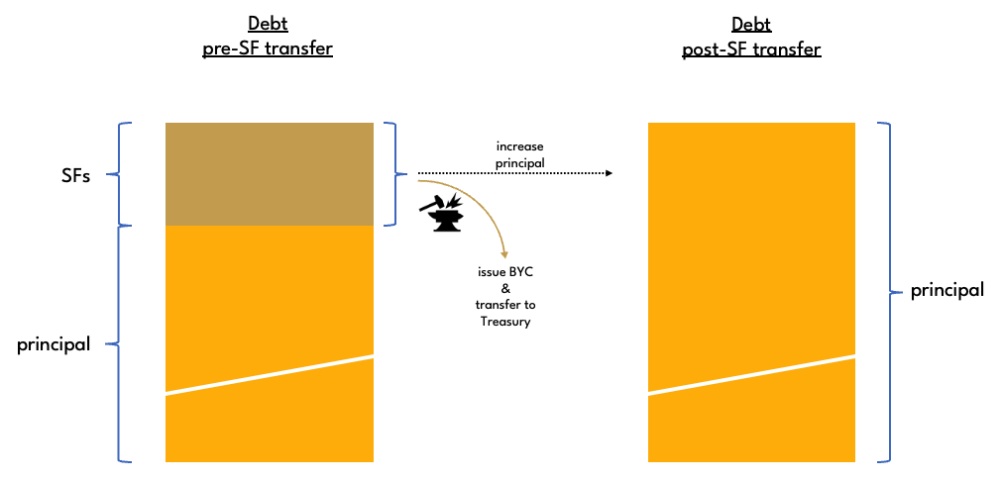

# Treasury

The **Treasury** is a component of the protocol that stores BYC. It effectively functions as a buffer which takes in and distributes BYC in response to user interactions with the protocol. The amount of BYC held in the Treasury is referred to as the **Treasury balance**.

The Treasury is filled by:
* Stability Fees (including Transferred Fees)
* Liquidation Penalties
* Recharge Auctions

Treasury funds are discharged via:
* Savings Interest withdrawals
* Bad debt recovery
* Surplus Auctions

Note that funds in the Treasury cannot be directly accessed by anyone. Every deposit to or withdrawal from the Treasury must be approved by a coin with one of the **Approver Mods** as its puzzle. Approver Mods are whitelisted in the **Approver Mod Hashes** Statute. The only way in which funds can leave the Treasury are to pay Savings Interest when savers make a withdrawal or to pay the winner of a Surplus Auction.

If the Treasury balance exceeds the **Treasury Maximum** plus the [Surplus Auction Lot Amount](./surplus-auction), a **Surplus Auction** can be held that auctions off an amount of BYC equal to the Surplus Auction Lot Amount for [CRT](./crt_token). If the Treasury balance remains above the Treasury Maximum plus the Surplus Auction Lot Amount, another Surplus Auction can be started right away.

If the Treasury balance is below the **Treasury Minimum** less the [Recharge Auction Lot Amount](./recharge-auction), a **Recharge Auction** can be held. The protocol auctions off CRT that it mints in return for an amount of BYC equal to the Recharge Auction Lot Amount to refill the Treasury. If the Treasury balance remains below the Treasury Minimum minus the Recharge Auction Lot Amount, another Recharge Auction can be started right away.

Another option to recharge the Treasury is to mint BYC against accrued Stability Fees in collateral vaults. This can be done by anyone at any time. The amount of BYC minted in this manner is kept track of in the **Transferred Fees** variable of the respective collateral vault. A fee transfer always transfers the maximum amount of fees that are eligible to be transferred. It is not possible to transfer fees in excess of accrued SFs. A fee transfer is only permitted if it is larger than the **Minimum SF Transfer Amount** and the collateral vault is not in liquidation. Fee transfers are an important mechanism to ensure that there is enough Bytecash available in the Treasury for the protocol to meet its liabilities on demand.

It is governance's responsibility to continuously monitor the protocol's assets and liablities to ensure that the Treasury Maximum:
* is not set too low so that it prevents the Treasury from holding enough BYC to cover the outstanding Savings Interest on demand
* is not set too high so that the amount of BYC removed from circulation is so large that it causes BYC to trade above its peg

In practice, governance should set the Treasury Maximum to the amount of accrued Savings Interest plus a buffer that can be used to cover bad debt in case it arises, and similarly for the Treasury Minimum, which should be set to a value greater than 0.

## Statutes

* **Approver Mod Hashes**:
    * Statute index: -3
    * Statute name: STATUTE_TREASURY_COIN_APPROVER_MOD_HASHES
    * considerations: it is crucial that approver mods can only spend treasury funds in very specific circumstances as intended by the protocol.
* **Treasury Minimum**:
    * Statute index: 17
    * Statute name: STATUTE_TREASURY_MINIMUM
    * considerations: other than at protocol launch, should be set to a value greater than 0 as a buffer to cover bad debt. Should not be set too large to prevent unnecessary recharge auctions.
* **Treasury Maximum**:
    * Statute index: 18
    * Statute name: STATUTE_TREASURY_MAXIMUM
    * considerations: should be set to a value greater than accrued savings interest to have a buffer for covering bad debt. the buffer should be sufficiently large to not need constant readjustments as savings interest accrues over time. the buffer should also not be so large that it puts upwards price pressure on the BYC price.
* **Minimum SF Transfer Amount**:
    * Statute index: 19
    * Statute name: STATUTE_MINIMUM_SF_TRANSFER_AMOUNT
    * considerations: should be large enough so that transfers to Treasury cannot occur too frequently to thwart coin hogging attacks. should not be set too high so that it prevents a large amount of accrued SFs from being transferred to Treasury, requiring unnecessary recharge auctions to be held.
